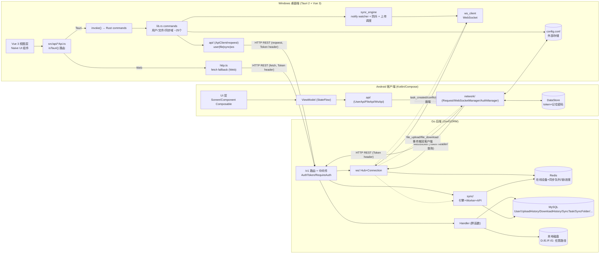

# 云梯 (FileSync) 架构说明文档

> 本文档描述三端（Android / Go 后端 / Windows 桌面端）的整体架构、技术栈、模块关系与已知问题，作为后续对话的统一背景参考，避免重复解释。
> 维护原则：描述「代码现状」而非「期望状态」，已定义但未实现的能力会明确标注为 **[仅 schema/未接线]**。

---

## 0. 一句话定位

这是一个**个人自托管文件传输/同步系统**，三端：Android（Kotlin/Compose）+ Windows 桌面（Tauri 2 + Vue 3 + Rust）+ Go 后端。客户端通过 HTTP（文件上传/下载/浏览）+ WebSocket（实时状态/同步任务）与 Go 后端交互；后端用 MySQL 存账户与传输记录、Redis 记在线设备与同步队列、本地磁盘存文件、WS 推送实时事件。

⚠ **同步链路现状**：Go 后端同步引擎已全链路实现（Redis 队列 + worker 调度 + base CAS 冲突检测 + WS 派发，见 §4.11）。**Windows 桌面端同步上报/执行链路已接通**（`file_changed` 带 `base_hash` 上报、`task_created` 原子发布执行、冲突隔离、`waiting_unlock`、多线程全量同步、日志窗口，见 §3B.6）。**WS 认证问题已修复**（`ws_client.rs` URL 补齐 `/v1/ws/connect` 路径）。Android 端仍无文件监听守护。

---

## 1. 系统全景



数据流要点：
- **HTTP**：客户端每个请求带 `Token` 头；后端 `AuthToken`（非阻塞解析）+ `RequireAuth`（私有组阻塞校验）二级中间件；token 即将过期时后端用 `New-Token` 响应头无声续期。
- **WebSocket**：客户端连 `wss://host/file/v1/ws/connect`（注意路径前缀与 REST 的 `/v1` 不一致，见 §6）；WS 仅做事件路由/广播，不参与文件字节传输。
- **文件字节**：上传走 multipart（单次缓冲落盘），下载走 HTTP Range 流式 `io.Copy`。

---

## 2. 技术栈速览

| 维度 | Android 前端 | Windows 桌面端 | Go 后端 (`new_server`) |
|---|---|---|---|
| 语言 | Kotlin 2.4.0 / JVM 11 | Rust (src-tauri) + TypeScript (Vue) | Go 1.25.3 |
| UI / 框架 | Jetpack Compose (BOM 2025.12) + Material3 | Tauri 2 + Vue 3 + Naive UI | Gin 1.12 + gin-contrib/cors |
| 网络 | OkHttp 5.3（手写封装） | reqwest 0.12（Rust）/ fetch（Web fallback） | Gin + gorilla/websocket |
| 序列化 | kotlinx-serialization-json 1.9 | serde_json (Rust) / TypeScript interface | encoding/json |
| 持久化 | DataStore Preferences | 无本地 DB；运行期 SyncConfig 内存缓存 | GORM + MySQL；Redis 在线设备+同步队列 |
| 认证 | Token 头 / 下载用 query token | Token 写 Rust SyncConfig（Tauri）/ localStorage（Web） | JWT-HS256 (golang-jwt/v5) + bcrypt |
| 下载 | PRDownloader 0.6（断点续传） | build_download_url → 前端 fetch Range | HTTP Range / 206 Partial |
| WS | OkHttp WebSocket | tokio-tungstenite | gorilla/websocket |
| 配置 | 外部存储 config.conf (Properties) | set_sync_config invoke / localStorage | Viper config.yaml |
| DI | 无框架，`object` 单例 | Tauri managed state (`Arc<RwLock<T>>`) | 构造器闭包手动注入 |
| 测试 | 仅模板，无真实覆盖 | 无测试 | 无测试 |

Android SDK：`compileSdk/targetSdk 37`，`minSdk 24`，versionName 1.0，release 未开混淆。

---

## 3. Android 前端架构

### 3.1 包结构与分层
根包 `com.sunyuanling.filesync`（`app/src/main/java/com/sunyuanling/filesync/`）：

```
config.kt                 AppConfig 单例 + LogLevel（仅配置用）
MainActivity.kt           入口 Activity + FileSyncApp + AppInitializer
api/                      按域划分的 API 门面（object）
  ├ ApiRoutes.kt          路由常量（相对 /v1）
  ├ file/ (FileApi, FileParams, FileResponse)
  ├ user/ (UserApi, UserParams, UserResponse)
  └ ws/   (WsApi, WsParams, WsResponse)
network/                  传输层
  ├ request.kt            Request 单例：OkHttp + JSON 封装 + DataStore token
  ├ Response.kt           统一响应信封 Response<T> + PageData + 异常
  ├ Authmanager.kt        AuthManager：token 过期 SharedFlow 事件
  └ websocket.kt          WebSocketManager（注：package 声明仍为 com.example.filesync.data.sync）
dataClass/Download.kt     UI 下载模型
graph/                    导航图构造器 (Main/Auth/File/Monitor/Settings)
router/                   类型安全路由 AppDestination + AppNavHost（旧 AppRoute.kt 已废弃）
ui/
  ├ components/ (files/ home/ notice/ serverSetting/)
  ├ screen/     (Home/Monitor/files/monitoring/permission/person/transmission/)
  ├ theme/      (Color/Theme/Type)
  └ viewModel/  (data/ files/ home/ transmission/ user/)
util/                     (DateUtil/DeviceInfo/FileLogger/FileUtils/PermissionHelper/RootHelper 等)
```

**架构模式**：MVVM（半 Clean，无独立 domain 层、无 use case）。分层表达：
- 数据/API 层：`api/*`（域对象门面）+ `network/*`（传输）。约定见 `api/file/FileApi.kt:1-3`：*"每个函数只组装参数 + 调 Request.xSuspend，不写业务逻辑"*。
- 展示层：`ui/viewModel/*`（ViewModel）+ `ui/screen|components/*`（Composable）。
- **无 Repository 抽象、无本地缓存**：每个界面打开都重新请求网络（如 `FileTransferListViewModel.kt:174`、`RecentFilesViewModel.kt:24`）。

ViewModel 暴露不可变 `StateFlow`，UI 用 `collectAsState()` 订阅；离散状态用 sealed class（`WsState`/`UploadState`/`RootStatus`/`SyncStatus`/`PPersonalState`/`FileTransferStatus`）。

### 3.2 网络层
核心 `network/request.kt`（`Request` 单例）：
- 单个 `OkHttpClient`，30s 超时，`retryOnConnectionFailure(true)`（`request.kt:57-62`）。
- `Json { ignoreUnknownKeys; isLenient }`（`request.kt:64-68`）。
- `baseUrl = "${AppConfig.getBaseUrl()}/v1"`（`request.kt:35`）——**`var` 在单例首次初始化时求值**，运行时改服务器配置后需手动重赋值（潜在陈旧 URL bug，见 §7）。
- **无 OkHttp Interceptor**：鉴权按需在每个 builder 上 `header("Token", token)`（`request.kt:234,301`）。
- 泛型 reified 方法：`get/post`（回调式）+ `getSuspend/postSuspend` + 低层 `requestSuspend`；全部在 `Dispatchers.IO`。
- 信封：后端返回 `{code, message, data}`，由 `Response<T>`（`network/Response.kt:9-19`）建模；`code != 200` 返回 `Result.failure`。
- **HTTP 401**：清 token + 广播 `AuthManager.TokenExpired`（`request.kt:241-245,325-329`）。
- **自动取 token**：`/user/login`、`/user/verify` 在白名单 `TOKEN_ENDPOINTS`（`request.kt:55`）触发 `tryExtractToken` 提取 `data.token` 并持久化。
- **multipart 旁路**：`Request` 只发 JSON，上传/注册/改信息走不了它；`ui/viewModel/files/FileUpload.kt:181-247` 直接构造 `MultipartBody` + `ProgressRequestBody` 上报进度，并手动解码响应。

WebSocket `network/websocket.kt`（`WebSocketManager`）：
- 独立 `OkHttpClient`（read timeout 0、20s ping），连 `AppConfig.getWsUrl()`，默认路径 `/file/v1/ws/connect`（`config.kt:103`）。
- 鉴权：`Token` 头 + `X-Device-Info` 头 + 设备信息查询参数（`websocket.kt:80-84,111-116`）。
- 状态 `StateFlow<WsState>`（Connecting/Connected/Disconnected/Error）+ 消息 `StateFlow<WsMessage?>`（Text/Binary）。
- 重连指数退避 `1.5s*2^n`，上限 30s，**硬编码最大 5 次**（`websocket.kt:51,178-184`）——与 `AppConfig.wsMaxReconnectAttempts`（默认 -1 无限）冲突，该配置项未被读取。
- 生命周期绑 Activity：`ON_START` 连（仅当有 token）、`ON_STOP` 断（`MainActivity.kt:175-187`）。

### 3.3 鉴权与登录流
- 登录 `ui/screen/person/LoginScreen.kt` → `UserApi.login` → 成功 `Request.saveCredentials` + `UserStore.setCurrent(user)` → 跳 `HomeDestination` 清栈。
- **`UserStore`**（`ui/viewModel/user/UserStore.kt`）：进程级可观察当前用户单例，`userInfo: StateFlow<UserInfo?>` + `isAdmin`（`role=="admin"`）。登录/verify 填充，登出清除。是 admin 功能判定的唯一可信来源。
- token 存 DataStore key `token`；「记住密码」存 **明文** `saved_username/saved_password`（`request.kt:50-52,103-133`）。
- 启动判定 `MainActivity.AppInitializer`：按权限/token/根权限选 `PermissionDestination`/`LoginDestination`/`HomeDestination`（`MainActivity.kt:109-128`）。
- 校验：`PersonalScreen` 调 `UserApi.verify()` → 成功 `UserStore.setCurrent`。
- 401 全局：`AuthManager` SharedFlow → `FileSyncApp` 收到后断 WS + Toast + 跳登录清栈。
- **无 refresh token 机制**，过期强制重登。

### 3.4 持久化
- **DataStore**（store 名 `"secure_prefs"` 但**未加密**，仅为 `preferencesDataStore`）：token + 记住凭证。
- **无 Room/SQLite/SharedPreferences**。
- **config.conf**：`ConfigManager` 读写 Java Properties 于 `<ExternalStorage>/FileSync/config.conf`（`ConfigManager.kt:12-17`），承载全部 `AppConfig` 字段（服务器地址/端口/HTTPS/超时/分块/并发/下载目录/同步开关/`persistentDownloadEnabled`/日志）。
- **下载任务持久化**：`DownloadStore`（`ui/viewModel/data/DownloadStore.kt`）在 `persistentDownloadEnabled` 开启时把未完成 `DownloadItem` 写 `<ExternalStorage>/FileSync/pending_downloads.json`，app 重启恢复。
- 日志：`<ExternalStorage>/FileSync/log/app.log` 轮转；下载：`<ExternalStorage>/FileSync/downloads`。

### 3.5 导航
- **Jetpack Navigation-Compose 类型安全路由**：`@Serializable` 目的地在 `router/AppDestination.kt`；`AppNavHost` 装配 5 个图（main/file/settings/auth/monitor）。
- 起点动态决定（见 §3.3）；底部 `NavigationSuiteScaffold` 由 `TopLevelDestination` 四标签驱动（Home/Files/Monitor/Personal），登录/权限页隐藏底栏。
- 监控：`MonitorDestination`（底部标签→`MonitorScreen` 面板）→ 卡片点进 `MonitorListDestination`（→`DevicesList` 设备列表页）。
- **旧 `router/AppRoute.kt` 是字符串路由遗留物**，未使用，属死代码。

### 3.6 文件传输逻辑（前端侧）
**下载状态源已收敛为单例 `DownloadController`**（`ui/viewModel/data/DownloadController.kt`），`DownloadListViewModel`/`FileTransferListViewModel` 均作薄壳订阅它。
- **`DownloadController`**（进程级单例）：持有 `downloads: StateFlow<List<DownloadItem>>`、PRDownloader id 映射、通知 id 映射；WS 消息观察；`addDownload/pauseDownload/resumeDownload/cancelDownload/retryDownload/removeDownload`。瞬时速度 = Δ字节/Δ毫秒（修原 createTime 平均速度 bug）。`attach()` 时若 `persistentDownloadEnabled` 开启则 `restorePendingDownloads()`。
- **前台服务 `DownloadService`**（`service/DownloadService.kt`）：有活跃下载时 `startForeground`(dataSync 类型)；前台通知带「暂停/恢复/取消」按钮，PendingIntent→Service→Controller；无活跃下载自停。
- **通知**：`DownloadNotificationHelper`（`ui/components/notice/NotificationHelper.kt`）`buildForegroundBase`/`notifyForeground`（单文件带 action）+ `showComplete`/`showFailed`。
- 下载用 PRDownloader（断点续传），URL 由 `FileApi.buildDownloadUrl` 构造，**token 放查询串**（PRDownloader 无法设头）。
- **上传**：`FileUploadViewModel` 逐文件先 `checkFile` 再 `uploadSingleFile`（multipart），`ProgressRequestBody` 上报进度。
- **实时状态**：解析 WS 消息 `type=="file_download"` 的 `event` start/completed。
- **[未接线]** `AppConfig.autoSyncEnabled/autoSyncIntervalMs/syncOnWifiOnly` 可配但无任何调度器消费——实时同步基底为下一轮目标。
- **PRDownloader 固有限制**：下载任务是进程内 int id，app 被杀无法自动续传旧任务；当前能做：前台服务期间稳定运行、通知栏可操作、被杀后重开可重试。真"被杀自动续传"需换 WorkManager/自建分块，属未来工作。

### 3.7 主要功能模块（按底部 4 标签）
1. **Home**：仪表盘（存储用量、在线设备数 [来自 `DevicesViewModel.getMyDevices` 真实数]、同步/服务器状态、最近下载、快捷上传/搜索、运行模式徽章）。
2. **Files**：远端文件浏览（可用磁盘列表、目录栈导航、目录选择器下载、上传页）。
3. **Monitor**：监控面板（服务器状态、在线设备卡片）→ `DevicesList` 设备监控页（见 §3.8）。
4. **Personal**：登录/资料查看/编辑资料。
- 外加：**Transfers**（`FileTransferListScreen` 筛选/排序/多选/删除，订阅 `DownloadController`）、**Settings**（服务端/传输/同步[含 root 可见的持久化续传开关]/日志/浏览/关于，经 `ConfigManager` 持久化）、**Permissions**、**Notifications**、**FileLogger**、**RootHelper**（root 设备 `su`）。

### 3.8 设备监控模块（新增）
- **`DeviceMonitorViewModel`**（`ui/viewModel/monitor/DeviceMonitorViewModel.kt`）：`refresh()` 先 `ensureUserStore()`（空则 verify 填充），按角色拉取——所有人加载「我的在线设备」`/ws/my-devices`；admin 额外加载「所有在线设备」`/ws/online`。WS 重连自动刷新。含平台标签映射（Android/鸿蒙/PC/Web/iOS）与 Go RFC3339Nano 时间解析。
- **`DevicesList.kt`**：两分区——「我的在线设备」（所有人）+「所有在线设备」（仅 admin 多出，每行显示归属用户）。设备卡片含平台图标/设备名/平台标签/IP/在线时长/版本号。key 加 `"my-"/"all-"` 前缀避免跨分区重复。
- **权限模型**：普通用户仅见自己账户在线设备；admin 多一个「所有在线设备」模块（后端 `GetOnlineUsers` 强制 admin 校验，不可越权）。
- **历史设备管理 [未实现]**：`Device` 模型已在 schema，监控页分区结构可平滑扩展第三模块。

### 3.9 持久化续传与 root 开关（新增）
- `AppConfig.persistentDownloadEnabled`（默认关）+ `ConfigManager` 持久化 + `DownloadStore` JSON。
- `SyncSettingsScreen` 加「持久化续传（Root）」开关，**仅 `RootHelper.checkRootAccess()` 通过才显示**。
- 约束：app 被杀后重开可恢复未完成任务续传；"被杀即实时续"需 root daemon + FileObserver，属未来工作（见 §9）。

---

## 3B. Windows 桌面端架构（`filesync-desktop/`）

### 3B.1 技术栈

| 维度 | 值 |
|---|---|
| 框架 | Tauri 2（Rust 后端 + WebView 前端） |
| 前端 | Vue 3 + Vite + TypeScript + Naive UI |
| 后端（Rust） | Tauri commands + reqwest 0.12 + notify 6 + tokio + tokio-tungstenite |
| 持久化 | 无本地 DB；`SyncConfig.folder_mappings` 内存缓存，启动时从服务器 MySQL 拉取 |
| 状态管理 | Pinia store（Vue 侧）；`Arc<RwLock<SyncConfig>>` 共享状态（Rust 侧） |
| 路径别名 | `@/` → `src/`（vite.config.ts + tsconfig.json paths） |

### 3B.2 目录结构

```
filesync-desktop/
├ src/                        Vue 3 前端
│  ├ api/
│  │  ├ platform.ts           平台感知：token/server_url/device_id 读写
│  │  ├ http.ts               Web 模式 fetch 封装（对标 Rust ApiClient）
│  │  ├ user/ userApi.ts + userTypes.ts
│  │  ├ file/ fileApi.ts + fileTypes.ts
│  │  └ sync/ syncApi.ts + syncTypes.ts
│  ├ competent/               页面级 composable（login/register/resetPassword）
│  ├ views/                   Vue 页面（dashboard/file/catalog/monitor/sync）
│  ├ router/ store/ models/   路由 + Pinia store + 旧类型（兼容保留）
│  └ request/                 @syl/base-request workspace 包（已迁移，保留空壳）
└ src-tauri/src/
   ├ lib.rs                   Tauri 入口 + 全部 ~25 个 command 定义
   ├ config.rs                SyncConfig + FolderMapping（内存状态）
   ├ device.rs                generate_device_id / hostname
   ├ api/
   │  ├ client.rs             ApiClient（reqwest 封装，无状态）
   │  ├ routes.rs             全部路由常量（与 Go 后端对齐）
   │  ├ user/ api+params+response.rs
   │  ├ file/ api+params+response.rs
   │  ├ sync/ api+params+response.rs
   │  └ ws/ types.rs
   ├ sync_engine.rs           文件 watcher + 防抖 + 上传调度
   ├ upload_worker.rs         上传 worker 池
   ├ ws_client.rs             WebSocket 连接管理
   └ watcher.rs               基础监听（监控页用）
```

### 3B.3 网络层设计（核心）

**所有网络请求统一在 `src/api/*Api.ts` 做平台分支：**

```
isTauri() == true   →  invoke() → Rust command → reqwest → Go 服务器
isTauri() == false  →  http.ts fetch() → Go 服务器（Web 部署模式）
```

- **Token**：Tauri 模式登录后写入 Rust `SyncConfig.token`，同时同步写一份 `localStorage`（供 web 模式 `http.ts` 复用）。
- **Server URL**：Tauri 模式默认 `http://localhost:8991`（`SyncConfig::default()`），可通过 `invoke('set_sync_config', ...)` 覆盖；Web 模式从 `localStorage` 读（`platform.ts:getServerUrl()`）。
- **Device ID**：Tauri 模式由 Rust `generate_device_id()` 生成并持有；Web 模式在 `localStorage` 用 `crypto.randomUUID()` 生成一次复用。

### 3B.4 Tauri Commands 清单

| 域 | Commands |
|---|---|
| 配置 | `set_sync_config`, `get_sync_config`, `get_device_id` |
| 用户 | `login`（写 token 到 SyncConfig）, `verify`, `register`, `reset_password` |
| 文件 | `get_available_disks`, `traverse_directory`, `upload_file`（本地路径→multipart）, `build_download_url`, `get_download_history`, `delete_download_history` |
| 同步文件夹 | `create_sync_folder`（写服务器+自动加入 watcher）, `list_sync_folders`, `delete_sync_folder`（写服务器+清内存缓存） |
| 同步任务 | `list_pending_tasks`, `list_conflicts`, `delete_conflict` |
| 引擎 | `start_sync`（拉服务器 folders→填充缓存→启动引擎）, `stop_sync`, `is_sync_running` |
| 监听 | `add_watch`, `remove_watch`, `list_watches`（基础监控页用） |
| 映射（低级） | `add_folder_mapping`, `remove_folder_mapping` |

### 3B.5 同步文件夹管理设计

**权威数据源：服务器 MySQL `sync_folders` 表**（含 `local_path / remote_path / direction / enabled / owner_device_id`）。

客户端**无本地持久化**，流程：

1. 注册新 folder：`create_sync_folder` → 服务器落库 → 自动更新 `SyncConfig.folder_mappings` 内存缓存 → 自动加入 watcher
2. 启动同步：`start_sync` → 拉 `list_sync_folders` → 填充内存缓存 → 启动 sync_engine → 开始监听所有 local_path
3. 删除 folder：`delete_sync_folder` → 服务器删除 → 清理内存缓存（watcher 在重启后自然消失）

`SyncConfig.folder_mappings` 是纯运行期缓存，应用退出即清零，下次启动重新拉服务器。

### 3B.6 同步链路已接通（桌面端）

桌面端同步上报/执行链路本轮已落地（详见 §4.11 后端冲突模型 + `SYNC_PROTOCOL.md`）：

- **配置目录**：`app_paths.rs` 以可执行文件所在目录为基准，建 `config/`(含 `config.yml`、`logs/`) 与 `sync/`；`config.rs` 启动读 `config.yml`（token 不落盘）。
- **日志**：`logger.rs` 全局日志（Tauri 事件 `app-log` + `config/logs/` 文件）；独立日志窗口 `LogViewer.vue`（label=`logs`），菜单「工具→打开日志窗口」+ 快捷键 `Ctrl+Alt+T`。
- **file_changed 上报**：`upload_worker.rs` 上传后上报，带 `base_hash`（CAS 基线）；`base_store.rs` 记录每文件已知服务端 hash，持久化 `config/state.json`。
- **task_created 执行**：`ws_client.rs` 下载走「写 `.synctmp` → 校验 hash → 原子 rename」原子发布；目标被占用回 `task_blocked`（转 `waiting_unlock`）。
- **冲突**：收 `conflict` → 隔离本地分叉到 `.syncpending/` + 收敛服务端版本 + 记待办；`conflict_resolved` 处理 `accept_server`/`keep_local`。
- **多线程全量同步**：`start_sync` 末尾遍历目录把「无基线」文件入上传队列（`upload_workers` 并发）；下载用 `Semaphore(download_workers)` 限流。
- **UI**：`SyncManage.vue`（建同步文件夹/启停/状态/冲突 resolve）、`ViewCatalog.vue` 文件管理（上传/下载/删除/刷新）；新增后端 `POST /v1/file/delete`。

#### 仍存在的问题

- ✅ ~WS 连接认证失败~ → `ws_client.rs` URL 补齐 `/v1/ws/connect` 路径（原 `{ws_url}?token=...` 打到根路径 404）。Go 端 `AuthToken` 已正确支持 query token 回退、`RequireAuth` 拦截正确。
- P2 `upload_file` / `keep_local_reupload` 仍一次性读整文件到内存，大文件需改流式。
- P2 离线期间被改的「已基线」文件不会被首次全量同步重传（`initial_sync` 只推无基线文件，缺带 hash 的 scan 比对）。
- P3 服务器地址设置页缺失：`set_sync_config` 已能持久化 `config.yml`，缺填地址的 UI。
- P3 Office 稳定窗口未做：watcher 仅按 `~`/`.` 前缀过滤，未「等文件 size/mtime 稳定 N 秒再上报」，可能抓到保存中间态。
- 经 `/file/delete` 删同步目录内文件仅 `os.Remove`，不更新 trunk、不传播同步（属手动管理）。

---

## 4. Go 后端架构

### 4.1 目录与分层
```
new_server/
├ cmd/main.go            入口
├ config/ config.go + config.yaml   Viper 配置
├ internal/
│  ├ database/ db_connect.go(MySQL) redis_connect.go
│  ├ handler/ routers.go + file/ + user/   胖 Handler
│  ├ middleware/ auth.go cors.go jwt.go(死) logger.go
│  ├ model/  GORM 模型（User/Upload/Download/SyncTask/SyncFolder/File/FileVersion/Device 等）
│  ├ ws/ hub.go connection.go handler.go types.go init.go router.go sync_events.go
│  ├ sync/ engine.go worker.go operations.go handler.go router.go types.go   同步引擎+REST
│  ├ repository/  [空]
│  ├ service/     [空]
│  └ internal_config/ [空]
├ pkg/ token/toekn.go(注意拼写) password/ logger/ device_store/ sync_store/
│     e/ jwtutil/ response/  [均空，sync_store 为新增已实现]
├ SYNC_PROTOCOL.md  同步前后端对接契约
├ venv/ getKey.go + key.yaml   JWT 密钥（被 gitignore）
├ sql/init_mysql.sql  参考 DDL+种子（非 app 执行，靠 AutoMigrate）
├ static/avatar/      头像
└ log/server.log
```

**架构模式**：标准分层但**胖 Handler**——Handler 内联做校验/DB/业务/WS 通知；无 service/usecase、无 repository 抽象（目录为空，是「装出来的分层」）。手动构造器闭包注入 `*gorm.DB`/`*redis.Client`，无接口，难以单测。

### 4.2 启动序列（`cmd/main.go`）
`config.Init` → `logger.Init` → `gin.New()`(+cors+ZapLogger+Recovery) → `database.InitMySQL`(连接池 10/100,1h) → `db.AutoMigrate(17 模型，含 SyncFolder)` → `database.InitRedis`+ping → `ws.InitWS(db)` → `device_store.Init(redis)` → `sync.InitSync(db,redis,Conf.Sync)`（启动 N 个 worker goroutine + Reaper） → 注册 `/ping` 与 `handler.RegisterRouters(r,db,redis,syncEngine)` → `r.Run(:port)`。

### 4.3 路由与中间件
所有 API 在 `/v1` 组。中间件：
| 中间件 | 位置 | 作用 |
|---|---|---|
| gin-contrib/cors | `main.go:46` | CORS `*`，允许 `Token` 头，暴露 `New-Token`/`Token-Refreshed` |
| ZapLogger | `logger.go:15` | 结构化请求日志，debug 下捕获 body（截 4KB） |
| Recovery | `main.go:54` | panic 恢复 |
| AuthToken | `routers.go:16`/`auth.go:30` | **非阻塞**解析 token，置 `Auth` bool + `UserInfo` claims；剩余 <`refresh_expire` 时经 `New-Token` 头续期（`auth.go:60-82`） |
| RequireAuth | `routers.go:27`/`auth.go:95` | **阻塞**私有组校验，失败返回 HTTP200 body `code:401` |
| RequireRole | `auth.go:112` | 已定义但**未接到任何路由** |

死/重复代码：`middleware/jwt.go`（硬编码 `your-secret-key`）全死；`middleware/cors.go:Cors()` 与 `auth.go:CORS()` 都未被用（实际用 gin-contrib）。无限流。

### 4.4 全部 API 端点
公共（无需 token）：`GET /ping`、`POST /v1/ping`、`POST /v1/user/{register,login,reset-password,verify}`。
私有（RequireAuth）：
- `POST /v1/user/update-info`（multipart：username/email/phone + 可选头像）
- 文件 `POST /v1/file/{available-disks,traverse-directory,upload,download-history,delete-download-history}`、`GET /v1/file/download`（支持 Range，query：path/name/device_id）
- WebSocket：`GET /v1/ws/connect`、`GET /v1/ws/my-devices`（所有人，自己的连接）、`GET /v1/ws/online`（**仅 admin**，所有在线用户设备）、`GET /v1/ws/stats`、`GET /v1/ws/user/:id/connections`、`POST /v1/ws/{send,broadcast,group,group/send}`、`DELETE /v1/ws/{conn/:conn_id,user/:id,device/:device_id}`、`GET /v1/ws/group/:name/users`
- **同步**（`internal/sync/router.go`）：`POST/GET /v1/sync/folders`、`PUT/DELETE /v1/sync/folders/:id`、`POST /v1/sync/{notify,scan}`、`GET /v1/sync/tasks[?status=&device_id=&limit=]`、`GET /v1/sync/tasks/pending?device_id=`、`POST /v1/sync/tasks/:id/{complete,failed}`、`GET /v1/sync/conflicts`、`DELETE /v1/sync/conflicts/:id`

> `config.yaml:30-33` 的 whitelist（`/ping`、`/register`）是前缀匹配，与真实路径 `/v1/user/register` 不符；因 AuthToken 非阻塞故无害，whitelist 实为摆设。

### 4.5 数据库层
- **MySQL via GORM**，`InitMySQL`（`db_connect.go:17`），注入 zap GORM logger（200ms 慢查询、debug 打 SQL）。靠 `AutoMigrate` 维护 schema（每次启动跑，`main.go:64-83`）。
- `sql/init_mysql.sql` 是**参考 DDL+种子**（注释写明「从 PostgreSQL 迁移」），app 不执行；可能导致与 AutoMigrate schema 漂移（FK/注释/复合索引 AutoMigrate 不补）。
- **13 张表**（user/device/file/file_version/sync_task/upload_history/download_history/permission/role/role_permission/user_role/dict_type/dict_data/operation_log/storage_config/share_record）。
- ⚠ **关键现实**：16 模型中**仅 `User`、`UploadHistory`、`DownloadHistory` 被 handler 读写**。RBAC、File 元数据/version、SyncTask、ShareRecord、StorageConfig、OperationLog、Device、字典表全部 **[仅 AutoMigrate+种子，无业务代码]**。
- Redis 仅被 `pkg/device_store` 用（在线设备），业务 handler 的 `redisClient` 形参**从未被引用**（死参）。

### 4.6 鉴权与授权
- 无状态 **JWT-HS256**（`pkg/token/toekn.go`）。Claims：`UserID int64`、`Username`、`Email`、`Roles []string` + 标准注册项；`GenerateToken(...,expireDays)` / `ParseToken`。
- ⚠ **密钥来源**：并非 viper 的 `auth.secret`，而是 `venv.GetEncryptionKey()` 读 `venv/key.yaml`（`venv/getKey.go:24` 包 init）。`venv/` 被 gitignore → **全新克隆无法编译运行**，需手补 key.yaml。
- token 过期 `auth.token_expire`=7d，剩余<`refresh_expire`=1d 时自动续期（`New-Token` 响应头）。
- 密码 bcrypt（cost 10，`pkg/password/password.go`）。
- token 传输：`Token` 头，回退 `?token=` 查询（WS 客户端用）。
- **设备监控权限**：`ws/handler.go` 新增 `GetMyDevices`（所有人，返回自己连接）+ `isAdmin(roles)` 辅助；`GetOnlineUsers` 加 **admin 守卫**（`claims.Roles` 含 `admin` 才返回所有在线用户，否则 403）。admin 判定链路：登录 `userLogin.go:100` 把 `[]string{u.Role}` 写入 JWT → `AuthToken` 解析 → `GetOnlineUsers` 读 token Roles。
- ⚠ `RequireRole` 中间件仍未接线（admin 守卫是各 handler 内联判定，非全局中间件）。CORS `*`、WS `CheckOrigin:true` 仍在。`auth.enabled`/`auth.secret` 配置项未用。

### 4.7 文件操作（后端侧）
**上传** `handler/file/upload.go:22 HandlerFuncUpload`：
- 同时接 JSON 与 multipart（嗅探 Content-Type）。参数 `path/name/action∈{check,upload}`。
- 路径授权 `isPathAllowedDownload`（`download.go:232`）按 `config.Conf.File.AllowedPaths`（D:/E:/F:/G:）做盘符感知前缀匹配。
- 扩展名/大小/文件名长度校验（默认上限 10GB、禁 `.exe`、名 ≤255）。
- `action=check`：`os.Stat` 报存在/大小/mtime（客户端文件名冲突预检）。
- `action=upload`：拒覆盖，`c.FormFile("file")` → **`c.SaveUploadedFile`（Gin 缓冲落盘，非流式/非分块）** → 写 `UploadHistory`（uploading→completed）。WS 推 `file_upload` start/failed/completed（仅起止无百分比）。
- ⚠ 文件落盘到**客户端指定绝对路径**（任意允许盘根），`config.File.Storage.*`（base/upload/temp/trash）**定义但全未用**。

**下载** `handler/file/download.go:24 HandlerFuncDownload`：
- 同路径授权，拒目录；下载前先写 `DownloadHistory(pending)`。
- 全量 `serveFullFile`：设头后 `io.Copy` 流式（不全量入内存）。
- Range `serveRangeFile`：解析 `Range: bytes=`，`file.Seek`+`io.CopyN`，`206 Partial Content`+`Content-Range`，支持客户端续传/分片。
- MIME 用手写扩展名表（`getMimeType`，默认 `application/octet-stream`）。
- WS 推 `file_download` start/complete。

### 4.8 WebSocket 子系统
- **Hub**（`hub.go`）`sync.Once` 单例 + `Run()` goroutine；按 conn/user(多设备)/device/group 索引；**同设备单连**（新连挤掉旧连）；`SendToUser/Conn/Device/Group/Broadcast`，广播用 `sync.WaitGroup` 并发扇出。
- **Connection**（`connection.go`）每连 `readPump`/`writePump`/`heartbeatCheck` 三 goroutine；ping/pong（PongWait 60s、PingPeriod 54s、MaxMessageSize 512KB、SendBuf 256、90s 心跳超时关、5s 写超时）。
- **消息**（`types.go`）JSON 信封 `{id,type,from,target,content,timestamp,extra}`；type ∈ text/broadcast/system/heartbeat/ack/file_sync/notification；target ∈ user/conn/device/group/all。`init.go` 注册默认 handler：`file_sync` 走可注入的 `FileSyncMessageHandler`（见下），无 event 时回落到 target 路由；`notify`/`text` 按 target 路由、`broadcast` 发全员。
- **同步事件**（`sync_events.go`）：8 个 event 常量（`file_changed`/`task_created`/`task_progress`/`task_completed`/`task_failed`/`conflict`/`scan_request`/`scan_result`）+ `SetFileSyncHandler` 注入器（避免 ws↔sync 循环依赖）。`file_sync` 消息带 `event` 字段时由 `sync.Engine.handleWSMessage` 处理。
- **HTTP/WS 桥**（`handler.go:Connect`）升级后把设备写 Redis（`device_store.Online`，key `device:online:{id}` TTL 10s + `user:devices:{uid}` set）。
- 后端**已具备** `file_sync` 服务端编排：见 §4.11 同步引擎。

### 4.9 配置
Viper 读 `config/config.yaml`（`SetConfigName("config")`、`AddConfigPath("./config")`）+ `AutomaticEnv()` → `var Conf = new(Config)`（`config.go:11`）。结构含 db/redis/log/whitelist/auth/server/file/user/**sync**；helper `IsExtensionAllowed`/`IsPathAllowed`（盘符前缀校验，file 与 sync 共用）/`GetAllowedPaths`。`config.yaml` 关键值：MySQL `syncfile@127.0.0.1:3306/syncfile`（密码 123456）、Redis `127.0.0.1:6379 db0`、`server.port=8991`、token 7d、refresh 1d、允许盘 D/E/F/G、上传 10GB 禁 .exe、头像 ≤~50MB、sync.worker_concurrency=4/max_retry=3/lock_ttl=300s/task_timeout=600s。**真实 JWT 密钥在 `venv/key.yaml`，与 `config.yaml.auth.secret` 无关**。

### 4.10 并发与后台任务
- **同步 worker**：`sync.InitSync` 启动 `WorkerConcurrency`(默认4) 个 goroutine `BRPOP` Redis 队列 `sync:queue`，目标设备在线则置 syncing + 发文件锁(SetNX TTL) + WS 推 `task_created`；Reaper goroutine 30s 扫超时任务重试、扫 pending+在线补入队。
- 并发原语：Hub goroutine + 每连三 goroutine + N worker + Reaper；`sync.RWMutex` 护 Hub map 与 Connection 状态；`sync.Once` 护 Hub/连接关闭；Redis pipeline/SetNX 护在线设备与同步锁。
- `storage_config.last_sync` 仍 **[无消费方]**。

### 4.11 同步引擎（`internal/sync/`）— 已实现
后端定位为「接收客户端上报 → 编排 → 推任务给目标设备」，文件探测在客户端（Android root daemon / Windows Rust watcher / 鸿蒙 download_only）。
- **Redis 存储层** `pkg/sync_store/sync_store.go`：`sync:queue`(List+BRPOP)、`sync:lock:file:{sha256[:16]}`(SetNX TTL)、`sync:progress:{id}`(HSet,24h TTL)、`sync:pending:user:{uid}`(计数)。
- **引擎** `engine.go`：WS 回调 `handleWSMessage` 分发 `file_changed`/`task_progress`/`task_completed`/`task_failed`/`scan_result`；`HandleFileChange` 做元数据 upsert(File 表启用)+冲突检测(FileHash 双变则推 `conflict` 事件+入库冲突记录)+向其它在线设备派发 download/delete/mkdir 任务；`relative_path` 经 `cleanRelPath` 清洗 `..` 防穿越。
- **Worker** `worker.go`：BRPOP 出队 → 目标在线 + 文件锁 → 置 syncing → WS 推 `task_created`(含 remote_dir)；Reaper 兜底超时重试与离线积压补发。
- **操作** `operations.go`：Complete/Fail/Progress 回调、`HandleScan` 离线重连全量比对补任务、Folder CRUD、Task 查询、Conflict 列表/解决。
- **REST** `handler.go`+`router.go`：见 §4.4 `/v1/sync/*`。
- **冲突策略**：保留两者——服务端拒收新版本，推 `conflict` 让源端本地改名加 `.{conflict_suffix}` 后缀重报；冲突记录入库，`DELETE /sync/conflicts/:id` 供后续清理残留。
- **协议契约**：`SYNC_PROTOCOL.md`（WS 事件字段 + REST 接口签名）。
- **客户端侧 [未接线]**：Android `SyncEngine`+root daemon 待做；Rust 桌面端有 watcher 但需补 `device_id`/`file_changed` 上报/算 hash/接 `task_created`。

---

## 5. 前后端契约

### 5.1 统一响应信封
`{ "code": int, "message": string, "data": T }`，`code==200` 成功。前端 `Response<T>` 建模。
⚠ 例外：`POST /v1/user/register` 返回 `{message,user}` **无 code**，前端 `Request` 的 code==200 校验恒失败（`UserApi.kt:25-33` 有 TODO）。分页存在两套模型：`Response.PageData` vs `FileResponse.Pagination`，稍不一致。

### 5.2 DTO 约定
前端字段 camelCase + `@SerialName("snake_case")` 对齐后端 `json` tag（约定见 `FileParams.kt:1-4`）。每域有 `*Params.kt`（请求 DTO）+`*Response.kt`（响应 DTO）配对。

### 5.3 鉴权契约
- HTTP：`Token: <jwt>` 头（下载亦支持 `?token=`）。续期靠 `New-Token` 响应头。
- WS：`Token` 头（受限于客户端库，Android 同时把 token 放查询串）。
- 401 → body `code:401`（私有组）/ 清 token 重登。

### 5.4 WebSocket 消息协议
信封见 §4.8。当前真正流转的事件：
- 后端 → 客户端：`file_upload`（start/failed/completed）、`file_download`（start/complete）、`file_sync`（同步引擎派发的 `task_created`/`task_progress`/`task_completed`/`task_failed`/`conflict`/`scan_request`）。
- 客户端 → 后端：`file_sync`（`file_changed`/`scan_result`/`task_progress`/`task_completed`/`task_failed`，带 `event` 字段走引擎编排）、`text`/`broadcast`（Hub 按 target 路由）。
- 同步事件字段契约详见 `new_server/SYNC_PROTOCOL.md`。

### 5.5 文件传输约定
- 上传：multipart，字段 `path/name/action=upload` + 文件 part `file`；先 `action=check` 冲突预检。单次缓冲落盘，10GB 上限（大文件内存风险）。
- 下载：`GET /v1/file/download?path=&name=&device_id=`，支持 `Range` 续传。
- 路径必须落在 `File.AllowedPaths`（默认 D:/E:/F:/G:）盘符前缀内，大小写不敏感（Windows）。

### 5.6 已知前后端不一致
| 项 | 前端 | 后端 | 说明 |
|---|---|---|---|
| WS 路径前缀 | `/file/v1/ws/connect` | `/v1/ws/connect` | 前端 config 默认多 `/file` 前缀，需核实网关/反代是否补齐 |
| register 响应 | 期望 `{code,...}` | 实际 `{message,user}` | 前端 TODO 标注调用恒失败 |
| multipart | `Request` 不支持 | 上传/改信息需 multipart | 前端绕过 `Request` 直接造请求 |
| token 位置 | HTTP 头 / 下载放查询 | 头优先、查询回退 | 已对齐 |
| 下载 history 字段 | `deviceId` 形参 Int? | 设备 id 为 string | `DownloadList.kt:134,409` 有类型混用 |

---

## 6. 架构合理性评估

### 6.1 设计合理之处
1. **前后端技术选型匹配场景**：Compose+MVVM、Gin+GORM+MySQL 对个人自托管系统是合适且主流的轻量栈。
2. **二级鉴权中间件**（非阻塞解析 + 阻塞守卫）+ 滑动窗口 `New-Token` 续期，是兼顾安全与体验的好做法。
3. **下载 Range/206 流式**（`io.Copy`）内存高效且可续传。
4. **WS Hub 设计扎实**：多设备/同设备单连/groups/ping-pong/心跳超时/优雅关闭、广播并发扇出。
5. **跨切面基础设施（pkg/）清晰**：token/password/logger/device_store 拆分得当；zap+lumberjack+GORM 适配器含慢查询捕获。
6. **上传防御性校验**（扩展名黑白名单、大小、文件名长度、盘符感知路径白名单）到位。
7. **前端文档与约定自律**：大量文件头注释、DTO snake/camel 约定、sealed 状态类型、类型安全导航。

### 6.2 架构层面问题（需关注）
1. **「同步」基本闭环（仅 Android + UI 待补）**：**后端同步引擎已实现**（§4.11：Redis 队列 + worker + 冲突检测 + WS 派发 + Folder CRUD/Task 回调/Scan 比对）；**Windows（Rust 桌面端）同步链路已跑通**（§3B.6：watcher + sha256 + `file_changed` 上报 + ws_client 执行 `task_created` + 冲突保留），实测可用。**剩两块**：① 桌面端「冲突待办/同步任务列表」UI 简陋（功能已通，界面不行）；② Android 端尚未接（无 root daemon/FileObserver，autoSync 标志暂无消费方）。
2. **后端「装出来的分层」**：service/repository/internal_config/pkg(e|jwtutil|response) 全空 → 实为胖 Handler，与目录暗示的 clean 架构不符，易误导。要么补分层，要么删空目录、按真实结构重命名。
3. **schema 与实现脱节（部分消化）**：落地模型升至 6 个（User/Upload/Download/**SyncTask/SyncFolder/File**）。仍未落地：FileVersion(版本历史未写)/RBAC(Permission/Role/RolePermission/UserRole)/DictType/DictData/OperationLog/StorageConfig/ShareRecord/Device 表。文档对外承诺仍须区分「schema-defined」与「functional」。
4. **构建/密钥风险**：`venv/` gitignored 但 `pkg/token` 编译期依赖其 `init()`，新克隆不能 build。`config.yaml.auth.secret` 是死配置，真实密钥在 key.yaml，密钥管理不一致。
5. **无 Repository/无缓存的纯网络依赖前端**：每屏重拉，无离线能力，且 ViewModel 直连 API object，缺抽象层。`baseUrl` 单例初始化求值 + 运行时改配置不重赋值 = 陈旧 URL bug。
6. **安全面**：前端明文存密码、"`secure_prefs`" 未加密、cleartext 全开、过度权限（SMS/联系人/相机/麦克风未被代码用）；后端 CORS `*`、WS `CheckOrigin: true`、`RequireRole` 未接线致 admin 端点开放。
7. **上传单次缓冲落盘**：10GB 上限却用 `SaveUploadedFile`，大文件内存/风险偏高；应改流式/分块上传。
8. **死代码/半成品迁移残留**：前端 `com.example` 包（websocket.kt）、死 `AppRoute.kt`、stub `DevicesViewModel`、未消费的 WS 重连/日志配置；后端死 `middleware/jwt.go`(硬编码 secret)、死 cors、`redisClient` 死参、拼写 `toekn.go`、误导性 `venv` 命名。
9. **schema 双源**：AutoMigrate vs `init_mysql.sql` 会漂移；README 仍写 PostgreSQL（实际 MySQL），文档需更新。
10. **无测试**：前后端均无真实测试覆盖，重构风险高。

### 6.3 结论
架构**骨架合理、基础设施扎实**。**后端同步引擎已落地**；**Windows 桌面端网络层已统一**（TS 全部走 invoke/fetch，两套 HTTP 客户端问题消除），Tauri command 集完整（~25 个），平台适配器模式支持 Web 部署。

当前主要落差：**Windows 桌面端同步已闭环、实测可用**，仅「冲突待办/同步任务列表」UI 简陋；**Android 端同步未做**（无探测）。

建议优先级：
① **桌面端「冲突收件箱/同步任务列表」UI**（同步功能已通，界面简陋；冲突待办语义见 §9.2）
② 桌面端设置页面（服务器地址 UI）
③ **分片文件传输协议**替代单缓冲上传（见 §9.5）
④ 修构建（venv 密钥纳入安全分发）
⑤ 清死代码 + 补/删空分层目录
⑥ 修安全（凭证加密、收窄权限/CORS、接线 RequireRole）
⑦ Android 同步（root daemon + FileObserver）

---

## 7. 已知问题清单（供后续对话引用）

> ✅ = 本轮已解决；保留历史项为已完成项的审计记录。

**前端**
- P1 `network/websocket.kt` package 仍为 `com.example.filesync.data.sync`，应改 `com.sunyuanling.filesync.*`；测试包同病。
- P1 `AppConfig.wsMaxReconnectAttempts`/`autoSync*`/日志系列配置项 **未接线**，`WebSocketManager` 硬编码 5 次重连。
- P1 `Request.baseUrl` 单例 init 求值，改服务器配置后需手动重赋值。
- P2 DataStore `"secure_prefs"` 未加密；「记住密码」明文存。
- P2 cleartext 全开（`network_security_config.xml`）；`AndroidManifest` 过度权限且 `MANAGE_EXTERNAL_STORAGE` 重复声明。
- P2 `/user/register` 响应无 code 致前端校验恒失败；multipart 接口走不通 `Request`（3 处 TODO）。
- P3 `router/AppRoute.kt` 死代码；`MonitorScreen.kt` 内塞 FileDetail/Search/About 多屏；分页模型重复。
- P1 **同步客户端待接线**：`AppConfig.autoSyncEnabled/autoSyncIntervalMs/syncOnWifiOnly` 仍无调度器消费；无 `SyncEngine`/root daemon/FileObserver；后端同步引擎已就绪（§4.11），需 Android 侧补上报 `file_changed`+接 `task_created`（契约 `SYNC_PROTOCOL.md`）。
- ✅ ~`DevicesViewModel` 桩~ → 改为调 `WsApi.getMyDevices` 返回真实在线设备数。
- ✅ ~下载状态多实例/进度不同步/暂停恢复失效~ → `DownloadController` 单例收敛 + 前台服务 + 通知栏 action。
- ✅ ~`DownloadList` deviceId 类型混用~ → `DownloadItem` 加 `deviceId` 字段。
- ✅ ~`DownloadRepository`/`TransferScreen`/`TransmissionList`/`MicroTransmissionCard` 废弃文件~ → 已删除。
- ✅ ~监控路由 bug（`MonitorDestination` 双注册）~ → `MonitorGraph` 改绑 `MonitorListDestination`。

**Windows 桌面端**
- ✅ ~WS 连接认证失败~ → `ws_client.rs` URL 补齐 `/v1/ws/connect` 路径，Go 端认证链路经验证正确。
- P2 `upload_file` / `keep_local_reupload` 仍整文件读内存，大文件需改流式。
- P2 离线期间被改的「已基线」文件不会被首次全量同步重传（`initial_sync` 只推无基线文件，缺带 hash 的 scan 比对）。
- P3 服务器地址设置页缺失：`set_sync_config` 已持久化 `config.yml`，缺填地址 UI。
- P3 Office 稳定窗口未做：watcher 仅按 `~`/`.` 前缀过滤，未「size/mtime 稳定 N 秒再上报」。
- ✅ ~`file_changed` 上报 / `task_created` 执行待接线~ → 已落地：上传带 `base_hash`、原子发布(.synctmp)、冲突隔离(.syncpending)、`waiting_unlock`、多线程全量同步（见 §3B.6）。
- ✅ ~配置无持久化~ → `config/config.yml`（exe 同级 `config/`+`sync/`），`base_store` 持久化 `config/state.json`。
- ✅ ~无日志可见~ → 全局 `logger` + 独立日志窗口（菜单 / `Ctrl+Alt+T`）。
- ✅ ~`builder error`~ → `SyncConfig::default()` server_url 已改为 `http://localhost:8991`，`make_client()` 返回 `Result`。
- ✅ ~两套 HTTP 客户端并存 / TS 直接 fetch~ → 网络层统一走 invoke / fetch fallback。
- ✅ ~重启丢失 folder_mappings~ → `start_sync` 从服务器拉 `list_sync_folders` 重建缓存。

**后端**
- P1 `venv/` gitignored 但编译依赖 → 新克隆不能 build；`auth.secret`/`auth.enabled` 死配置。
- P1 `RequireRole` 中间件仍未接线（admin 守卫靠各 handler 内联 `isAdmin`，非全局）；CORS `*`、WS `CheckOrigin:true`。
- P1 service/repository 等空目录误导；handlers 形参 `redisClient` 死参（file/ws handler 未用）。
- P2 上传 `SaveUploadedFile` 缓冲落盘（10GB 上限内存风险）；`File.Storage.*` 配置未用、文件落任意盘路径。
- P2 死代码：`middleware/jwt.go`(硬编码 secret)、`middleware/cors.go`/`auth.go:CORS()`；拼写 `toekn.go`；`venv` 命名误导。
- P3 AutoMigrate vs `init_mysql.sql` schema 漂移；README 仍写 PostgreSQL；无测试。
- ✅ ~admin 端点对所有登录用户开放~ → `GetOnlineUsers` 加 admin 守卫；新增 `GetMyDevices` 供所有人。
- ✅ ~`sync_task` 表无 handler/worker，file_sync 仅客户端间路由~ → 新增 `internal/sync/` 引擎 + worker + 冲突检测 + REST `/v1/sync/*`；`file_sync` 接入服务端编排。
- ✅ ~路径校验重复且 `IsPathAllowed` 死代码~ → 提升为 `config.Conf.IsPathAllowed` 盘符前缀校验，file/sync 共用。

---

## 8. 约定与术语表（供代码导航）

| 术语 | 含义 / 位置 |
|---|---|
| 云梯 | App 名（`res/values/strings.xml:2`） |
| `Request` | 前端网络单例 `network/request.kt`，hand-rolled OkHttp+JSON |
| `Response<T>` | 前端统一信封模型 `network/Response.kt` |
| `WebSocketManager` | 前端 WS 管理器 `network/websocket.kt`（package 异常） |
| `AuthManager` | 前端 token 过期事件总线 `network/Authmanager.kt` |
| `AppConfig` / `ConfigManager` | 前端配置单例 / config.conf 读写 |
| `Request.baseUrl` | `${server}/v1`（REST）；WS 用 `AppConfig.getWsUrl()` 默认 `/file/v1/ws/connect` |
| `AuthToken` / `RequireAuth` | 后端非阻塞/阻塞鉴权中间件 `internal/middleware/auth.go` |
| `Hub` / `Connection` | 后端 WS 单例/单连 `internal/ws/` |
| `device_store` | 后端 Redis 在线设备存储 `pkg/device_store/` |
| `venv` | 后端 JWT 密钥包（非 Python venv）`new_server/venv/` |
| `DownloadController` | 前端下载进程级单例 `ui/viewModel/data/DownloadController.kt` |
| `DownloadService` | 前端下载前台服务 `service/DownloadService.kt` |
| `DownloadStore` | 前端下载任务持久化 `ui/viewModel/data/DownloadStore.kt` |
| `UserStore` | 前端当前用户可观察单例 `ui/viewModel/user/UserStore.kt` |
| `DeviceMonitorViewModel` | 设备监控 VM `ui/viewModel/monitor/DeviceMonitorViewModel.kt` |
| `isAdmin` | 后端 admin 判定辅助 `ws/handler.go`（Roles 含 "admin"） |
| `sync.Engine` | 后端同步引擎 `internal/sync/engine.go`（编排上报→任务→派发） |
| `sync.Worker` | 后端同步 worker `internal/sync/worker.go`（BRPOP 队列 + Reaper） |
| `sync_store` | 后端 Redis 同步存储 `pkg/sync_store/sync_store.go`（队列/锁/进度/计数） |
| `SyncFolder` / `SyncTask` | 同步文件夹配置 / 同步任务模型 `internal/model/` |
| `SYNC_PROTOCOL.md` | 前后端同步对接契约 `new_server/SYNC_PROTOCOL.md` |
| `IsPathAllowed` | 盘符前缀路径校验 `config/config.go`（file/sync 共用） |
| `SyncConfig` | 桌面端 Rust 运行期配置 `config.rs`（server_url/token/device_id/folder_mappings），`Arc<RwLock<T>>` 共享 |
| `FolderMapping` | 内存缓存的 folder 映射 `{local_path, remote_path, folder_id}`，来源于服务器 `sync_folders` |
| `ApiClient` | 桌面端 Rust HTTP 客户端封装 `api/client.rs`（reqwest，无状态） |
| `platform.ts` | 桌面端 TS 平台感知工具 `src/api/platform.ts`（token/server_url/device_id 的 Tauri/Web 双路读写） |
| `http.ts` | 桌面端 TS Web 模式 fetch 封装 `src/api/http.ts`（对标 Rust ApiClient，isTauri()==false 时使用） |
| `*Api.ts` | 桌面端 TS API 入口层 `src/api/{user,file,sync}/*Api.ts`，每个函数做 isTauri() 路由 |
| [仅 schema/未接线] | 表/模型/配置已定义但无业务代码消费，文档中统一标注 |
| P1/P2/P3 | 问题优先级，P1 最高；✅ 标记本轮已解决项 |

入口速查：前端 `MainActivity.kt`；后端 `cmd/main.go`；路由 `internal/handler/routers.go`；前端 API 路由常量 `api/ApiRoutes.kt`；后端配置 `config/config.yaml`。

---

## 9. 实时同步基底（后端 + Windows 客户端已闭环，Android 待接）

> 后端编排层（§4.11）+ Windows（Rust）客户端（§3B.6）均已落地、实测可用，本节记录设计约束与剩余待办（Android + UI）。

### 9.1 现状
- **后端**：同步引擎 `internal/sync/` 全链路实现——Redis 队列(`sync:queue`)+文件锁+进度+计数、worker BRPOP 调度 + Reaper 超时重试/离线补发、冲突检测(hash 双变推 `conflict`+残留可 `DELETE /sync/conflicts/:id` 清理)、Folder CRUD/Task 回调/Scan 全量比对、WS `file_sync` 接入编排、REST `/v1/sync/*`。
- **Windows（Rust 桌面端）**：**同步已闭环、实测可用**——稳定 `device_id` + `notify` watcher + sha256 + `file_changed` 上报 + ws_client 执行 `task_created`(download/delete/mkdir) + 冲突保留（详见 §3B.6）。**唯一短板**：冲突待办/同步任务列表 UI 简陋。
- **Android**：**未接**——无 root daemon / FileObserver，autoSync 标志暂无消费方。

### 9.2 关键约束（已确认）
- **探测在客户端**：同步厂家发生在客户端——Android 用 root daemon(`su` fork + FileObserver)主动探测上报；Windows 用 Rust watcher；鸿蒙无监听能力则当 `download_only` 客户端。后端只做"接收上报 → 编排 → 推任务给目标设备"。
- **双向同步 + 冲突保留两者**：源端 hash 与服务端 hash 都非空且不等 → 推 `conflict` 让源端改名 `.conflict.<ts>` 重报；冲突记录入库可清理。
- **守护强度**：用户期望 root 模式「被杀也继续」，需 root daemon；非 root 仅「app 在前台/前台服务时同步」。
- **开关归属**：同步作为 root 模式功能，默认关，仅 `RootHelper.checkRootAccess()` 通过才可见（与 `persistentDownloadEnabled` 同模式）。

### 9.3 复用与待补
- **后端已补**：SyncTask/SyncFolder 模型 + File 元数据启用 + sync_store + engine/worker/operations/handler/router + WS sync_events + config sync 段。
- **Rust 已补**：稳定 device_id（`device.rs:generate_device_id`）、完整 Tauri command 集（用户/文件/同步域共 ~25 个）、ApiClient(reqwest)、notify watcher + 防抖 + 上传 worker + ws_client 骨架、`start_sync` 启动时从服务器拉 folder 列表填充缓存、`create_sync_folder` 自动加入 watcher。
- **Rust 已接通**（原"待补"①②③ 均已落地，见 §3B.6）：`file_changed` 上报 + sha256、ws_client 执行 `task_created`(download/delete/mkdir) 并回 `task_completed/failed`、remove 走 delete 上报、冲突保留。
- **Rust 待补**：① upload_file 改流式 → 并入 §9.5 分片传输协议；② 冲突待办/同步任务列表 UI（功能已通、界面简陋）。
- **Android 待补**：`SyncEngine` 单例、root daemon 进程模型、FileObserver 接线、同步规则配置 UI。

### 9.4 应用内更新机制（搁置备忘）
- 决策：APK 上传由 **PC 端发起**（当前 PC 端未具备 → 整体搁置）；安装**全部弹系统安装框**（非 root 静默不做）；范围**仅 Android**。
- 未来落点：后端 `update` 模块（`AppRelease` + upload/check/download + WS `app_update` 推送）+ PC 端上传 UI + Android `UpdateController`（check + WS 监听 + 下载复用 `DownloadController` + FileProvider + `ACTION_VIEW` + `REQUEST_INSTALL_PACKAGES`）。

### 9.5 分片文件传输协议（设计中，替代当前单缓冲上传）

> 动机：当前上传走 `SaveUploadedFile` 单次缓冲落盘（§6.2#7，10GB 上限有内存风险）。改为「分片 + 按偏移定位写」——**落盘即成品、无需拼接**，天然支持乱序 / 并发 / 断点续传。Rust 端用 **BLAKE3**（比 SHA-256 快、可并行、Merkle 树结构便于合并校验）。

**客户端（发送端）**
- 传输前先发**文件元信息**：总大小、分片大小、分片数、整体 BLAKE3。
- 文件切分片，每片带**序号 `index`**，多线程**乱序上传**；每片可带分片 BLAKE3。

**服务端（接收端）**
- 收元信息后**预分配空间**：`fallocate`/`posix_fallocate`(Linux) 或 `set_len`(注意仅逻辑稀疏)。目的不是"物理连续"（SSD 上无意义），而是**提前撞 ENOSPC + 抗碎片 + 免边写边扩展元数据**。
- 每片按 `offset = index * chunk_size` **定位写**：必须用 positional write（Rust `FileExt::write_at`/`seek_write`），**不动共享文件游标 → 多线程共享同一个 fd 并发写无需加锁**；**切忌 `seek()+write()`**（共享 cursor 必 race，是该方案能"无锁并发写"的命门）。
- 写入即校验**分片 BLAKE3**；用**原子 bitset（`[AtomicU64]`）**标记已落盘片，兼做**幂等去重 + 断点续传**（重连只补缺片）。
- 全部落盘后做**整体校验**，二选一（**别既逐片又整读**）：
  - **BLAKE3 hazmat / 子树合并**：分片大小取 1024 的 2 幂次倍且对齐 → 由分片子树哈希**合并出根哈希**，省掉最后整读一遍；
  - 或**单遍并行**：落盘后 `Hasher::update_rayon` 整读一次（BLAKE3 够快，可能比"逐片哈希 + 二次整读"更省）。
- 收尾：`sync_all()` 落盘一次；文件名先 `.part`，整体校验通过再 **rename 成正式名**（中途挂掉不留半成品）。
- 校验项：`index` 越界、`chunk_size`/总大小合理性、路径白名单（复用 `config.IsPathAllowed`）。

**哈希选型**：只防传输损坏可用 `xxh3`（更快、非加密）；要校验 + Merkle 合并便利，则以 **BLAKE3** 为准。

> 状态：[设计中 / 未实现]。当前上传仍为单缓冲 `SaveUploadedFile`，落地后从 §6.2#7 / §6.3③ 移除。

---

*本文档基于代码现状生成，随实现演进需同步更新；尤其注意 §6.2/§7 中的 [未接线] 项在被实现后应及时从清单移除。§9 后端 + Windows 客户端已转正（见 §4.11 / §3B.6），剩余 Android 接入与桌面端同步 UI 落地后应从 §9.3 移除；§9.5 分片传输协议实现后从 §6.3③ 移除。*
