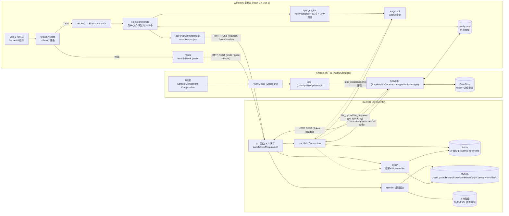

# 云梯 (FileSync) 架构说明文档

> 本文档描述三端（Android / Go 后端 / Windows 桌面端）的整体架构、技术栈、模块关系与已知问题，作为后续对话的统一背景参考，避免重复解释。
> 维护原则：描述「代码现状」而非「期望状态」，已定义但未实现的能力会明确标注为 **[仅 schema/未接线]**。

---

## 0. 一句话定位

这是一个**个人自托管文件传输/同步系统**，四端：Android（Kotlin/Compose）+ Windows 桌面（Tauri 2 + Vue 3 + Rust）+ HarmonyOS（ArkTS + ArkUI）+ Go 后端。客户端通过 HTTP（文件上传/下载/浏览）+ WebSocket（实时状态/同步任务）与 Go 后端交互；后端用 MySQL 存账户与传输记录、Redis 记在线设备与同步队列、本地磁盘存文件、WS 推送实时事件。

⚠ **同步链路现状（2026-07-19）**：**同步核心已闭环、双向真机实测通过**。Go 后端同步引擎全链路实现（Redis 队列 + worker + base CAS + 冲突保留两者 + scan 追赶比对 + **同内容幂等吸收/回声抑制** + 物理文件缺失自愈，见 §4.11）；**Windows 端**探测→上传→上报→执行闭环（§3B.6）+ **离线追赶机制已落地**（`catch_up.rs`：两阶段 stat 比对 + scan）+ **同步默认启用**（setup 自动启动 + 登录后补位）+ **个人中心/资料编辑/密码修改/头像** + **服务器地址设置**（`ServerSettings.vue`）；**Android 端**同步引擎落地（task 执行 + FileObserver 探测 + 连接追赶 + 冲突隔离 + 保活服务，§3.11），Windows↔Android 双向同步实测可用；**同步列表分页加载**（每页 10 条，滚动到底自动追加，FAB 回到顶部）+ **GC 优化**（`DateUtil`/`TimeUtils`/`parseIsoToMillis` 缓存格式化器，`HomeScreen` `forEach` 改 `items` 懒渲染）。**三端统一分片上传协议（blake3）**：`file_lib` v3（`fc_describe`）经 cgo（服务端）/JNI（安卓 `filecore_jni`，缺 .so 回退纯 Java）/原生（桌面）/NAPI（鸿蒙 `libfilecore.so`，缺 .so 回退纯 ArkTS `Blake3Util`）**四端**复用同一实现。**鸿蒙端 MVP 已落地**（§3C：login + 文件浏览 + 分片上传 + 下载 + 同步执行 download_only + 同步列表 + 设置；无 root、无文件监听，只接 task_created 不上报 file_changed）。**剩余核心尾巴见 §6.3 待办清单**（公网安全为首位）。

---

## 1. 系统全景


```mermaid
flowchart LR
    subgraph Desktop["Windows 桌面端 (Tauri 2 + Vue 3)"]
        VUE["Vue 3 视图层<br/>Naive UI 组件"]
        TSAPI["src/api/*Api.ts<br/>isTauri() 路由"]
        HTTP_TS["http.ts<br/>fetch fallback (Web)"]
        INVOKE["invoke() → Rust commands"]
        RUST_CMD["lib.rs commands<br/>用户/文件/同步域 ~25个"]
        RUST_API["api/ (ApiClient/reqwest)<br/>user|file|sync|ws"]
        CFG["SyncConfig<br/>server_url+token+folder_mappings"]
        ENGINE["sync_engine<br/>notify watcher + 防抖 + 上传调度"]
        WS_C["ws_client<br/>WebSocket"]
        VUE --> TSAPI
        TSAPI -->|Tauri| INVOKE --> RUST_CMD --> RUST_API
        TSAPI -->|Web| HTTP_TS
        RUST_CMD --> CFG
        RUST_CMD --> ENGINE
        ENGINE --> WS_C
    end

    subgraph Android["Android 客户端 (Kotlin/Compose)"]
        UI["UI 层<br/>Screen/Component Composable"]
        VM["ViewModel (StateFlow)"]
        APIA["api/ (UserApi/FileApi/WsApi)"]
        NET["network/ (Request/WebSocketManager/AuthManager)"]
        DS[("DataStore<br/>token+记住密码")]
        CFG[("config.conf<br/>外部存储")]
        UI --> VM --> APIA --> NET
        NET <--> DS
        NET <--> CFG
    end

    subgraph Go["Go 后端 (Gin/GORM)"]
        R["/v1 路由 + 中间件<br/>AuthToken/RequireAuth"]
        H["Handler (胖函数)"]
        WS["ws/ Hub+Connection"]
        SYNC["sync/<br/>引擎+Worker+API"]
        DS2[("Redis<br/>在线设备+同步队列/锁/进度")]
        DB[("MySQL<br/>User/UploadHistory/DownloadHistory/SyncTask/SyncFolder/...")]
        DISK[("本地磁盘<br/>D:/E:/F:/G: 任意路径")]
        R --> H
        R --> WS
        R --> SYNC
        H --> DB
        H --> DISK
        WS --> DS2
        SYNC --> DB
        SYNC --> DS2
        WS -.-> SYNC
    end

    NET -- "HTTP REST (Token header)" --> R
    NET -- "WebSocket (Token header/查询)" --> WS
    WS -. "file_upload/file_download 事件推回客户端" .-> NET

    RUST_API -- "HTTP REST (reqwest, Token header)" --> R
    WS_C -- "WebSocket (token query)" --> WS
    WS -. "task_created/conflict 推回桌面端" .-> WS_C
    HTTP_TS -- "HTTP REST (fetch, Token header)" --> R
```

数据流要点：
- **HTTP**：客户端每个请求带 `Token` 头；后端 `AuthToken`（非阻塞解析）+ `RequireAuth`（私有组阻塞校验）二级中间件；token 即将过期时后端用 `New-Token` 响应头无声续期。
- **WebSocket**：客户端连 `wss://host/file/v1/ws/connect`（注意路径前缀与 REST 的 `/v1` 不一致，见 §6）；WS 仅做事件路由/广播，不参与文件字节传输。
- **文件字节**：上传走分片协议 `init/chunk/complete`（blake3 校验，见 §9.5；旧 multipart 仍保留但客户端已弃用），下载走 HTTP Range 流式 `io.Copy`。

---

## 2. 技术栈速览

| 维度 | Android 前端 | Windows 桌面端 | Go 后端 (`new_server`) |
|---|---|---|---|
| 语言 | Kotlin 2.4.0 / JVM 11 | Rust (src-tauri) + TypeScript (Vue) | Go 1.25.3 + Rust(`file_lib/` 静态库经 cgo) |
| UI / 框架 | Jetpack Compose (BOM 2025.12) + Material3 | Tauri 2 + Vue 3 + Naive UI | Gin 1.12 + gin-contrib/cors |
| 网络 | OkHttp 5.3（手写封装） | reqwest 0.12（Rust）/ fetch（Web fallback） | Gin + gorilla/websocket |
| 序列化 | kotlinx-serialization-json 1.9 | serde_json (Rust) / TypeScript interface | encoding/json |
| 哈希 | blake3 (`io.github.rctcwyvrn:blake3`) | blake3 (Rust crate) / @noble/hashes (TS) | blake3 (`file_lib/` Rust 静态库) |
| 持久化 | DataStore Preferences | 无本地 DB；运行期 SyncConfig 内存缓存 | GORM + MySQL；Redis 在线设备+同步队列+上传会话 |
| 认证 | Token 头 / 下载用 query token | Token 写 Rust SyncConfig（Tauri）/ localStorage（Web） | JWT-HS256 (golang-jwt/v5) + bcrypt |
| 下载 | PRDownloader 0.6（断点续传） | build_download_url → 前端 fetch Range | HTTP Range / 206 Partial |
| WS | OkHttp WebSocket | tokio-tungstenite | gorilla/websocket |
| 配置 | 外部存储 config.conf (Properties) | set_sync_config invoke / localStorage | Viper config.yaml |
| DI | 无框架，`object` 单例 | Tauri managed state (`Arc<RwLock<T>>`) | 构造器闭包手动注入 |
| 测试 | 仅模板，无真实覆盖 | 无测试 | 无测试 |

Android SDK：`compileSdk/targetSdk 37`，`minSdk 24`，versionName 1.0，release 未开混淆。

---

## 3. Android 前端架构

### 3.1 包结构与分层
根包 `com.sunyuanling.filesync`（`app/src/main/java/com/sunyuanling/filesync/`）：

```
config.kt                 AppConfig 单例 + LogLevel（仅配置用）
MainActivity.kt           入口 Activity + FileSyncApp + AppInitializer
api/                      按域划分的 API 门面（object）
  ├ ApiRoutes.kt          路由常量（相对 /v1）
  ├ file/ (FileApi, FileParams, FileResponse)
  ├ user/ (UserApi, UserParams, UserResponse)
  └ ws/   (WsApi, WsParams, WsResponse)
network/                  传输层
  ├ request.kt            Request 单例：OkHttp + JSON 封装 + DataStore token
  ├ Response.kt           统一响应信封 Response<T> + PageData + 异常
  ├ Authmanager.kt        AuthManager：token 过期 SharedFlow 事件
  └ websocket.kt          WebSocketManager（注：package 声明仍为 com.example.filesync.data.sync）
dataClass/Download.kt     UI 下载模型
graph/                    导航图构造器 (Main/Auth/File/Monitor/Settings)
router/                   类型安全路由 AppDestination + AppNavHost（旧 AppRoute.kt 已废弃）
ui/
  ├ components/ (files/ home/ notice/ serverSetting/)
  ├ screen/     (Home/Monitor/files/monitoring/permission/person/transmission/)
  ├ theme/      (Color/Theme/Type)
  └ viewModel/  (data/ files/ home/ transmission/ user/)
util/                     (DateUtil/DeviceInfo/FileLogger/FileUtils/PermissionHelper/RootHelper/Blake3Util 等)
```

**架构模式**：MVVM（半 Clean，无独立 domain 层、无 use case）。分层表达：
- 数据/API 层：`api/*`（域对象门面）+ `network/*`（传输）。约定见 `api/file/FileApi.kt:1-3`：*"每个函数只组装参数 + 调 Request.xSuspend，不写业务逻辑"*。
- 展示层：`ui/viewModel/*`（ViewModel）+ `ui/screen|components/*`（Composable）。
- **无 Repository 抽象、无本地缓存**：每个界面打开都重新请求网络（如 `FileTransferListViewModel.kt:174`、`RecentFilesViewModel.kt:24`）。

ViewModel 暴露不可变 `StateFlow`，UI 用 `collectAsState()` 订阅；离散状态用 sealed class（`WsState`/`UploadState`/`RootStatus`/`SyncStatus`/`PPersonalState`/`FileTransferStatus`）。

### 3.2 网络层
核心 `network/request.kt`（`Request` 单例）：
- 单个 `OkHttpClient`，30s 超时，`retryOnConnectionFailure(true)`（`request.kt:57-62`）。
- `Json { ignoreUnknownKeys; isLenient }`（`request.kt:64-68`）。
- `baseUrl = "${AppConfig.getBaseUrl()}/v1"`（`request.kt:35`）——**`var` 在单例首次初始化时求值**，运行时改服务器配置后需手动重赋值（潜在陈旧 URL bug，见 §7）。
- **无 OkHttp Interceptor**：鉴权按需在每个 builder 上 `header("Token", token)`（`request.kt:234,301`）。
- 泛型 reified 方法：`get/post`（回调式）+ `getSuspend/postSuspend` + 低层 `requestSuspend`；全部在 `Dispatchers.IO`。
- 信封：后端返回 `{code, message, data}`，由 `Response<T>`（`network/Response.kt:9-19`）建模；`code != 200` 返回 `Result.failure`。
- **HTTP 401**：清 token + 广播 `AuthManager.TokenExpired`（`request.kt:241-245,325-329`）。
- **自动取 token**：`/user/login`、`/user/verify` 在白名单 `TOKEN_ENDPOINTS`（`request.kt:55`）触发 `tryExtractToken` 提取 `data.token` 并持久化。
- **分片上传**：不再走 `Request` 的 JSON 通道；`ChunkedUploader.kt`（`api/file/`）直接用 OkHttp 调 `init/chunk/complete`，`Semaphore` 并发 + `AtomicLong` 字节级进度 + `SessionGoneException` 自愈 + `CancellationException` 取消；哈希由 `util/Blake3Util.kt`（`io.github.rctcwyvrn:blake3`）算叶子/整文件/Merkle 树根。

WebSocket `network/websocket.kt`（`WebSocketManager`）：
- 独立 `OkHttpClient`（read timeout 0、20s ping），连 `AppConfig.getWsUrl()`，默认路径 `/file/v1/ws/connect`（`config.kt:103`）。
- 鉴权：`Token` 头 + `X-Device-Info` 头 + 设备信息查询参数（`websocket.kt:80-84,111-116`）。
- 状态 `StateFlow<WsState>`（Connecting/Connected/Disconnected/Error）+ 消息 `StateFlow<WsMessage?>`（Text/Binary）。
- 重连指数退避 `1.5s*2^n`，上限 30s，**硬编码最大 5 次**（`websocket.kt:51,178-184`）——与 `AppConfig.wsMaxReconnectAttempts`（默认 -1 无限）冲突，该配置项未被读取。
- 生命周期绑 Activity：`ON_START` 连（仅当有 token）、`ON_STOP` 断（`MainActivity.kt:175-187`）。

### 3.3 鉴权与登录流
- 登录 `ui/screen/person/LoginScreen.kt` → `UserApi.login` → 成功 `Request.saveCredentials` + `UserStore.setCurrent(user)` → 跳 `HomeDestination` 清栈。
- **`UserStore`**（`ui/viewModel/user/UserStore.kt`）：进程级可观察当前用户单例，`userInfo: StateFlow<UserInfo?>` + `isAdmin`（`role=="admin"`）。登录/verify 填充，登出清除。是 admin 功能判定的唯一可信来源。
- token 存 DataStore key `token`；「记住密码」存 **明文** `saved_username/saved_password`（`request.kt:50-52,103-133`）。
- 启动判定 `MainActivity.AppInitializer`：按权限/token/根权限选 `PermissionDestination`/`LoginDestination`/`HomeDestination`（`MainActivity.kt:109-128`）。
- 校验：`PersonalScreen` 调 `UserApi.verify()` → 成功 `UserStore.setCurrent`。
- 401 全局：`AuthManager` SharedFlow → `FileSyncApp` 收到后断 WS + Toast + 跳登录清栈。
- **无 refresh token 机制**，过期强制重登。

### 3.4 持久化
- **DataStore**（store 名 `"secure_prefs"` 但**未加密**，仅为 `preferencesDataStore`）：token + 记住凭证。
- **无 Room/SQLite/SharedPreferences**。
- **config.conf**：`ConfigManager` 读写 Java Properties 于 `<ExternalStorage>/FileSync/config.conf`（`ConfigManager.kt:12-17`），承载全部 `AppConfig` 字段（服务器地址/端口/HTTPS/超时/分块/并发/下载目录/同步开关/`persistentDownloadEnabled`/日志）。
- **下载任务持久化**：`DownloadStore`（`ui/viewModel/data/DownloadStore.kt`）在 `persistentDownloadEnabled` 开启时把未完成 `DownloadItem` 写 `<ExternalStorage>/FileSync/pending_downloads.json`，app 重启恢复。
- 日志：`<ExternalStorage>/FileSync/log/app.log` 轮转；下载：`<ExternalStorage>/FileSync/downloads`。

### 3.5 导航
- **Jetpack Navigation-Compose 类型安全路由**：`@Serializable` 目的地在 `router/AppDestination.kt`；`AppNavHost` 装配 5 个图（main/file/settings/auth/monitor）。
- 起点动态决定（见 §3.3）；底部 `NavigationSuiteScaffold` 由 `TopLevelDestination` 四标签驱动（Home/Files/Monitor/Personal），登录/权限页隐藏底栏。
- 监控：`MonitorDestination`（底部标签→`MonitorScreen` 面板）→ 卡片点进 `MonitorListDestination`（→`DevicesList` 设备列表页）。
- **旧 `router/AppRoute.kt` 是字符串路由遗留物**，未使用，属死代码。

### 3.6 文件传输逻辑（前端侧）
**下载状态源已收敛为单例 `DownloadController`**（`ui/viewModel/data/DownloadController.kt`），`DownloadListViewModel`/`FileTransferListViewModel` 均作薄壳订阅它。
- **`DownloadController`**（进程级单例）：持有 `downloads: StateFlow<List<DownloadItem>>`、PRDownloader id 映射、通知 id 映射；WS 消息观察；`addDownload/pauseDownload/resumeDownload/cancelDownload/retryDownload/removeDownload`。瞬时速度 = Δ字节/Δ毫秒（修原 createTime 平均速度 bug）。`attach()` 时若 `persistentDownloadEnabled` 开启则 `restorePendingDownloads()`。
- **前台服务 `DownloadService`**（`service/DownloadService.kt`）：有活跃下载时 `startForeground`(dataSync 类型)；前台通知带「暂停/恢复/取消」按钮，PendingIntent→Service→Controller；无活跃下载自停。
- **通知**：`DownloadNotificationHelper`（`ui/components/notice/NotificationHelper.kt`）`buildForegroundBase`/`notifyForeground`（单文件带 action）+ `showComplete`/`showFailed`。
- 下载用 PRDownloader（断点续传），URL 由 `FileApi.buildDownloadUrl` 构造，**token 放查询串**（PRDownloader 无法设头）。
- ✅ **上传**：走 `ChunkedUploader`（`api/file/ChunkedUploader.kt`）——分片 + blake3 + `Semaphore` 并发（默认3）+ `AtomicLong` 字节级进度 + `SessionGoneException` 自动重新 init 一次 + `CancellationException` 取消；`FileUploadViewModel` 改继承 `AndroidViewModel`，接入 `DeviceInfoUtil.getDeviceId`，加 `cancelUpload()`。旧 multipart 接口（`FileApi.checkFile`/`uploadFile`、`UploadParams`、`UploadData`、`CheckFileData`、`ApiRoutes.FILE_UPLOAD`）已删除。
- **实时状态**：解析 WS 消息 `type=="file_download"` 的 `event` start/completed。
- **[未接线]** `AppConfig.autoSyncEnabled/autoSyncIntervalMs/syncOnWifiOnly` 可配但无任何调度器消费——实时同步基底为下一轮目标。
- **PRDownloader 固有限制**：下载任务是进程内 int id，app 被杀无法自动续传旧任务；当前能做：前台服务期间稳定运行、通知栏可操作、被杀后重开可重试。真"被杀自动续传"需换 WorkManager/自建分块，属未来工作。

### 3.7 主要功能模块（按底部 4 标签）
1. **Home**：仪表盘（存储用量、在线设备数 [来自 `DevicesViewModel.getMyDevices` 真实数]、同步/服务器状态、最近下载、快捷上传/搜索、运行模式徽章）。
2. **Files**：远端文件浏览（可用磁盘列表、目录栈导航、目录选择器下载、上传页）。
3. **Monitor**：监控面板（服务器状态、在线设备卡片）→ `DevicesList` 设备监控页（见 §3.8）。
4. **Personal**：登录/资料查看/编辑资料。
- 外加：**Transfers**（`FileTransferListScreen` 筛选/排序/多选/删除，订阅 `DownloadController`）、**Settings**（服务端/传输/同步[含 root 可见的持久化续传开关]/日志/浏览/关于，经 `ConfigManager` 持久化）、**Permissions**、**Notifications**、**FileLogger**、**RootHelper**（root 设备 `su`）。

### 3.8 设备监控模块（新增）
- **`DeviceMonitorViewModel`**（`ui/viewModel/monitor/DeviceMonitorViewModel.kt`）：`refresh()` 先 `ensureUserStore()`（空则 verify 填充），按角色拉取——所有人加载「我的在线设备」`/ws/my-devices`；admin 额外加载「所有在线设备」`/ws/online`。WS 重连自动刷新。含平台标签映射（Android/鸿蒙/PC/Web/iOS）与 Go RFC3339Nano 时间解析。
- **`DevicesList.kt`**：两分区——「我的在线设备」（所有人）+「所有在线设备」（仅 admin 多出，每行显示归属用户）。设备卡片含平台图标/设备名/平台标签/IP/在线时长/版本号。key 加 `"my-"/"all-"` 前缀避免跨分区重复。
- **权限模型**：普通用户仅见自己账户在线设备；admin 多一个「所有在线设备」模块（后端 `GetOnlineUsers` 强制 admin 校验，不可越权）。
- **历史设备管理 [未实现]**：`Device` 模型已在 schema，监控页分区结构可平滑扩展第三模块。

### 3.9 持久化续传与 root 开关（新增）
- `AppConfig.persistentDownloadEnabled`（默认关）+ `ConfigManager` 持久化 + `DownloadStore` JSON。
- `SyncSettingsScreen` 加「持久化续传（Root）」开关，**仅 `RootHelper.checkRootAccess()` 通过才显示**。
- 约束：app 被杀后重开可恢复未完成任务续传；"被杀即实时续"需 root daemon + FileObserver，属未来工作（见 §9）。

### 3.10 同步入口 + 强制保活 + 同步列表（新增）
- **API 层**：`api/sync/`（`SyncApi`/`SyncResponse`）对齐后端 `/v1/sync/*`——`listTasks`/`pendingTasks`/`listConflicts`/`resolveConflict`/`deleteConflict`/`listFolders`；DTO 字段与 GORM 模型 json tag 严格一致。
- **强制保活**：`AppConfig.forceKeepAliveEnabled`（默认关，`ConfigManager` 持久化）→ 消费者 `service/SyncKeepAliveService`（dataSync 前台服务 + 常驻低优先级通知）：持有 WS 连接、30s 守护循环掉线重连、START_STICKY；开启时 `MainActivity` 的 ON_STOP **不再断开 WS**（连接归服务管），app 启动时若开关已开自动拉起服务。`SyncSettingsScreen` 提供开关 + 电池优化白名单跳转（`REQUEST_IGNORE_BATTERY_OPTIMIZATIONS`）。root 设备的进程级守护（LSPosed 看门狗拉起）在 app 外部，独立维护。
- **同步列表**：`SyncListScreen`（`SyncListDestination`，fileGraph）两 tab——「同步记录」(`/sync/tasks`) 与「待处理」（本设备 `/sync/tasks/pending` + 冲突 `/sync/conflicts`，冲突可 accept_server / keep_local / 删除）；VM `ui/viewModel/sync/SyncListViewModel`。
- **Files 页入口**：`file.kt` 磁盘列表首屏加「同步」卡片（同步设置 / 同步列表两行入口，副标题实时显示保活开关与 WS 连接状态）。
- ✅ `WebSocketManager` 重连上限接线 `AppConfig.wsMaxReconnectAttempts`（负数=无限，默认 -1），替换原硬编码 5 次；指数退避防溢出；新增不丢消息的 `events: SharedFlow`（缓冲 256，同步引擎订阅；`messageFlow` StateFlow 保留给旧订阅者）。

### 3.11 Android 同步引擎 + Rust 内核接入（新增，真正的同步）
- **Rust 内核（JNI）**：`Android/filecore_jni/`（cdylib，jni 0.21，path 依赖 `new_server/file_lib`）→ `app/src/main/jniLibs/*/libfilecore_jni.so`（`build.ps1`，需 NDK+cargo-ndk，见该目录脚本头注释）。Kotlin 门面 `core/FileCore`：`describe`（一趟 mmap+rayon 算叶子/树根/整文件哈希，走 file_lib v3 的 `fc_describe`，与服务端 `fc_finalize` 逐字节一致）/`hashChunk`/`merkleRoot`/`fileHashHex`；**.so 缺失自动回退纯 Java blake3**（Blake3Util），仅性能差。`ChunkedUploader.describe` 已优先走原生。
- **同步引擎** `sync/SyncEngine`（object，对齐 `SYNC_PROTOCOL.md`，行为对标桌面端）：
  - 执行派发：WS `file_sync/task_created`（经 SharedFlow，不丢）→ download（流式下载 + blake3 校验 + `.synctmp` 原子 rename 发布）/delete/mkdir → REST `complete/failed` 回报；in-flight 去重。
  - 探测上报：`RecursiveWatcher`（inotify 递归，动态补挂新目录）→ 2s 稳定窗防抖 + size/mtime 复查 → delete-before-upload + 分片上传 → REST `notify`（file_changed 带 `base_hash` CAS）→ 更新基线。
  - 连接追赶（每次 WS Connected）：拉 pending 任务执行 + 逐 folder「Phase1 先上传本地离线变更（带 base，冲突安全）→ Phase2 `scan` 全量清单交服务端比对补齐」——**流量爆发防护**：scan 是元数据级 hash 比对只传差异 + stat 缓存（size/mtime 未变不重算 hash）+ 上传/下载各 Semaphore(2) + `syncOnWifiOnly` 门控。
  - 冲突：收 `conflict` → 本地分叉隔离 `.syncpending/<conflictId>_<name>` + 主目录收敛服务端版；`conflict_resolved`：accept_server 丢副本 / keep_local 以 server_hash 为 base 回放重传。
  - 自写抑制：引擎自己发布/删除的路径 10s 内的 watcher 事件不回环上报。
- **存储**：`sync/SyncMappingStore`（**设备私有**的 folder→本地目录映射 + 本机启用，`FileSync/sync_mappings.json`——folder 定义在服务器由 Windows 端创建，映射各设备自理）；`sync/SyncBaseStore`（基线 hash + stat 快照，`FileSync/sync_base.json`，防抖落盘）。
- **UI**：`SyncFolderMapScreen`（`SyncFolderMapDestination`）——列服务器 folders，本机设置映射路径（可一键默认 `FileSync/sync/<名>`）+ 启用开关；Files 同步卡片加第三行入口，同步列表行副标题显示引擎状态。
- **接线**：`AppConfig.autoSyncEnabled` 正式有消费者——MainActivity 启动时与 `SyncKeepAliveService.onCreate` 都会（幂等）`SyncEngine.start`。
- **后端 file_lib v3**：新增 `fc_describe`（客户端描述计算），crate-type 加 rlib 供 JNI 依赖，`fc_abi_version()==3`，Go 测试同步更新、`.a` 已重建。

---

## 3C. HarmonyOS 鸿蒙端架构（`harmony/`）

> **本轮新增（2026-07-19）**。对标 Android 端落地 MVP，定位为 **download_only 同步客户端**（无 root、无文件监听）。
> 维护原则同 §3/§3B：描述「代码现状」，未实现能力标注 **[未接线]**。

### 3C.1 技术栈

| 维度 | 值 |
|---|---|
| 框架 | HarmonyOS NEXT / 5.0（API 22，Stage 模型，`runtimeOS: HarmonyOS`） |
| 语言 | ArkTS（TypeScript 子集，严格模式：禁止 spread / 对象字面量当类型 / 结构化类型 / Function.apply-call 等） |
| UI | ArkUI 声明式（@Entry/@Component struct + @State/@StorageLink + @Builder） |
| 构建 | DevEco Studio 6.0.2 + hvigorw + OHOS NDK + CMake + ninja |
| 网络 | `@kit.NetworkKit` 的 `http`（HTTP）与 `webSocket`（WS）；fetch fallback 不适用 |
| 序列化 | `JSON.parse` + 显式 interface 断言（无 kotlinx-serialization） |
| 哈希 | **Rust 内核 NAPI 复用**（见 §3C.6）；纯 ArkTS blake3 回退（`util/Blake3Util.ets`，移植官方 reference_impl.rs，已用 npm blake3 验证逐字节一致） |
| 持久化 | `preferences`（DataStore 等价物：token / 用户缓存 / 配置 / 凭据 / 设备 id / 下载任务 / 同步映射）；无本地 DB |
| 认证 | Token 头 / `?token=` 查询回退（WS）；JWT 续期由响应头 `New-Token` 自动捕获（见 §3C.4） |
| 下载 | `@ohos.net.http` Range 请求 + `@ohos.file.fs` 定位写（无 PRDownloader 等价物，自实现流式 + 断点续传）；`DocumentSaveDialog` 选保存位置；通知栏进度/完成/失败 |
| 保活 | `@kit.BackgroundTasksKit` 长时任务（`DATA_TRANSFER`）+ 通知栏常驻；权限 `KEEP_BACKGROUND_RUNNING` + `LOCATION` |
| Native | Rust 静态库 `libfilecore.a`（来自 `new_server/file_lib`，构建为 OHOS 三 ABI）+ C++ NAPI 包装 → `libfilecore.so`，ArkTS `import fileCoreNative from 'libfilecore.so'` 调用 |
| 设备 ID | 首次启动生成「时间戳 + 随机数」并 preferences 持久化（无系统级 UDID 权限） |

鸿蒙工程 monorepo 结构（DevEco 模板）：

```
harmony/
├ AppScope/app.json5               bundleName=com.example.file
├ products/sunyuanling/            入口模块
│  ├ build-profile.json5           含 externalNativeOptions 指向 cpp/CMakeLists.txt
│  ├ build.ps1                     构建 libfilecore.a for OHOS 三 ABI，落 cpp/prebuilts/
│  └ src/main/
│     ├ module.json5               权限 INTERNET/KEEP_BACKGROUND_RUNNING/LOCATION（公共目录用应用专属目录，无需文件权限）
│     ├ ets/
│     │  ├ app/                    AppConfig（运行期配置 + 持久化 + 变更广播）/ UserStore
│     │  ├ api/
│     │  │  ├ user/                UserApi + UserTypes（对标 Android api/user）
│     │  │  ├ file/                FileApi + FileTypes + ChunkedUploader（走 FileCore + delete-before-upload）
│     │  │  ├ sync/               SyncApi + SyncTypes（同步 REST + WS 事件 DTO）
│     │  │  └ ws/                 WsApi + WsTypes（设备监控 REST：getMyDevices/getOnlineUsers/getStats）
│     │  ├ core/FileCore.ets      Rust 内核门面（NAPI 调用 + 回退纯 ArkTS blake3）
│     │  ├ net/
│     │  │  ├ Request.ets         统一 HTTP 单例（信封校验 / 401 事件 / New-Token 续期 / postMultipart）
│     │  │  ├ Response.ets        ApiResponseData<T> + PageData + 异常
│     │  │  ├ AuthManager.ets     TokenExpired 回调列表（对标 SharedFlow）
│     │  │  └ WebSocketManager.ets  指数退避重连 + 消息回调分发
│     │  ├ download/
│     │  │  ├ DownloadController.ets  Range 流式 + 并发限制 + 通知 + AppStorage 响应式
│     │  │  ├ DownloadStore.ets   下载任务持久化（preferences JSON，重启恢复）
│     │  │  └ DownloadTypes.ets   DownloadItem + DownloadStatus（避免循环依赖）
│     │  ├ sync/
│     │  │  ├ SyncEngine.ets      download_only 引擎（接 task_created，公共下载目录落盘）
│     │  │  └ SyncMappingStore.ets  设备私有 folder→本地目录映射 + 启用状态持久化
│     │  ├ service/
│     │  │  └ BackgroundTaskHelper.ets  长时任务保活（DATA_TRANSFER + 通知栏常驻）
│     │  ├ util/
│     │  │  ├ Blake3Util.ets      纯 ArkTS BLAKE3（移植 reference_impl.rs，验证一致）
│     │  │  ├ DeviceInfo.ets      设备 id 持久化
│     │  │  └ NotificationHelper.ets  下载通知（进度/完成/失败）
│     │  ├ constants/ApiRoutes.ets 路由常量 + formatRoute（path 参数 %s）
│     │  ├ router/AppRoutes.ets   页面路由常量
│     │  ├ token/tokenManager.ets  preferences 持久化 token（内存缓存）
│     │  ├ sunyuanlingability/    EntryAbility（onCreate 初始化 7 个单例 + 恢复下载 + 保活）
│     │  └ pages/                15 个页面（Index/LoginPage/MainShell + 4 Tab + FileBrowse/Upload/Transfers/SyncList/Settings/ServerSettings/EditProfile/ChangePassword/DeviceListPage/SyncFolderMapPage）
│     └ cpp/
│        ├ CMakeLists.txt           链接 libfilecore.a + libace_napi.z.so → libfilecore.so
│        ├ napi_init.cpp            NAPI 包装（abiVersion/hashChunk/merkleRoot/describeFile）
│        ├ filecore.h               同 new_server/file_lib/filecore.h
│        ├ types/libfilecore/Index.d.ts   NAPI 模块的 TS 声明
│        └ prebuilts/<abi>/libfilecore.a  Rust 静态库（OHOS 三 ABI）
├ common/ + features/{adaptiveLayout,responsiveLayout}/   DevEco 模板（已无用，待清理）
└ oh-package.json5                 模板默认依赖（hypium + hamock）
```

### 3C.2 网络层（`net/Request.ets`）

- **统一 HTTP 单例** `Request`：对标 Android `request.kt`，所有 `get/post/put/delete` 经 `requestJson<T>()`：自动注入 `Token` 头（来自 `TokenManager` 内存缓存），读响应头 `New-Token` 静默续期；HTTP 401 或业务 `code==401` → 清 token + `authManager.notifyTokenExpired()`。
- **响应信封**：后端 `{code, message, data}`，`code==200 / 0 / undefined`（兼容 register 返回无 code）视为成功；返回**完整信封**（不脱壳，对标 Android，调用方既可读 data 也可读 message）。
- **downloadBuffer / downloadRange / probeDownload**：HTTP Range 下载专用，token 注入 query string；`probeDownload` 用 `Range: bytes=0-0` 探测 `Content-Range`/`Content-Length`/`Accept-Ranges`，**校验 HTTP 状态码**（403/404/500 抛异常），支持断点续传规划。
- **uploadChunk**：raw `application/octet-stream` body，按业务 `code` 区分 `200` / `422`（ChunkVerifyException）/ `404`（SessionGoneException）。
- **postMultipart**：手写 `multipart/form-data` boundary 拼装（文本字段 + 可选文件 part），用于 `update-info` 等需要表单+文件的接口。
- **ArkTS 限制适配**：禁用 spread（手动复制 `Record`），禁用对象字面量当类型（`RequestOptions` / `DownloadProbe` / `WaitQueueItem` 等显式 interface），对象字面量初始化 `Record` 时键名带引号避免被识别为接口形状。

### 3C.3 鉴权与登录流

- **登录**：`LoginPage` → `UserApi.login(params)` → 成功 `TokenManager.setToken` + `userStore.setCurrent(user)` → `router.replaceUrl(MAIN_SHELL)`。「记住密码」明文存 preferences（与 Android 一致，可换 EncryptedStorage）。
- **启动判定**（`Index.ets`）：无 token → LoginPage；有 token → 异步 `UserApi.verify()` 校正本地缓存用户：成功 setCurrent 后进入 MainShell；网络异常但有缓存用户 → 仍进入（离线容错，下次 401 由 AuthManager 处理）。
- **401 全局**：`AuthManager` 回调列表，`MainShell` 订阅 → 清用户/token + 跳登录页。
- **WS 鉴权**：`WebSocketManager.connect()` 拼 query `token=<jwt>` + Header `Token` + 设备信息 query；token 失效时 `AuthManager` 触发自动断 WS。

### 3C.4 文件传输（前端侧）

- **下载**（`DownloadController`）：进程级单例，`AppStorage` key `downloads` 持有 `DownloadItem[]`（替换引用触发 `@StorageLink`）；`addDownload` 支持 `targetUri` 参数（用户通过 `DocumentSaveDialog` 选择的保存位置）；**并发限制**（`maxConcurrentDownloads` 信号量 + 等待队列）；`Request.probeDownload` 探测支持 Range 后流式 `downloadRange(4MB/chunk)` + `fs.writeSync` 追加；暂停/取消经 `Map<id, boolean>` 信号；**通知栏**（`NotificationHelper`：进度/完成/失败）；**持久化**（`DownloadStore`：未完成任务落 preferences，重启 `restorePendingDownloads()` 恢复）。
- **下载保存位置**：`FileBrowsePage` 点文件 → `DocumentViewPicker.save()` 让用户选保存位置（`targetUri`）下载；取消/无 context 时 `DownloadController` 默认落**应用专属公共下载目录** `Download/云梯/下载`（`CloudLadderStorage.downloadDir()`，文件管理器可见）。
- **分片上传**（`ChunkedUploader`）：与 Android 同协议——算描述（**优先走 Rust 内核 `FileCore.describe`**，无内核或失败回退纯 ArkTS `Blake3Util` 单趟流式）→ `uploadInit` →（秒传直返）→ 并发 `runPool` 上传缺失分片 → `complete`；`SessionGoneException` 重新 init 一次，`ChunkVerifyException` 重试该片。**delete-before-upload**（先 `/file/delete` 删旧再 init，404 视为可忽略）。
- **文件读取**：ArkTS `@ohos.file.fs` 的 `ReadOptions` 自 API 11 起仅 `offset`（相对当前指针）+ `length`（**无 position**）；描述计算走顺序读（指针自然前进），分片上传 per-chunk `openSync` 拿独立 fd（指针=0，`offset` 即绝对位置）。
- **picker**：`@ohos.file.picker.DocumentViewPicker` 选本地文件，返回 `file://` URI 直接喂给 `fs.openSync` 与 `ChunkedUploader`。

### 3C.5 Rust 内核 NAPI 接入（**三端统一内核**）

- **构建**：`harmony/products/sunyuanling/build.ps1` 镜像 `Android/filecore_jni/build.ps1`，但目标是 OHOS Rust 三 ABI（`aarch64/armv7/x86_64-unknown-linux-ohos`），用 DevEco NDK 的 `clang/clang++/llvm-ar` 作 `CC/CXX/AR`，cargo 产物 `libfilecore.a` 拷到 `src/main/cpp/prebuilts/<abi>/`。
- **NAPI 包装** `cpp/napi_init.cpp`：暴露 `abiVersion()` / `hashChunk(data): Uint8Array|null` / `merkleRoot(leaves): Uint8Array|null` / `describeFile(path, chunkSize): Uint8Array|null`（packed `[file_hash(32)‖merkle_root(32)‖leaves(n*32)]`）；失败一律返回 null（对标 Android JNI），ArkTS 侧回退纯 ArkTS blake3（仅性能差，正确性等同）。`__attribute__((constructor))` 自动注册 NAPI 模块。
- **CMakeLists.txt**：链接 `prebuilts/${OHOS_ARCH}/libfilecore.a` + `ace_napi.z`（OHOS NAPI 运行时），输出 `libfilecore.so`，abiFilters `arm64-v8a` + `x86_64`（NEXT 不支持 `armeabi-v7a`）。
- **ArkTS 门面** `core/FileCore.ets`：`import fileCoreNative from 'libfilecore.so'`，`nativeAvailable` 启动时校验 `abiVersion()>=3`；`describe()` 优先走原生 `fc_describe`（mmap + rayon 并行），失败/不可用回退 `describeArkTS()`（纯 ArkTS 单趟流式，用 `Blake3Hasher`）。`ChunkedUploader.upload` 直接调 `FileCore.describe` 拿到 `Description`。
- **声明**：`cpp/types/libfilecore/Index.d.ts` 提供模块的 TS 类型（DevEco 当前 SDK 不强制校验，预留）。
- **三端一致性**：服务端 `fc_finalize`（cgo）、桌面端 `chunked_uploader::file_blake3_hex`（Rust crate）、Android `filecore_jni`（JNI）、**鸿蒙 `libfilecore.so`（NAPI）** 四端复用同一 `new_server/file_lib` 实现，blake3 叶子/树根/整文件哈希逐字节一致；纯 ArkTS `Blake3Util` 作为兜底也已用 npm `blake3` 包验证一致。

### 3C.6 同步引擎（download_only）

`sync/SyncEngine.ets`，对标 Android `sync/SyncEngine` 但**只执行不探测**：

- **启动**：`MainShell.aboutToAppear` → `syncEngine.start(ctx)`：注册 WS 消息/状态回调 + `wsManager.connect()` + 异步 `refreshFolders()`（拉 `SyncFolder` 列表 + 确保本地映射目录存在）。
- **本地同步目录（应用专属公共目录方案，`storage/CloudLadderStorage.ets`）**：⚠ 鸿蒙**手机**三条路全堵：`Environment.getUserDownloadDir()` 抛 `Capability not supported`（Full Mount 仅 2in1/平板）、`DocumentSelectMode.FOLDER` 选文件夹返回 `errorcode -1`（FolderSelection 仅 PC/2in1）、`request.agent` saveas 不能指向公共目录。**✅ 正解 = 应用专属公共目录**（QQ/微信同款）：`root = ${context.filesDir}/../Download/${context.applicationInfo.name}`（bundleName）→ 物理映射 `/storage/Users/currentUser/Download/<bundleName>/`，文件管理器转换层显示为「Download/应用名」+图标，**无需任何权限**，是**真实绝对路径**（native mmap/blake3 可用）。目录结构 `<root>/同步/<folder>/` + `<root>/下载/`；`SunyuanlingAbility.onCreate` 调 `cloudLadderStorage.init(context)` 即 `mkdirSync` 建好，全自动、无 picker、无权限弹窗。
- **执行派发**（接 WS `type==file_sync` + `content.event==task_created`）：
  - `download`：`Request.downloadBuffer` 整块下载到内存 → **对内存 buffer 直接算 blake3 校验**（`FileCore.hashBufferHex`，省一次读回）→ `fs.openSync(finalPath, CREATE|TRUNC)` 写公共目录（一次性 write，失败下轮 scan 重下）；成功回 `completeTask(id, file_hash)`。
  - `delete`：`fs.unlinkSync` 对应 relative_path；不存在视为已删，回 `completeTask`。
  - `mkdir`：`CloudLadderStorage.mkdirpUnder` 逐层建子目录，回 `completeTask`。
- **冲突**（接 `content.event==conflict`）：download_only 客户端无 watcher 能把本地分叉回放重传，**默认 `accept_server`**（自动调 `resolveConflict(id, 'accept_server')`，下次 download 同步会收敛为 trunk 版本）。
- **离线追赶**（每次 WS Connected，`catchUpRunning` 串行化防重连风暴并发）：① `SyncApi.pendingTasks(deviceId)` 拉本设备积压 pending 任务逐条 `executeTask`（复用 download/delete/mkdir 执行体）；② **扫描追赶**（对标 Android `catchUpFolder` 的 Phase2）——逐启用 folder `walk` 本地目录构建全量清单（目录项 + 文件项带 blake3，进程内 `hashCache` 按 path\|size\|mtime 缓存避免重连重算），`POST /sync/scan` 交服务端比对 trunk：**trunk 有本地无 → 补派 download**，补齐离线期间遗漏的下载。`triggerCatchUp()` 供 UI「重新对齐」手动触发。忽略 `.synctmp`/`.syncpending` 工作目录。
- **无 watcher / 无变更上报**：鸿蒙无 root 无文件监听能力，**不**实现 `RecursiveWatcher`、**不**调 `SyncApi.notify`（不主动上报本地变更）；download_only 无 Phase1 本地变更上传，本地变更走手动上传（`UploadPage`）触发，服务端不会为鸿蒙端派发 `file_changed` 事件回环。（scan 仅用于追赶时把本地清单交服务端比对补派下载，不含上传语义。）
- **保活**：`service/BackgroundTaskHelper.ets` 通过 `backgroundTaskManager.startBackgroundRunning(DATA_TRANSFER)` 申请长时任务 + 通知栏常驻「云梯同步服务运行中」；`SettingsPage` 保活开关直接调 `start()/stop()`；`SunyuanlingAbility.onCreate` 若 `forceKeepAliveEnabled` 已开则自动拉起。权限：`KEEP_BACKGROUND_RUNNING` + `LOCATION` + `APPROXIMATELY_LOCATION`。

### 3C.7 主要功能模块

1. **Home**：仪表盘——存储用量（聚合所有允许磁盘）、在线设备数（`WsApi.getMyDevices`）、WS 同步状态徽章、快捷操作（上传/文件/同步/传输）、最近下载列表（`FileApi.getDownloadHistory`）。
2. **Files**：可用磁盘列表 + 入口（上传 / 传输列表 / 同步列表 / **同步文件夹**）+ 进入 `FileBrowsePage` 浏览远端目录、点击文件弹 `DocumentSaveDialog` 选保存位置后下载。
3. **Monitor**：服务器在线状态（ping）、WS 连接状态、服务器地址、在线设备数（可点击进入 `DeviceListPage`）、存储用量进度条、刷新。
4. **Personal**：头像（`Image` 加载服务器 `${baseUrl}/static/${avatar}`）+ 用户名 + 角色徽章 + 账户信息（ID/状态/上次登录/注册时间）+ 菜单（编辑资料/修改密码/服务器地址/同步文件夹/同步列表/传输列表/设置）+ 登出。
- 外加独立路由页：
  - `DeviceListPage`：「我的在线设备」（所有人）+「所有在线设备」（仅 admin），设备卡片含平台图标/设备名/平台标签/IP/版本/在线时长；WS 重连自动刷新。
  - `SyncFolderMapPage`：只读展示保存位置（应用专属公共目录 `Download/云梯`）+ 列服务器 folders + 本机映射路径（`<root>/同步/<name>`）+ 启用开关（`SyncMappingStore` 持久化）。
  - `TransfersPage`（下载列表 + 进度 + 暂停/恢复/取消/移除）、`SyncListPage`（同步记录 + 待处理 + 冲突待办两 tab + WS 状态徽章）、`UploadPage`（picker 选文件 → 输入远端路径 → ChunkedUploader 进度）、`SettingsPage`（同步开关/保活/WiFi/分片大小/WS 状态）、`ServerSettingsPage`、`EditProfilePage`（**multipart 已接通**：用户名/邮箱/手机 + 头像选择上传）、`ChangePasswordPage`（接 `POST /v1/user/change-password`）。

### 3C.8 已知差距与待办（鸿蒙端）

- ✅ ~本地 multipart 上传~ → `Request.postMultipart` 已实现，`EditProfilePage` 已接通（含头像选择上传）。
- ✅ ~HomePage / MonitorPage 占位~ → 已实现完整仪表盘 + 监控面板 + DeviceListPage。
- ✅ ~下载持久化~ → `DownloadStore`（preferences JSON）+ `restorePendingDownloads()` 已接。
- ✅ ~同步映射 UI~ → `SyncFolderMapPage` + `SyncMappingStore`（公共下载目录，启用/禁用开关）。
- ✅ ~保活~ → `BackgroundTaskHelper`（长时任务 DATA_TRANSFER + 通知栏常驻）。
- ✅ ~下载通知~ → `NotificationHelper`（进度/完成/失败）。
- ✅ ~下载保存位置~ → `DocumentSaveDialog` 弹框选择。
- **AVPlayer / 文件预览**：未实现，下载完成的文件无 in-app 预览。
- **文件搜索**：未实现（Android 有 `FileSearchDestination`）。
- **多文件批量上传**：当前仅单文件上传（Android 支持多文件选择 + 队列）。
- **`HarmonyOS NEXT` ABI 限制**：仅支持 `arm64-v8a` + `x86_64`，**不支持 `armeabi-v7a`**（已在 build-profile.json5 abiFilters 中体现）。
- **features 模板残留**：`common/` / `adaptiveLayout/` / `responsiveLayout/` 是 DevEco 初始模板，已无用，待清理（oh-package 依赖也已断开）。
- **`router.back()` 已废弃**：DevEco 警告，待迁移到新导航 API（`Navigation` 组件）。

---

## 3B. Windows 桌面端架构（`filesync-desktop/`）

### 3B.1 技术栈

| 维度 | 值 |
|---|---|
| 框架 | Tauri 2（Rust 后端 + WebView 前端） |
| 前端 | Vue 3 + Vite + TypeScript + Naive UI |
| 后端（Rust） | Tauri commands + reqwest 0.12 + notify 6 + tokio + tokio-tungstenite + blake3 |
| 前端依赖 | @noble/hashes（blake3，Web 模式分片哈希，与 Rust 逐字节一致） |
| 持久化 | 无本地 DB；`SyncConfig.folder_mappings` 内存缓存，启动时从服务器 MySQL 拉取 |
| 状态管理 | Pinia store（Vue 侧）；`Arc<RwLock<SyncConfig>>` 共享状态（Rust 侧） |
| 路径别名 | `@/` → `src/`（vite.config.ts + tsconfig.json paths） |

### 3B.2 目录结构

```
filesync-desktop/
├ src/                        Vue 3 前端
│  ├ api/
│  │  ├ platform.ts           平台感知：token/server_url/device_id 读写
│  │  ├ http.ts               Web 模式 fetch 封装（对标 Rust ApiClient，含 httpPostRawBytes）
│  │  ├ user/ userApi.ts + userTypes.ts
│  │  ├ file/ fileApi.ts + fileTypes.ts + chunkedUploader.ts(@noble/hashes blake3，Web 模式分片)
│  │  └ sync/ syncApi.ts + syncTypes.ts
│  ├ competent/               页面级 composable（login/register/resetPassword/home + ServerSettings.vue）
│  ├ views/                   Vue 页面（dashboard/file/catalog/monitor/sync + transfer/ + logs/ + person/（PersonalCenter/EditProfile/ChangePassword））
│  ├ router/ store/ models/   路由 + Pinia store（含 useTransferStore.ts）+ 旧类型（兼容保留）
│  └ request/                 @syl/base-request workspace 包（已迁移，保留空壳）
└ src-tauri/src/
   ├ lib.rs                   Tauri 入口 + 全部 ~25 个 command 定义（setup 读 log_cfg 传 logger::init）
   ├ config.rs                SyncConfig + FolderMapping + FileConfig + LogConfig（持久化 config.yml）
   ├ app_paths.rs             运行目录定位（base/config + base/sync + base/log，对齐后端 ./log/）
   ├ logger.rs                级别过滤 + 按大小轮转（lumberjack 模式）+ 可选 stderr
   ├ device.rs                generate_device_id / hostname（device_id 仍用 sha256）
   ├ api/
   │  ├ client.rs             ApiClient（reqwest 封装，无状态，#[derive(Clone)]+ post_raw_bytes）
   │  ├ routes.rs             全部路由常量（与 Go 后端对齐，含分片上传 init/status/chunk/complete）
   │  ├ user/ api+params+response.rs
   │  ├ file/ api+params+response.rs（含 init/chunk/complete DTO）
   │  ├ sync/ api+params+response.rs
   │  └ ws/ types.rs
   ├ chunked_uploader.rs      blake3+Merkle+并发分片+断点续传+秒传+SessionGone 重试一次+file_blake3_hex
   ├ base_store.rs            BaseEntry {hash,size,mtime} 基线存储（old-format 自动迁移）
   ├ catch_up.rs              离线追赶：Phase1 stat 比对 + Phase2 scan 全量清单
   ├ sync_engine.rs           文件 watcher + 防抖 + 上传调度（should_ignore pub，含 .synctmp/.syncpending）
   ├ upload_worker.rs         自动同步上传 worker（走 chunked + delete-before-upload + action 字段）
   ├ ws_client.rs             WebSocket 连接（download_and_publish 走 blake3 校验；keep_local_reupload 走 chunked；WS 连接后自动 catch_up）
   └ watcher.rs               基础监听（监控页用）
```

### 3B.3 网络层设计（核心）

**所有网络请求统一在 `src/api/*Api.ts` 做平台分支：**

```
isTauri() == true   →  invoke() → Rust command → reqwest → Go 服务器
isTauri() == false  →  http.ts fetch() → Go 服务器（Web 部署模式）
```

- **Token**：Tauri 模式登录后写入 Rust `SyncConfig.token`，同时同步写一份 `localStorage`（供 web 模式 `http.ts` 复用）。
- **Server URL**：Tauri 模式默认 `http://localhost:8991`（`SyncConfig::default()`），可通过 `invoke('set_sync_config', ...)` 覆盖；Web 模式从 `localStorage` 读（`platform.ts:getServerUrl()`）。
- **Device ID**：Tauri 模式由 Rust `generate_device_id()` 生成并持有；Web 模式在 `localStorage` 用 `crypto.randomUUID()` 生成一次复用。

### 3B.4 Tauri Commands 清单

| 域 | Commands |
|---|---|
| 配置 | `set_sync_config`(可选 `log_level` 热切换), `get_sync_config`, `get_device_id` |
| 用户 | `login`（写 token 到 SyncConfig）, `verify`, `register`, `reset_password`, `update_profile`（multipart 表单+头像）, `change_password`（需旧密码验证，从 token 取当前用户） |
| 文件 | `get_available_disks`, `traverse_directory`, `upload_file`（本地路径→分片上传 blake3，emit `upload-progress-byte`）, `build_download_url`, `get_download_history`, `delete_download_history`, `delete_file`（文件管理 + 同步 delete-before-upload 复用）, `open_log_window_cmd` |
| 同步文件夹 | `create_sync_folder`（写服务器+自动加入 watcher）, `list_sync_folders`, `delete_sync_folder`（写服务器+清内存缓存）, `update_sync_folder` |
| 同步任务 | `list_pending_tasks`, `list_sync_tasks`(分页), `clear_sync_tasks`(批量清理), `list_conflicts`, `resolve_conflict`, `delete_conflict` |
| 引擎 | `start_sync`（拉服务器 folders→填充缓存→启动引擎，幂等）, `stop_sync`, `is_sync_running` |
| 监听 | `add_watch`, `remove_watch`, `list_watches`（基础监控页用） |
| 映射（低级） | `add_folder_mapping`, `remove_folder_mapping` |

### 3B.5 同步文件夹管理设计

**权威数据源：服务器 MySQL `sync_folders` 表**（含 `local_path / remote_path / direction / enabled / owner_device_id`）。

客户端**无本地持久化**，流程：

1. 注册新 folder：`create_sync_folder` → 服务器落库 → 自动更新 `SyncConfig.folder_mappings` 内存缓存 → 自动加入 watcher
2. 启动同步：`start_sync` → 拉 `list_sync_folders` → 填充内存缓存 → 启动 sync_engine → 开始监听所有 local_path
3. 删除 folder：`delete_sync_folder` → 服务器删除 → 清理内存缓存（watcher 在重启后自然消失）

`SyncConfig.folder_mappings` 是纯运行期缓存，应用退出即清零，下次启动重新拉服务器。

### 3B.6 同步链路已接通（桌面端）

桌面端同步上报/执行链路本轮已落地（详见 §4.11 后端冲突模型 + `SYNC_PROTOCOL.md`）：

- **配置目录**：`app_paths.rs` 以可执行文件所在目录为基准，建 `config/`(含 `config.yml`)、`sync/`、`log/`(运行目录下，对齐后端 `./log/`)；`config.rs` 启动读 `config.yml`（token 不落盘）。
- **日志**：`logger.rs` 全局日志——级别过滤（`Level` enum + `AtomicU8`）+ 按大小轮转（`filesync.log`→`.1`→`.2`…删除第 `max_backup+1` 个，对齐后端 lumberjack 策略）+ 可选 stderr；配置在 `config.yml` 的 `log` 段（`LogConfig`：level/file/console/format/max_size/max_backup/max_age）。`info/warn/error/debug` API 不变。独立日志窗口 `LogViewer.vue`（菜单「工具→打开日志窗口」+ 快捷键 `Ctrl+Alt+T`）。
- **file_changed 上报**：`upload_worker.rs` 上传后上报，带 `base_hash`（CAS 基线）；`base_store.rs` 记录每文件已知服务端 hash（统一 blake3），持久化 `config/state.json`。
- **task_created 执行**：`ws_client.rs` 下载走「写 `.synctmp` → 校验 blake3（`chunked_uploader::file_blake3_hex`，不匹配直接 fail）→ 原子 rename」原子发布；目标被占用回 `task_blocked`（转 `waiting_unlock`）。
- **冲突**：收 `conflict` → 隔离本地分叉到 `.syncpending/` + 收敛服务端版本 + 记待办；`conflict_resolved` 处理 `accept_server`/`keep_local`，后者走 `keep_local_reupload`（delete-before-upload + chunked 重新上传）。
- **多线程全量同步**：`start_sync` 末尾遍历目录把「无基线」文件入上传队列（`upload_workers` 并发）；下载用 `Semaphore(download_workers)` 限流。
- **UI**：`SyncManage.vue`（建同步文件夹/启停/状态/冲突 resolve）、`ViewCatalog.vue` 文件管理（`doUpload` 改 `Promise.allSettled` 并行上传，每文件走 `transferStore.startManualUpload` 独立追踪进度）；新增后端 `POST /v1/file/delete`。

#### 上传（统一分片协议）
- **桌面端双端实现**：`chunked_uploader.rs`（Rust）/ `chunkedUploader.ts`（Web 模式）——流式 blake3 + 叶子哈希 Merkle 树根 + 整文件哈希；`Semaphore` 乱序并发分片池；断点续传（init 返回已落盘位图，只补缺片）；秒传（整文件哈希命中跳过 chunk）；`SessionGone`（任一 chunk 收 404）自动重新 init 一次；进度回调 `Arc<dyn Fn(sent,total)>` / 闭包逐字节一致。
- **自动同步** `upload_worker.rs`：从 multipart+sha256 改走 `chunked_uploader::upload`；**delete-before-upload**（先 `DELETE /file/delete` 删远端旧文件再分片上传，解决"已存在文件上传被拒"）；base_store 存 blake3。
- **冲突 keep_local** `ws_client.rs::keep_local_reupload`：同样走 chunked_uploader + delete-before-upload。
- **哈希统一为 blake3**：`sha256_hex`/`sha2` import / `reqwest::multipart` import 已删；`chunked_uploader::file_blake3_hex` 流式 blake3 供下载校验复用。
- 注：`device.rs` 仍用 sha256 生成 device_id（非文件哈希，不变）；`sha2` crate 保留。

#### 传输列表 UI（新增）
- `useTransferStore.ts`（Pinia）：聚合 uploads/downloads/syncEvents 三类，监听 Tauri 事件（`upload-progress-byte`/`download-progress`/`sync-event`/`upload-progress`/`ws-status`），5s 轮询 `is_sync_running`+同步数据；`indicator` getter 按优先级返回图标态（upload>download>sync>idle）；`startManualUpload(entry, remoteDir)` 独立追踪每文件进度。
- `TransferList.vue`（路由 `/transfers`）：三 tab——上传（`NProgress` 进度条+字节）、下载（状态）、同步引擎（状态徽章+冲突待办+活动日志）。
- `home.vue`：用户名左侧加 `NBadge`+ElementPlus 图标（空闲 Files / 上传 Upload / 下载 Download / 同步 Loading+spin 动画），点击跳 `/transfers`；`onMounted` 调 `transferStore.init()`。

#### 仍存在的问题

- ✅ ~WS 连接认证失败~ → `ws_client.rs` URL 补齐 `/v1/ws/connect` 路径。
- ✅ ~`upload_file` / `keep_local_reupload` 一次性读整文件到内存~ → 改走 `chunked_uploader`。
- ✅ ~桌面端离线追赶机制~ → `catch_up.rs` 两阶段追赶：Phase1 stat 比对本地变更上传+notify（带 base CAS），Phase2 `POST /sync/scan` 全量清单交服务端比对。`base_store.rs` 存 `BaseEntry {hash,size,mtime}`。
- ✅ ~同步默认不启用~ → `lib.rs` `setup` 延迟 1s 自动启动 + `login.vue` 登录后补位 + `transferStore.init()` 兜底。
- ✅ ~服务器地址设置页缺失~ → `ServerSettings.vue`（头部齿轮图标 + 对话框，保存到 Rust `config.yml` + localStorage）。
- ✅ ~个人中心/资料编辑/密码修改~ → `PersonalCenter.vue`/`EditProfile.vue`/`ChangePassword.vue`，导航栏用户名头像+下拉入口。
- ✅ ~后端无密码修改接口~ → 新增 `POST /v1/user/change-password`（`changePassword.go`，从 token 取当前用户+验旧密码）。
- P2 重命名/移动语义：rename 被当成 delete+create。
- P3 Office 稳定窗口未做（Android 端已有 2s 稳定窗 + 复查，桌面未对齐）。
- 经 `/file/delete` 删同步目录内文件仅 `os.Remove`，不更新 trunk（属手动管理）。

---

## 4. Go 后端架构

### 4.1 目录与分层
```
new_server/
├ cmd/main.go            入口
├ config/ config.go + config.yaml   Viper 配置
├ file_lib/              Rust 静态库 libfilecore.a + C ABI（blake3 早校验/定位写/Merkle/finalize/move）+ README.md
├ internal/
│  ├ database/ db_connect.go(MySQL) redis_connect.go
│  ├ handler/ routers.go + file/ + user/   胖 Handler（file/ 含 upload_chunked/upload_chunk/upload_complete/upload_janitor/delete 等）
│  ├ middleware/ auth.go cors.go jwt.go(死) logger.go
│  ├ model/  GORM 模型（User/Upload/Download/SyncTask/SyncFolder/File/FileVersion/Device 等）
│  ├ ws/ hub.go connection.go handler.go types.go init.go router.go sync_events.go
│  ├ sync/ engine.go worker.go operations.go handler.go router.go types.go   同步引擎+REST
│  ├ repository/  [空]
│  ├ service/     [空]
│  └ internal_config/ [空]
├ pkg/ token/toekn.go(注意拼写) password/ logger/ device_store/ sync_store/
│     filecore/(cgo 绑定 file_lib) upload_store/(分片会话+Redis 位图) e/ jwtutil/ response/  [e/jwtutil/response 空，sync_store/filecore/upload_store 已实现]
├ SYNC_PROTOCOL.md  同步前后端对接契约（哈希 blake3，分片协议见 file_lib/README.md）
├ venv/ getKey.go + key.yaml   JWT 密钥（被 gitignore）
├ sql/init_mysql.sql  参考 DDL+种子（非 app 执行，靠 AutoMigrate）
├ static/avatar/      头像
└ log/server.log
```

**架构模式**：标准分层但**胖 Handler**——Handler 内联做校验/DB/业务/WS 通知；无 service/usecase、无 repository 抽象（目录为空，是「装出来的分层」）。手动构造器闭包注入 `*gorm.DB`/`*redis.Client`，无接口，难以单测。

### 4.2 启动序列（`cmd/main.go`）
`config.Init` → `logger.Init` → `gin.New()`(+cors+ZapLogger+Recovery) → `database.InitMySQL`(连接池 10/100,1h) → `db.AutoMigrate(17 模型，含 SyncFolder)` → `database.InitRedis`+ping → `ws.InitWS(db)` → `device_store.Init(redis)` → `sync.InitSync(db,redis,Conf.Sync)`（启动 N 个 worker goroutine + Reaper） → 注册 `/ping` 与 `handler.RegisterRouters(r,db,redis,syncEngine)` → `r.Run(:port)`。

### 4.3 路由与中间件
所有 API 在 `/v1` 组。中间件：
| 中间件 | 位置 | 作用 |
|---|---|---|
| gin-contrib/cors | `main.go:46` | CORS `*`，允许 `Token` 头，暴露 `New-Token`/`Token-Refreshed` |
| ZapLogger | `logger.go:15` | 结构化请求日志，debug 下捕获 body（截 4KB） |
| Recovery | `main.go:54` | panic 恢复 |
| AuthToken | `routers.go:16`/`auth.go:30` | **非阻塞**解析 token，置 `Auth` bool + `UserInfo` claims；剩余 <`refresh_expire` 时经 `New-Token` 头续期（`auth.go:60-82`） |
| RequireAuth | `routers.go:27`/`auth.go:95` | **阻塞**私有组校验，失败返回 HTTP200 body `code:401` |
| RequireRole | `auth.go:112` | 已定义但**未接到任何路由** |

死/重复代码：`middleware/jwt.go`（硬编码 `your-secret-key`）全死；`middleware/cors.go:Cors()` 与 `auth.go:CORS()` 都未被用（实际用 gin-contrib）。无限流。

### 4.4 全部 API 端点
公共（无需 token）：`GET /ping`、`POST /v1/ping`、`POST /v1/user/{register,login,reset-password,verify}`。
私有（RequireAuth）：
- `POST /v1/user/update-info`（multipart：username/email/phone + 可选头像）
- `POST /v1/user/change-password`（需 Token，验旧密码→改新密码）
- 文件 `POST /v1/file/{available-disks,traverse-directory,upload,download-history,delete-download-history,delete}`、`GET /v1/file/download`（支持 Range，query：path/name/device_id）
- 分片上传（重写版，详见 §9.5）：`POST /v1/file/upload/init`、`GET /v1/file/upload/status`、`POST /v1/file/upload/chunk`、`POST /v1/file/upload/complete`。旧 `POST /v1/file/upload`（multipart）仍保留但桌面/安卓已弃用。
- WebSocket：`GET /v1/ws/connect`、`GET /v1/ws/my-devices`（所有人，自己的连接）、`GET /v1/ws/online`（**仅 admin**，所有在线用户设备）、`GET /v1/ws/stats`、`GET /v1/ws/user/:id/connections`、`POST /v1/ws/{send,broadcast,group,group/send}`、`DELETE /v1/ws/{conn/:conn_id,user/:id,device/:device_id}`、`GET /v1/ws/group/:name/users`
- **同步**（`internal/sync/router.go`）：`POST/GET /v1/sync/folders`、`PUT/DELETE /v1/sync/folders/:id`、`POST /v1/sync/{notify,scan}`、`GET /v1/sync/tasks[?status=&device_id=&limit=]`（带 `page&page_size` 时返回分页形状 `{list,total,page,page_size}`）、`DELETE /v1/sync/tasks[?status=]`（批量清理终态记录，默认 completed+failed）、`DELETE /v1/sync/tasks/:id`（删单条终态记录）、`GET /v1/sync/tasks/pending?device_id=`、`POST /v1/sync/tasks/:id/{complete,failed,blocked}`、`GET /v1/sync/conflicts`、`POST /v1/sync/conflicts/:id/resolve`、`DELETE /v1/sync/conflicts/:id`

> `config.yaml:30-33` 的 whitelist（`/ping`、`/register`）是前缀匹配，与真实路径 `/v1/user/register` 不符；因 AuthToken 非阻塞故无害，whitelist 实为摆设。

### 4.5 数据库层
- **MySQL via GORM**，`InitMySQL`（`db_connect.go:17`），注入 zap GORM logger（200ms 慢查询、debug 打 SQL）。靠 `AutoMigrate` 维护 schema（每次启动跑，`main.go:64-83`）。
- `sql/init_mysql.sql` 是**参考 DDL+种子**（注释写明「从 PostgreSQL 迁移」），app 不执行；可能导致与 AutoMigrate schema 漂移（FK/注释/复合索引 AutoMigrate 不补）。
- **13 张表**（user/device/file/file_version/sync_task/upload_history/download_history/permission/role/role_permission/user_role/dict_type/dict_data/operation_log/storage_config/share_record）。
- ⚠ **关键现实**：16 模型中**仅 `User`、`UploadHistory`、`DownloadHistory` 被 handler 读写**。RBAC、File 元数据/version、SyncTask、ShareRecord、StorageConfig、OperationLog、Device、字典表全部 **[仅 AutoMigrate+种子，无业务代码]**。
- Redis 仅被 `pkg/device_store` 用（在线设备），业务 handler 的 `redisClient` 形参**从未被引用**（死参）。

### 4.6 鉴权与授权
- 无状态 **JWT-HS256**（`pkg/token/toekn.go`）。Claims：`UserID int64`、`Username`、`Email`、`Roles []string` + 标准注册项；`GenerateToken(...,expireDays)` / `ParseToken`。
- ⚠ **密钥来源**：并非 viper 的 `auth.secret`，而是 `venv.GetEncryptionKey()` 读 `venv/key.yaml`（`venv/getKey.go:24` 包 init）。`venv/` 被 gitignore → **全新克隆无法编译运行**，需手补 key.yaml。
- token 过期 `auth.token_expire`=7d，剩余<`refresh_expire`=1d 时自动续期（`New-Token` 响应头）。
- 密码 bcrypt（cost 10，`pkg/password/password.go`）。
- token 传输：`Token` 头，回退 `?token=` 查询（WS 客户端用）。
- **设备监控权限**：`ws/handler.go` 新增 `GetMyDevices`（所有人，返回自己连接）+ `isAdmin(roles)` 辅助；`GetOnlineUsers` 加 **admin 守卫**（`claims.Roles` 含 `admin` 才返回所有在线用户，否则 403）。admin 判定链路：登录 `userLogin.go:100` 把 `[]string{u.Role}` 写入 JWT → `AuthToken` 解析 → `GetOnlineUsers` 读 token Roles。
- ⚠ `RequireRole` 中间件仍未接线（admin 守卫是各 handler 内联判定，非全局中间件）。CORS `*`、WS `CheckOrigin:true` 仍在。`auth.enabled`/`auth.secret` 配置项未用。

### 4.7 文件操作（后端侧）
**上传** `handler/file/upload.go:22 HandlerFuncUpload`：
- 同时接 JSON 与 multipart（嗅探 Content-Type）。参数 `path/name/action∈{check,upload}`。
- 路径授权 `isPathAllowedDownload`（`download.go:232`）按 `config.Conf.File.AllowedPaths`（D:/E:/F:/G:）做盘符感知前缀匹配。
- 扩展名/大小/文件名长度校验（`allowed_extensions` 不写=允许所有；`forbidden_extensions` 默认空——见 §4.9；默认上限 10GB、名 ≤255）。
- `action=check`：`os.Stat` 报存在/大小/mtime（客户端文件名冲突预检）。
- `action=upload`：拒覆盖，`c.FormFile("file")` → **`c.SaveUploadedFile`（Gin 缓冲落盘，非流式/非分块）** → 写 `UploadHistory`（uploading→completed）。WS 推 `file_upload` start/failed/completed（仅起止无百分比）。**此旧端点客户端已弃用，桌面/Android 改走分片协议。**
- ⚠ 文件落盘到**客户端指定绝对路径**（任意允许盘根），`config.File.Storage.*`（base/upload/temp/trash）**定义但全未用**。

**分片上传**（`file_lib/` Rust 静态库 + cgo，`pkg/filecore/` Go 绑定 + `pkg/upload_store/` Redis 会话/位图）：
- `upload_chunked.go` init：校验描述自洽（叶哈希/树根/整文件/分片数/总大小）+ 秒传查重（整文件 blake3 命中）+ 建会话 + 预分配（`fc_preallocate`）。
- `upload_chunk.go` 单片：`fc_chunk_write`（blake3 早校验 + 定位写）；HTTP 码 404=会话过期 / 422=分片校验失败 / 200=成功；位图标记已落盘（幂等去重 + 断点续传）。
- `upload_complete.go`：`ShouldBindJSON` 读参数（曾因 `c.PostForm` 读不到 JSON body 出 bug，已修）→ `fc_finalize` 单趟校验 + 算整文件哈希 + `fc_move` 原子落盘 → 写 `File` 表 + 同步引擎派发 download/mkdir。
- `upload_janitor.go`：会话回收。
- 详见 `file_lib/README.md` + `SYNC_PROTOCOL.md`；哈希统一 blake3。

**下载** `handler/file/download.go:24 HandlerFuncDownload`：
- 同路径授权，拒目录；下载前先写 `DownloadHistory(pending)`。
- 全量 `serveFullFile`：设头后 `io.Copy` 流式（不全量入内存）。
- Range `serveRangeFile`：解析 `Range: bytes=`，`file.Seek`+`io.CopyN`，`206 Partial Content`+`Content-Range`，支持客户端续传/分片。
- MIME 用手写扩展名表（`getMimeType`，默认 `application/octet-stream`）。
- WS 推 `file_download` start/complete。

### 4.8 WebSocket 子系统
- **Hub**（`hub.go`）`sync.Once` 单例 + `Run()` goroutine；按 conn/user(多设备)/device/group 索引；**同设备单连**（新连挤掉旧连）；`SendToUser/Conn/Device/Group/Broadcast`，广播用 `sync.WaitGroup` 并发扇出。
- **Connection**（`connection.go`）每连 `readPump`/`writePump`/`heartbeatCheck` 三 goroutine；ping/pong（PongWait 60s、PingPeriod 54s、MaxMessageSize 512KB、SendBuf 256、90s 心跳超时关、5s 写超时）。
- **消息**（`types.go`）JSON 信封 `{id,type,from,target,content,timestamp,extra}`；type ∈ text/broadcast/system/heartbeat/ack/file_sync/notification；target ∈ user/conn/device/group/all。`init.go` 注册默认 handler：`file_sync` 走可注入的 `FileSyncMessageHandler`（见下），无 event 时回落到 target 路由；`notify`/`text` 按 target 路由、`broadcast` 发全员。
- **同步事件**（`sync_events.go`）：8 个 event 常量（`file_changed`/`task_created`/`task_progress`/`task_completed`/`task_failed`/`conflict`/`scan_request`/`scan_result`）+ `SetFileSyncHandler` 注入器（避免 ws↔sync 循环依赖）。`file_sync` 消息带 `event` 字段时由 `sync.Engine.handleWSMessage` 处理。
- **HTTP/WS 桥**（`handler.go:Connect`）升级后把设备写 Redis（`device_store.Online`，key `device:online:{id}` TTL 10s + `user:devices:{uid}` set）。
- 后端**已具备** `file_sync` 服务端编排：见 §4.11 同步引擎。

### 4.9 配置
Viper 读 `config/config.yaml`（`SetConfigName("config")`、`AddConfigPath("./config")`）+ `AutomaticEnv()` → `var Conf = new(Config)`（`config.go:11`）。结构含 db/redis/log/whitelist/auth/server/file/user/**sync**；helper `IsExtensionAllowed`/`IsPathAllowed`（盘符前缀校验，file 与 sync 共用）/`GetAllowedPaths`。`config.yaml` 关键值：MySQL `syncfile@127.0.0.1:3306/syncfile`（密码 123456）、Redis `127.0.0.1:6379 db0`、`server.port=8991`、token 7d、refresh 1d、允许盘 D/E/F/G、头像 ≤~50MB、sync.worker_concurrency=4/max_retry=3/lock_ttl=300s/task_timeout=600s。**log 段**：`path=./log`、`level/format/json/console(file)/max_size(MB)/max_age(天)/max_backup`——lumberjack 按大小轮转策略（与桌面端 `LogConfig` 字段命名一致，见 §3B.6）。**文件上传扩展名策略**：`file.upload.allowed_extensions` 不写=允许所有；`forbidden_extensions` 默认注释掉（空）。**真实 JWT 密钥在 `venv/key.yaml`，与 `config.yaml.auth.secret` 无关**。

### 4.10 并发与后台任务
- **同步 worker**：`sync.InitSync` 启动 `WorkerConcurrency`(默认4) 个 goroutine `BRPOP` Redis 队列 `sync:queue`，目标设备在线则置 syncing + 发文件锁(SetNX TTL) + WS 推 `task_created`；Reaper goroutine 30s 扫超时任务重试、扫 pending+在线补入队。
- 并发原语：Hub goroutine + 每连三 goroutine + N worker + Reaper；`sync.RWMutex` 护 Hub map 与 Connection 状态；`sync.Once` 护 Hub/连接关闭；Redis pipeline/SetNX 护在线设备与同步锁。
- `storage_config.last_sync` 仍 **[无消费方]**。

### 4.11 同步引擎（`internal/sync/`）— 已实现
后端定位为「接收客户端上报 → 编排 → 推任务给目标设备」，文件探测在客户端（Android root daemon / Windows Rust watcher / 鸿蒙 download_only）。
- **Redis 存储层** `pkg/sync_store/sync_store.go`：`sync:queue`(List+BRPOP)、`sync:lock:file:{sha256[:16]}`(SetNX TTL)、`sync:progress:{id}`(HSet,24h TTL)、`sync:pending:user:{uid}`(计数)。
- **引擎** `engine.go`：WS 回调 `handleWSMessage` 分发 `file_changed`/`task_progress`/`task_completed`/`task_failed`/`scan_result`；`HandleFileChange` 做元数据 upsert(File 表启用)+冲突检测(FileHash 双变则推 `conflict` 事件+入库冲突记录)+向其它在线设备派发 download/delete/mkdir 任务；`relative_path` 经 `cleanRelPath` 清洗 `..` 防穿越。
- **Worker** `worker.go`：BRPOP 出队 → 目标在线 + 文件锁 → 置 syncing → WS 推 `task_created`(含 remote_dir)；Reaper 兜底超时重试与离线积压补发。
- **操作** `operations.go`：Complete/Fail/Progress 回调、`HandleScan` 离线重连全量比对补任务、Folder CRUD、Task 查询、Conflict 列表/解决。
- **REST** `handler.go`+`router.go`：见 §4.4 `/v1/sync/*`。
- **冲突策略**：保留两者——服务端拒收新版本，推 `conflict` 让源端本地改名加 `.{conflict_suffix}` 后缀重报；冲突记录入库，`DELETE /sync/conflicts/:id` 供后续清理残留。
- **协议契约**：`SYNC_PROTOCOL.md`（WS 事件字段 + REST 接口签名）。
- **客户端侧 [未接线]**：Android `SyncEngine`+root daemon 待做；Rust 桌面端有 watcher 但需补 `device_id`/`file_changed` 上报/算 hash/接 `task_created`。

---

## 5. 前后端契约

### 5.1 统一响应信封
`{ "code": int, "message": string, "data": T }`，`code==200` 成功。前端 `Response<T>` 建模。
⚠ 例外：`POST /v1/user/register` 返回 `{message,user}` **无 code**，前端 `Request` 的 code==200 校验恒失败（`UserApi.kt:25-33` 有 TODO）。分页存在两套模型：`Response.PageData` vs `FileResponse.Pagination`，稍不一致。

### 5.2 DTO 约定
前端字段 camelCase + `@SerialName("snake_case")` 对齐后端 `json` tag（约定见 `FileParams.kt:1-4`）。每域有 `*Params.kt`（请求 DTO）+`*Response.kt`（响应 DTO）配对。

### 5.3 鉴权契约
- HTTP：`Token: <jwt>` 头（下载亦支持 `?token=`）。续期靠 `New-Token` 响应头。
- WS：`Token` 头（受限于客户端库，Android 同时把 token 放查询串）。
- 401 → body `code:401`（私有组）/ 清 token 重登。

### 5.4 WebSocket 消息协议
信封见 §4.8。当前真正流转的事件：
- 后端 → 客户端：`file_upload`（start/failed/completed）、`file_download`（start/complete）、`file_sync`（同步引擎派发的 `task_created`/`task_progress`/`task_completed`/`task_failed`/`conflict`/`scan_request`）。
- 客户端 → 后端：`file_sync`（`file_changed`/`scan_result`/`task_progress`/`task_completed`/`task_failed`，带 `event` 字段走引擎编排）、`text`/`broadcast`（Hub 按 target 路由）。
- 同步事件字段契约详见 `new_server/SYNC_PROTOCOL.md`。

### 5.5 文件传输约定
- 上传：分片协议 `POST /v1/file/upload/{init,chunk,complete}` + `GET /v1/file/upload/status`，blake3 校验（叶子/树根/整文件），落盘即成品无需拼接，支持乱序/并发/断点续传/秒传（详见 §9.5）。旧 multipart `POST /v1/file/upload`（字段 `path/name/action=upload` + 文件 part `file`，先 `action=check` 冲突预检，10GB 上限单次缓冲落盘）仍存在但客户端已弃用。
- 下载：`GET /v1/file/download?path=&name=&device_id=`，支持 `Range` 续传。
- 路径必须落在 `File.AllowedPaths`（默认 D:/E:/F:/G:）盘符前缀内，大小写不敏感（Windows）。
- 哈希统一 blake3（同步链路文件哈希、base_store、下载校验、分片描述均用）；`device.rs` device_id 仍用 sha256（非文件哈希）。

### 5.6 已知前后端不一致
| 项 | 前端 | 后端 | 说明 |
|---|---|---|---|
| WS 路径前缀 | `/file/v1/ws/connect` | `/v1/ws/connect` | 前端 config 默认多 `/file` 前缀，需核实网关/反代是否补齐 |
| register 响应 | 期望 `{code,...}` | 实际 `{message,user}` | 前端 TODO 标注调用恒失败 |
| multipart | `Request` 不支持 | `update-info` 仍需 multipart | 前端绕过 `Request` 直接造请求（文件上传已改分片，不再走 multipart）|
| token 位置 | HTTP 头 / 下载放查询 | 头优先、查询回退 | 已对齐 |
| 下载 history 字段 | `deviceId` 形参 Int? | 设备 id 为 string | `DownloadList.kt:134,409` 有类型混用 |

---

## 6. 架构合理性评估

### 6.1 设计合理之处
1. **前后端技术选型匹配场景**：Compose+MVVM、Gin+GORM+MySQL 对个人自托管系统是合适且主流的轻量栈。
2. **二级鉴权中间件**（非阻塞解析 + 阻塞守卫）+ 滑动窗口 `New-Token` 续期，是兼顾安全与体验的好做法。
3. **下载 Range/206 流式**（`io.Copy`）内存高效且可续传。
4. **WS Hub 设计扎实**：多设备/同设备单连/groups/ping-pong/心跳超时/优雅关闭、广播并发扇出。
5. **跨切面基础设施（pkg/）清晰**：token/password/logger/device_store 拆分得当；zap+lumberjack+GORM 适配器含慢查询捕获。
6. **上传防御性校验**（扩展名黑白名单、大小、文件名长度、盘符感知路径白名单）到位。
7. **前端文档与约定自律**：大量文件头注释、DTO snake/camel 约定、sealed 状态类型、类型安全导航。

### 6.2 架构层面问题（需关注）
1. **「同步」基本闭环（仅 Android + UI 待补）**：**后端同步引擎已实现**（§4.11：Redis 队列 + worker + 冲突检测 + WS 派发 + Folder CRUD/Task 回调/Scan 比对）；**Windows（Rust 桌面端）同步链路已跑通**（§3B.6：watcher + blake3 + `file_changed` 上报 + ws_client 执行 `task_created` + 冲突保留，同步上传/keep_local 已切 blake3 分片协议）。**剩两块**：① 桌面端「冲突待办/同步任务列表」UI 简陋（功能已通，界面不行，但传输列表 UI 已落地 `/transfers`）；② Android 端尚未接（无 root daemon/FileObserver，autoSync 标志暂无消费方）。
2. **后端「装出来的分层」**：service/repository/internal_config/pkg(e|jwtutil|response) 全空 → 实为胖 Handler，与目录暗示的 clean 架构不符，易误导。要么补分层，要么删空目录、按真实结构重命名。
3. **schema 与实现脱节（部分消化）**：落地模型升至 6 个（User/Upload/Download/**SyncTask/SyncFolder/File**）。仍未落地：FileVersion(版本历史未写)/RBAC(Permission/Role/RolePermission/UserRole)/DictType/DictData/OperationLog/StorageConfig/ShareRecord/Device 表。文档对外承诺仍须区分「schema-defined」与「functional」。
4. **构建/密钥风险**：`venv/` gitignored 但 `pkg/token` 编译期依赖其 `init()`，新克隆不能 build。`config.yaml.auth.secret` 是死配置，真实密钥在 key.yaml，密钥管理不一致。
5. **无 Repository/无缓存的纯网络依赖前端**：每屏重拉，无离线能力，且 ViewModel 直连 API object，缺抽象层。`baseUrl` 单例初始化求值 + 运行时改配置不重赋值 = 陈旧 URL bug。
6. **安全面**：前端明文存密码、"`secure_prefs`" 未加密、cleartext 全开、过度权限（SMS/联系人/相机/麦克风未被代码用）；后端 CORS `*`、WS `CheckOrigin: true`、`RequireRole` 未接线致 admin 端点开放。
7. ✅ ~上传单次缓冲落盘~ → 改分片协议（§9.5）：`file_lib` cgo + `upload/init|chunk|complete`，blake3 早校验 + 定位写 + Merkle 合并 + 原子落盘；三端（Rust `blake3` / TS `@noble/hashes` / Android `rctcwyvrn:blake3`）逐字节一致。旧 multipart `SaveUploadedFile` 端点保留但客户端已弃用。
8. **死代码/半成品迁移残留**：前端 `com.example` 包（websocket.kt）、死 `AppRoute.kt`、stub `DevicesViewModel`、未消费的 WS 重连/日志配置；后端死 `middleware/jwt.go`(硬编码 secret)、死 cors、`redisClient` 死参、拼写 `toekn.go`、误导性 `venv` 命名。
9. **schema 双源**：AutoMigrate vs `init_mysql.sql` 会漂移；README 仍写 PostgreSQL（实际 MySQL），文档需更新。
10. **无测试**：前后端均无真实测试覆盖，重构风险高。

### 6.3 结论
架构**骨架合理、基础设施扎实**。**后端同步引擎已落地**；**Windows 桌面端网络层已统一**（TS 全部走 invoke/fetch，两套 HTTP 客户端问题消除），Tauri command 集完整（~25 个），平台适配器模式支持 Web 部署；**分片文件传输协议已三端落地**（blake3，§9.5）；传输列表 UI 已落地（`/transfers`）。

当前主要落差：**Windows 桌面端同步已闭环、实测可用**，仅「冲突待办/同步任务列表」UI 简陋（传输列表/进度面板已有，但冲突收件箱语义仍弱）；**Android 端同步未做**（无探测）。

**当前待办清单（2026-07-12 更新，按优先级）：**

**核心尾巴（不做完不算"同步核心完成"）**
① ✅ ~~桌面端离线追赶机制~~ → `catch_up.rs` 已落地，对齐 Android 两阶段追赶。✅ ~~桌面端同步默认启用~~ → setup 自动启动 + 登录补位。✅ ~~服务器地址设置 UI~~ → `ServerSettings.vue`。
② **服务端 sync 引擎集成测试**：CAS 快进/冲突/scan 比对/幂等吸收/物理缺失自愈——同步是状态机系统，目前零自动化覆盖，全靠三端手工联调。
③ **公网安全一轮**（服务经 DDNS 公网暴露中）：CORS `*`、WS `CheckOrigin:true`、`RequireRole` 未接线、venv 密钥分发、download token 走 query（进访问日志）、Android 明文记住密码。
④ **Android 列表 GC 崩溃**：主页 `forEach` 在 `item{}` 内非懒渲染 + `parseIsoToMillis` 每次 new Regex/SimpleDateFormat——已修复为 `items()` 懒渲染 + `ZonedDateTime.parse` 零分配 + `DateUtil`/`TimeUtils` 缓存；`SyncListScreen` 改分页 10 条+滚动加载更多+FAB 回顶。待真机验证。

**完善级（核心闭环后的体验/健壮性迭代）**
④ 重命名/移动语义（MOVED cookie 配对，避免 delete+create 断版本史）
⑤ Office 稳定窗（桌面对齐安卓的 2s 稳定窗+复查）
⑥ 冲突 keep_local 子目录回放（安卓按根目录名回放，靠重扫兜底）
⑦ 桌面端服务器地址设置 UI；清死代码/空目录；file_version 查看与回滚 UI
⑧ 鸿蒙端（**已落地 download_only MVP**，§3C）；root 看门狗模块（仅 Android 适用）；应用内更新（§9.4）

已完成项（历史）：~桌面冲突收件箱/任务列表 UI~（传输列表 + 同步记录分页/清理已落地）、~分片传输协议~（§9.5）、~Android 同步~（§3.11）、~**鸿蒙端 MVP**~（§3C：login + 文件浏览 + 分片上传 + 下载 + 同步执行 download_only + 同步列表 + 设置，Rust NAPI 内核四端统一）。

---

## 7. 已知问题清单（供后续对话引用）

> ✅ = 本轮已解决；保留历史项为已完成项的审计记录。

**前端**
- P1 `network/websocket.kt` package 仍为 `com.example.filesync.data.sync`，应改 `com.sunyuanling.filesync.*`；测试包同病。
- P1 `AppConfig.autoSync*`/日志系列配置项 **未接线**（`wsMaxReconnectAttempts` ✅ 已接线：负数=无限重连，`forceKeepAliveEnabled` ✅ 已接线：SyncKeepAliveService，见 §3.10）。
- P1 `Request.baseUrl` 单例 init 求值，改服务器配置后需手动重赋值。
- P2 DataStore `"secure_prefs"` 未加密；「记住密码」明文存。
- P2 cleartext 全开（`network_security_config.xml`）；`AndroidManifest` 过度权限且 `MANAGE_EXTERNAL_STORAGE` 重复声明。
- P2 `/user/register` 响应无 code 致前端校验恒失败（`update-info` 仍走 multipart 绕过 `Request`）。
- P3 `router/AppRoute.kt` 死代码；`MonitorScreen.kt` 内塞 FileDetail/Search/About 多屏；分页模型重复。
- P1 **同步客户端待接线**：`AppConfig.autoSyncEnabled/autoSyncIntervalMs/syncOnWifiOnly` 仍无调度器消费；无 `SyncEngine`/root daemon/FileObserver；后端同步引擎已就绪（§4.11），需 Android 侧补上报 `file_changed`+接 `task_created`（契约 `SYNC_PROTOCOL.md`）。（注：上传链路已改分片，但同步探测仍未接 → **[未接线] autoSync** 维持）
- ✅ ~`FileUploadViewModel` 走 multipart~ → 改走 `ChunkedUploader`。
- ✅ ~`DevicesViewModel` 桩~ → 调 `WsApi.getMyDevices` 返回真实设备数。
- ✅ ~下载状态多实例/进度不同步~ → `DownloadController` 单例 + 前台服务。
- ✅ ~`DownloadList` deviceId 类型混用~ → `DownloadItem` 加 `deviceId`。
- ✅ ~废弃文件清理~ → 已删除。
- ✅ ~监控路由 bug~ → 改绑 `MonitorListDestination`。
- ✅ ~同步记录不分页/GC 崩溃~ → `SyncListScreen` 分页 10 条+滚动加载+FAB 回顶；`HomeScreen` `forEach`→`items()`；`DateUtil`/`TimeUtils`/`parseIsoToMillis` 缓存格式化器。

**Windows 桌面端**
- ✅ ~WS 连接认证失败~ → URL 补齐 `/v1/ws/connect`。
- ✅ ~`upload_file` / `keep_local_reupload` 整文件读内存~ → 改走 `chunked_uploader`。
- ✅ ~桌面端离线追赶机制~ → `catch_up.rs` 两阶段追赶（§3B.6）。
- ✅ ~同步默认不启用~ → setup 自动启动 + 登录补位 + 前端兜底。
- ✅ ~服务器地址设置页缺失~ → `ServerSettings.vue`（齿轮图标+对话框）。
- ✅ ~个人中心/资料编辑/密码修改~ → `person/` 三个页面 + 导航栏头像下拉入口。
- ✅ ~后端无密码修改接口~ → 新增 `POST /v1/user/change-password`。
- P2 重命名/移动语义：rename 当 delete+create 处理。
- P3 Office 稳定窗口未做。
- ✅ ~`file_changed` 上报 / `task_created` 执行待接线~ → 已落地。
- ✅ ~配置无持久化~ → `config/config.yml` + `base_store` `config/state.json`。
- ✅ ~无日志可见~ → `logger` + 独立日志窗口。
- ✅ ~`builder error`~ → `SyncConfig::default()` server_url 默认值。
- ✅ ~两套 HTTP 客户端并存~ → 统一走 invoke / fetch fallback。
- ✅ ~重启丢失 folder_mappings~ → `start_sync` 从服务器拉取。
- ✅ ~无统一传输可视化~ → `useTransferStore` + `TransferList.vue` + 顶栏指示徽章。
- ✅ ~同步哈希不统一~ → 统一 blake3。
- ✅ ~Vite 未代理 `/static`~/~ → `vite.config.ts` 加 `/static`+`/v1` 代理。

**后端**
- ✅ ~scan 比对恒 0 行~ → `scan.go` 的 `file_path LIKE 'E:\FileSync\%'` 中反斜杠被 MySQL LIKE 当转义符吃掉，永远匹配不到 Windows 路径 → 改 `ESCAPE '|'` + 元字符转义。此 bug 曾导致安卓离线追赶完全失效。
- ✅ ~sync_task INSERT 全部失败（Error 1364）~ → 物理表残留 init_mysql.sql 的 `device_id bigint NOT NULL` 列（模型无此字段，AutoMigrate 不清理）→ 已 DROP。**教训：schema 双源漂移是真事故源，init_mysql.sql 与 AutoMigrate 需收敛。**
- ✅ ~秒传（instant）三端协议 bug~ → 服务端 init 秒传分支不建会话，客户端却照样调 complete → 404"会话不存在"报上传失败且不上报 file_changed；且该分支不做同步派发。修复：服务端 init 加 `device_id` 入参 + 秒传时走 `HandleUploadComplete` 派发（响应带 `synced`）；三端客户端（Rust/TS/Kotlin）instant 时不再调 complete、就地合成结果。
- P1 `venv/` gitignored 但编译依赖 → 新克隆不能 build；`auth.secret`/`auth.enabled` 死配置。
- P1 `RequireRole` 中间件仍未接线（admin 守卫靠各 handler 内联 `isAdmin`，非全局）；CORS `*`、WS `CheckOrigin:true`。
- P1 service/repository 等空目录误导；handlers 形参 `redisClient` 死参（file/ws handler 未用）。
- P2 旧 `upload.go` `SaveUploadedFile` 缓冲落盘仍保留（客户端已弃用，改走分片协议）；`File.Storage.*` 配置未用、文件落任意盘路径。
- P2 死代码：`middleware/jwt.go`(硬编码 secret)、`middleware/cors.go`/`auth.go:CORS()`；拼写 `toekn.go`；`venv` 命名误导。
- P3 AutoMigrate vs `init_mysql.sql` schema 漂移；README 仍写 PostgreSQL；无测试。
- ✅ ~admin 端点对所有登录用户开放~ → `GetOnlineUsers` 加 admin 守卫；新增 `GetMyDevices` 供所有人。
- ✅ ~`sync_task` 表无 handler/worker，file_sync 仅客户端间路由~ → 新增 `internal/sync/` 引擎 + worker + 冲突检测 + REST `/v1/sync/*`；`file_sync` 接入服务端编排。
- ✅ ~路径校验重复且 `IsPathAllowed` 死代码~ → 提升为 `config.Conf.IsPathAllowed` 盘符前缀校验，file/sync 共用。
- ✅ ~分片上传协议未实现~ → `file_lib/`(Rust 静态库 `libfilecore.a` + C ABI) + cgo `pkg/filecore/` + `pkg/upload_store/`(Redis 会话+位图) + handler `upload_chunked/upload_chunk/upload_complete/upload_janitor` + 路由 `/file/upload/{init,status,chunk,complete}`（见 §4.7 / §9.5）。
- ✅ ~`upload_complete.go` 用 `c.PostForm` 读不到 JSON body~ → 改 `ShouldBindJSON`。
- ✅ ~无密码修改接口~ → 新增 `POST /v1/user/change-password`（`changePassword.go`）。
- ✅ ~`ListTasks` 无默认 limit~ → `limit <= 0` 时默认 10。

---

## 8. 约定与术语表（供代码导航）

| 术语 | 含义 / 位置 |
|---|---|
| 云梯 | App 名（`res/values/strings.xml:2`） |
| `Request` | 前端网络单例 `network/request.kt`，hand-rolled OkHttp+JSON |
| `Response<T>` | 前端统一信封模型 `network/Response.kt` |
| `WebSocketManager` | 前端 WS 管理器 `network/websocket.kt`（package 异常） |
| `AuthManager` | 前端 token 过期事件总线 `network/Authmanager.kt` |
| `AppConfig` / `ConfigManager` | 前端配置单例 / config.conf 读写 |
| `Request.baseUrl` | `${server}/v1`（REST）；WS 用 `AppConfig.getWsUrl()` 默认 `/file/v1/ws/connect` |
| `AuthToken` / `RequireAuth` | 后端非阻塞/阻塞鉴权中间件 `internal/middleware/auth.go` |
| `Hub` / `Connection` | 后端 WS 单例/单连 `internal/ws/` |
| `device_store` | 后端 Redis 在线设备存储 `pkg/device_store/` |
| `venv` | 后端 JWT 密钥包（非 Python venv）`new_server/venv/` |
| `DownloadController` | 前端下载进程级单例 `ui/viewModel/data/DownloadController.kt` |
| `DownloadService` | 前端下载前台服务 `service/DownloadService.kt` |
| `DownloadStore` | 前端下载任务持久化 `ui/viewModel/data/DownloadStore.kt` |
| `UserStore` | 前端当前用户可观察单例 `ui/viewModel/user/UserStore.kt` |
| `DeviceMonitorViewModel` | 设备监控 VM `ui/viewModel/monitor/DeviceMonitorViewModel.kt` |
| `isAdmin` | 后端 admin 判定辅助 `ws/handler.go`（Roles 含 "admin"） |
| `sync.Engine` | 后端同步引擎 `internal/sync/engine.go`（编排上报→任务→派发） |
| `sync.Worker` | 后端同步 worker `internal/sync/worker.go`（BRPOP 队列 + Reaper） |
| `sync_store` | 后端 Redis 同步存储 `pkg/sync_store/sync_store.go`（队列/锁/进度/计数） |
| `SyncFolder` / `SyncTask` | 同步文件夹配置 / 同步任务模型 `internal/model/` |
| `SYNC_PROTOCOL.md` | 前后端同步对接契约 `new_server/SYNC_PROTOCOL.md` |
| `IsPathAllowed` | 盘符前缀路径校验 `config/config.go`（file/sync 共用） |
| `SyncConfig` | 桌面端 Rust 运行期配置 `config.rs`（server_url/token/device_id/folder_mappings + `LogConfig`），`Arc<RwLock<T>>` 共享 |
| `LogConfig` | 桌面端日志配置 `config.rs`（level/file/console/format/max_size/max_backup/max_age），字段命名对齐后端 `config.yaml` 的 `log` 段，持久化 `config.yml` |
| `FolderMapping` | 内存缓存的 folder 映射 `{local_path, remote_path, folder_id}`，来源于服务器 `sync_folders` |
| `ApiClient` | 桌面端 Rust HTTP 客户端封装 `api/client.rs`（reqwest，无状态，`#[derive(Clone)]`+`post_raw_bytes`）|
| `chunked_uploader` | 桌面端分片上传器——Rust `src-tauri/src/chunked_uploader.rs`（blake3+Merkle+并发+断点续传+秒传+SessionGone 重试+`file_blake3_hex`），TS `src/api/file/chunkedUploader.ts`（`@noble/hashes` blake3，Web 模式，逐字节一致）|
| `useTransferStore` | 桌面端传输状态 Pinia store `src/store/useTransferStore.ts`（聚合 uploads/downloads/syncEvents + 事件监听 + 5s 轮询 + `indicator` + `startManualUpload`）|
| `LogViewer` | 桌面端独立日志窗口组件 `src/views/logs/LogViewer.vue`（窗口 label=`logs`，菜单/`Ctrl+Alt+T` 打开）|
| `transfer/TransferList.vue` | 桌面端传输列表页（路由 `/transfers`，三 tab：上传/下载/同步引擎）|
| `blake3` | 文件哈希算法，三端实现：Rust `blake3` crate / TS `@noble/hashes` / Android `io.github.rctcwyvrn:blake3`；file_lib(后端 cgo) 复用同一规则算叶子/树根/整文件 |
| `file_lib` | 后端 Rust 静态库 `new_server/file_lib/`（产物 `lib/libfilecore.a`，C ABI：`fc_preallocate`/`fc_chunk_write`/`fc_merkle_root`/`fc_finalize`/`fc_move`），Go 经 cgo `pkg/filecore/` 调用，详见 `file_lib/README.md` |
| `upload_store` | 后端分片上传会话存储 `pkg/upload_store/`（Redis 会话 + 位图，幂等去重 + 断点续传）|
| `UploadCompleteData` | 分片上传完成响应 DTO（`storage_path`/`file_size`/`synced` 等），Rust `api/file/response.rs` + TS `fileTypes.ts` 共享 |
| `platform.ts` | 桌面端 TS 平台感知工具 `src/api/platform.ts`（token/server_url/device_id 的 Tauri/Web 双路读写） |
| `http.ts` | 桌面端 TS Web 模式 fetch 封装 `src/api/http.ts`（对标 Rust ApiClient，isTauri()==false 时使用） |
| `*Api.ts` | 桌面端 TS API 入口层 `src/api/{user,file,sync}/*Api.ts`，每个函数做 isTauri() 路由 |
| [仅 schema/未接线] | 表/模型/配置已定义但无业务代码消费，文档中统一标注 |
| P1/P2/P3 | 问题优先级，P1 最高；✅ 标记本轮已解决项 |

入口速查：前端 `MainActivity.kt`；后端 `cmd/main.go`；路由 `internal/handler/routers.go`；前端 API 路由常量 `api/ApiRoutes.kt`；后端配置 `config/config.yaml`。

---

## 9. 实时同步基底（后端 + Windows / Android 客户端已闭环，鸿蒙 download_only 落地）

> 后端编排层（§4.11）+ Windows（Rust）客户端（§3B.6）+ Android（Kotlin）客户端（§3.11）均已落地、实测可用；鸿蒙端（§3C）作为 download_only 客户端本轮落地 MVP。本节记录设计约束与剩余待办。

### 9.1 现状
- **后端**：同步引擎 `internal/sync/` 全链路实现——Redis 队列(`sync:queue`)+文件锁+进度+计数、worker BRPOP 调度 + Reaper 超时重试/离线补发、冲突检测(hash 双变推 `conflict`+残留可 `DELETE /sync/conflicts/:id` 清理)、Folder CRUD/Task 回调/Scan 全量比对、WS `file_sync` 接入编排、REST `/v1/sync/*`。
- **Windows（Rust 桌面端）**：**同步已闭环、实测可用**——稳定 `device_id` + `notify` watcher + blake3 + `file_changed` 上报 + ws_client 执行 `task_created`(download/delete/mkdir) + 冲突保留，同步上传/keep_local 已切分片协议（详见 §3B.6）。**短板**：冲突待办/同步任务列表 UI 简陋（但传输列表 `/transfers` + 顶栏指示已落地）。
- **Android**：✅ **已接**——`SyncEngine` 落地（task 执行 + FileObserver 探测上报 + 连接追赶 + 冲突隔离，§3.11）；同步列表分页 + GC 优化（`HomeScreen` `forEach`→`items`，`DateUtil`/`TimeUtils` 缓存格式化器，`SyncListScreen` 分页 10 条+滚动加载+FAB，后端 `ListTasks` 默认 limit=10）。
- **HarmonyOS（鸿蒙）**：✅ **MVP 已接**（§3C）——`SyncEngine`（download_only：接 task_created download/delete/mkdir + 连接追赶 + 冲突默认 accept_server），`libfilecore.so` NAPI 复用服务端 Rust 内核；无 watcher、无 file_changed 上报（鸿蒙无 root 无文件监听能力）。

### 9.2 关键约束（已确认）
- **探测在客户端**：Android 用 root daemon(`su` fork + FileObserver)主动探测上报；Windows 用 Rust watcher；鸿蒙无监听能力则当 `download_only` 客户端，**只接 task_created，不上报 file_changed**。后端只做"接收上报 → 编排 → 推任务给目标设备"。
- **双向同步 + 冲突保留两者**：源端 hash 与服务端 hash 都非空且不等 → 推 `conflict` 让源端改名 `.conflict.<ts>` 重报；冲突记录入库可清理。**鸿蒙端默认 accept_server**（无 watcher 无法 keep_local 回放重传）。
- **守护强度**：用户期望 root 模式「被杀也继续」，需 root daemon；非 root 仅「app 在前台/前台服务时同步」。**鸿蒙端无前台服务概念（NEXT 模型），保活仅靠应用生命周期**，被系统冻结期间 WS 断连，下次前台时重连 + 拉 pending 任务追赶。
- **开关归属**：同步作为基础功能（鸿蒙端无 root 概念，AppConfig.autoSyncEnabled 默认开），不像 Android 区分 root 可见性。

### 9.3 复用与待补
- **后端已补**：SyncTask/SyncFolder 模型 + File 元数据启用 + sync_store + engine/worker/operations/handler/router + WS sync_events + config sync 段。
- **Rust 已补**：稳定 device_id（`device.rs:generate_device_id`）、完整 Tauri command 集（用户/文件/同步域共 ~25 个）、ApiClient(reqwest)、notify watcher + 防抖 + 上传 worker + ws_client 骨架、`start_sync` 启动时从服务器拉 folder 列表填充缓存、`create_sync_folder` 自动加入 watcher。
- **Rust 已接通**（原"待补"①②③ 均已落地，见 §3B.6）：`file_changed` 上报 + blake3、ws_client 执行 `task_created`(download/delete/mkdir) 并回 `task_completed/failed`、remove 走 delete 上报、冲突保留；同步上传/keep_local 已切分片协议（§9.5）。
- **Rust 待补**：① 冲突待办/同步任务列表 UI（功能已通、界面简陋，传输列表已有但冲突收件箱语义仍弱）。
- **Android 已补**：同步 API 层（`api/sync/`）、强制保活前台服务（`SyncKeepAliveService`）、同步列表页、Files 同步入口（§3.10）；✅ **`SyncEngine` 已落地**（task_created 执行 + FileObserver 探测上报 + 连接追赶 + 冲突隔离，§3.11）、文件夹映射配置 UI、Rust 内核 JNI 接入（file_lib v3 `fc_describe`）。
- **Android 待补**：`filecore_jni` 的 NDK 构建产物（本机无 NDK，装好后跑 `Android/filecore_jni/build.ps1`；缺 .so 时自动回退纯 Java blake3）、root daemon 进程模型（LSPosed 看门狗在 app 外部）、真机端到端联调（Android↔Windows 双向）、conflict keep_local 子目录场景回放（当前按根目录名回放，靠重扫兜底）。
- **HarmonyOS 已补**（本轮新增，§3C）：完整 MVP 客户端骨架（11 个 @Entry 页面 + AppConfig + UserStore + TokenManager + 统一 Request + AuthManager + WebSocketManager + DownloadController + ChunkedUploader + SyncEngine + SyncApi + FileApi + UserApi + FileCore NAPI 门面）；**Rust 内核 NAPI 接入完成**（`libfilecore.so` 三 ABI 装包，与 cgo/JNI/Rust 三端逐字节一致）；同步 download_only 引擎落地（接 task_created download/delete/mkdir + 连接追赶 + 冲突 accept_server）；服务器地址/同步列表/传输列表/上传/修改密码/设置全部可路由。
- **HarmonyOS 待补**：① multipart upload-info 接入（`EditProfilePage` 暂为 stub）；② HomePage/MonitorPage 仪表盘与设备监控列表；③ 下载任务持久化恢复（对标 Android `DownloadStore`）；④ 同步 folder 映射 UI（当前默认沙箱 `filesDir/sync/<name>`，不可用户自定义）；⑤ 强制保活服务化（NEXT 模型无前台服务，需探索 LiveView/后台任务）；⑥ DevEco 模板残留 `common/` + `features/{adaptiveLayout,responsiveLayout}/` 待清理；⑦ HarmonyOS NEXT 不支持 armeabi-v7a，仅 arm64-v8a + x86_64。

### 9.4 应用内更新机制（搁置备忘）
- 决策：APK 上传由 **PC 端发起**（当前 PC 端未具备 → 整体搁置）；安装**全部弹系统安装框**（非 root 静默不做）；范围**仅 Android**。
- 未来落点：后端 `update` 模块（`AppRelease` + upload/check/download + WS `app_update` 推送）+ PC 端上传 UI + Android `UpdateController`（check + WS 监听 + 下载复用 `DownloadController` + FileProvider + `ACTION_VIEW` + `REQUEST_INSTALL_PACKAGES`）。

### 9.5 分片文件传输协议（已实现）

> ✅ 已三端落地。原动机：旧 `SaveUploadedFile` 单次缓冲落盘（§6.2#7，10GB 上限有内存风险）→ 改为「分片 + 按偏移定位写」——**落盘即成品、无需拼接**，天然支持乱序 / 并发 / 断点续传 / 秒传。哈希统一用 **blake3**。详见 `file_lib/README.md` + `SYNC_PROTOCOL.md`。

**双端实现（逐字节一致）**：
- 后端 `file_lib/`（Rust 静态库 `libfilecore.a`，C ABI）经 cgo（`pkg/filecore/`）暴露 `fc_preallocate`/`fc_chunk_write`/`fc_merkle_root`/`fc_finalize`/`fc_move`；`pkg/upload_store/` 管 Redis 会话+位图；handler `upload_chunked.go`/`upload_chunk.go`/`upload_complete.go`/`upload_janitor.go`。
- 桌面端 Rust `chunked_uploader.rs` + TS `chunkedUploader.ts`（Web 模式）；Android `ChunkedUploader.kt` + `util/Blake3Util.kt`。
- 哈希三端逐字节一致：Rust `blake3` crate / TS `@noble/hashes` / Android `io.github.rctcwyvrn:blake3`。

**协议要点（设计约束已落地）**：
- 客户端先发**文件描述**（总大小、分片大小、分片数、叶子哈希、Merkle 树根、整文件 blake3）→ init 校验描述自洽 + 秒传查重 + 预分配空间（`fc_preallocate`，提前撞 ENOSPC + 抗碎片）。
- 分片**乱序并发**上传（Rust/Android `Semaphore`、TS `runConcurrent` 并发池），每片 blake3 **早校验**；服务端按 `offset = index * chunk_size` **定位写**（`fc_chunk_write`，不动共享游标 → 无锁并发）；位图标记已落盘（幂等去重 + 断点续传，重连只补缺片）。
- complete：`fc_finalize` **单趟校验** + 算整文件哈希 + `fc_move` **原子落盘**（`.part`→正式名，中途挂掉不留半成品）→ 写 `File` 表 + 同步引擎派发。
- 会话过期：任一 chunk 收 404 → `SessionGone`，客户端自动重新 init 一次（不重算哈希；二次仍失败则抛出）。
- 取消：客户端 `cancelUpload()` / 协程 cancel / `CancellationException` 停止派发新分片。
- 哈希选型：blake3（校验 + Merkle 合并便利，比 SHA-256 快、可并行）。

> 状态：✅ 已实现。§6.2#7 / §6.3③ 已标 ✅ 移除。旧 `POST /file/upload`（multipart）保留但客户端弃用。

---

*本文档基于代码现状生成，随实现演进需同步更新；尤其注意 §6.2/§7 中的 [未接线] 项在被实现后应及时从清单移除。*

*进度快照（2026-07-19）：**同步核心已闭环 + 鸿蒙端 MVP 落地**——后端引擎（§4.11，含幂等吸收/自愈）+ Windows（§3B.6，含离线追赶/自动启动/个人中心/服务器设置）+ Android（§3.11，SyncEngine 完整闭环+GC 优化+分页）双向真机实测通过；**鸿蒙端（§3C）** download_only MVP 落地：login + 文件浏览 + 分片上传 + 下载 + 同步执行接 task_created download/delete/mkdir + 同步列表 + 设置 + 修改密码；Rust NAPI 内核 `libfilecore.so` 装包（与 cgo/JNI/桌面 Rust 三端逐字节一致）；四端统一 blake3 分片协议（§9.5）；`/user/change-password` 接口已补。**剩余核心尾巴见 §6.3 待办清单**：① sync 引擎集成测试 ② 公网安全 ③ Android 列表 GC 真机验证；其后进入完善级迭代；鸿蒙端剩余：multipart update-info / HomePage 仪表盘 / MonitorPage 设备列表 / 下载持久化恢复 / folder 映射 UI / NEXT 保活方案。*
