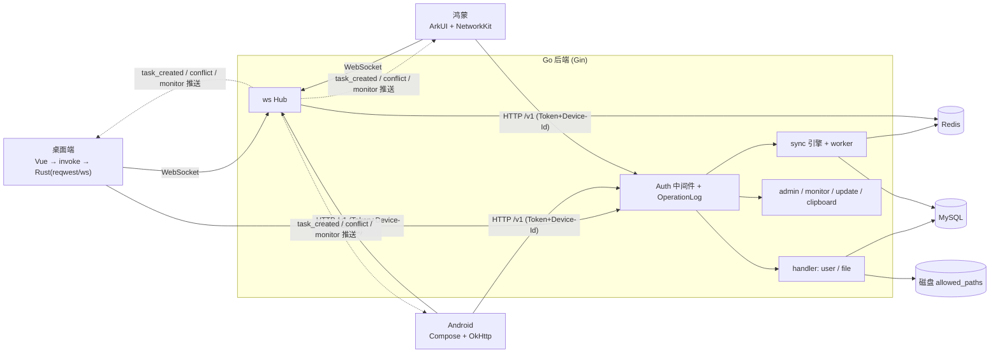

# 云梯 (FileSync) 架构说明

> 四端（Go 后端 / Windows·Linux 桌面端 / Android / 鸿蒙）的架构速览，作为对话与开发的统一背景。
> 维护原则：只写**代码现状**；已定义但未接线的能力标注 **[未接线]**；已修复的历史问题不再保留，看 git log。

## 0. 定位

个人自托管的文件传输 / 同步系统。客户端通过 HTTP（浏览、上传、下载、管理）+ WebSocket（实时事件、同步任务）访问 Go 后端；后端用 MySQL 存业务数据、Redis 存在线设备 / 同步队列 / 上传会话 / 剪贴板历史、本地磁盘存文件。

| 端 | 技术 | 同步角色 |
|---|---|---|
| 后端 `new_server/` | Go 1.25 + Gin + GORM；Rust 静态库 `file_lib`（cgo） | 编排：接收上报 → 冲突检测 → 派发任务 |
| 桌面端 `filesync-desktop/` | Tauri 2 + Vue 3 + Naive UI + Rust；Windows 为主，Linux（deb）可构建 | 双向（notify watcher） |
| Android `Android/` | Kotlin + Compose；Rust JNI（`filecore_jni`） | 双向（inotify 递归 watcher） |
| 鸿蒙 `harmony/` | ArkTS + ArkUI；Rust NAPI（`libfilecore.so`） | 仅下行 download_only（无 root、无监听） |

同步核心已闭环（三端真机验证）：base CAS、冲突保留两者、scan 离线追赶、同内容幂等吸收 / 回声抑制、物理文件缺失自愈。四端统一用 **blake3 分片上传协议**，哈希由同一份 `file_lib` 实现（cgo / 原生 / JNI / NAPI），均有纯语言回退。

---

## 1. 部署现状（2026-10-04 迁移至 Linux VM）

| 项 | 值 |
|---|---|
| 主机 | VMware 虚拟机 `sunyuanling-webserver`（Ubuntu 26.04，`192.168.31.120`，另有公网 IPv6）；SSH 别名 `vm` / `agent-dev` |
| 代码 | `/mnt/data/project`（git 仓库，systemd 直接运行仓库内构建产物） |
| 数据根 | `/mnt/data/file_sync`：`sync/`、`quickshare/`、`versions/`、`updates/`、`share_temp/`、`temp/`、`web/`、`bin/`（frpc/ddns-go）、`backup/`、`desktop-linux/` |
| 旧路径映射 | `E:\FileSync`、`F:\FileSync` → `/mnt/data/file_sync`；`F:\同步目录` → `/mnt/data/file_sync/sync`（DB 内路径已重写） |
| 证书 | `/mnt/data/sunyuanling/`，acme.sh + Cloudflare DNS-01 通配符，续签后 reload nginx 并推送到 HK/JP |

| 组件 | 形态 |
|---|---|
| Go 后端 | `systemd syc-file.service`（`Restart=always`），内部 supervisor 托管 frpc×2 + ddns-go |
| MySQL / Redis | 1Panel Docker 容器（库 `syncfile`；Redis 需密码），1Panel 仅作容器面板 |
| Web | 系统 nginx 80/443，`/file/` → `127.0.0.1:8991`（含 WS / Range / 不缓冲）。**客户端 WS 路径 `/file/v1/ws/connect` 的 `/file` 前缀由 nginx 剥掉**，直连后端则是 `/v1/ws/connect` |
| 对外入口 | frp 双节点：`ddns.sunyuanling.cn`（VPS 443）+ `jp.sunyuanling.cn:8443`（东京）；Cloudflare Tunnel（`www`/`vps` → 本机 nginx）；ddns-go 把 AAAA 指向本机 IPv6 |

**关键配置**（`new_server/config/config.yaml`，含密码，不入库）：`file.allowed_paths: ["/mnt/data"]`、`storage.base_path: file_sync`、`sync.sync_catalogue`、`share.temp_path`、`quick_share.base_path` 均指向 `/mnt/data/file_sync/*`；`supervisor.enabled: true`。

**开发工作流**（`.vscode/`）：后端 F5 = 构建 filecore → 停系统服务释放 8991 → 调试，结束自动恢复服务；发布 = `new_server/build.sh`（原地构建 `syc-file`）→ `systemctl restart syc-file`；filecore 构建 `new_server/file_lib/build.sh`（Linux）/ `build.ps1`（Windows）。Linux 前置：Rust + gcc，Go 在 `/usr/local/go/bin`，GOPROXY=goproxy.cn。桌面端 CI：`.github/workflows/desktop-build.yml`（Win/mac/Linux 矩阵）。

**一体镜像（Docker，开发中，暂不用于线上）**：`new_server/Dockerfile` 把 Go 后端 + MySQL 8.0 + Redis 打进一个镜像（不含 nginx），构建统一用 `bash new_server/docker/build.sh`（VS Code 运行配置「构建: 后端 Docker 镜像」）。首次启动由 `docker/entrypoint.sh` 生成随机 DB / Redis 密码并从范例生成 `/data/config/config.yaml`，之后改配置只需编辑数据卷再重启；默认端口 9999（改 `server.port` + `-p`）；`SYC_MODE=prod` 固定在镜像里（Gin release、不读旧 key.yaml、不托管 frpc/ddns-go），开发直接启动默认 `dev`，行为不变。

**Windows 主机**：后端 / MySQL / Redis / nginx / frpc / ddns-go 均已停止，仅作客户端开发环境与数据备份。客户端域名端口不变，无需改配置。

---

## 2. 系统全景


```mermaid
flowchart LR
    D["桌面端<br/>Vue → invoke → Rust(reqwest/ws)"]
    A["Android<br/>Compose + OkHttp"]
    H["鸿蒙<br/>ArkUI + NetworkKit"]
    subgraph Go["Go 后端 (Gin)"]
      MW["Auth 中间件 + OperationLog"]
      HD["handler: user / file"]
      SY["sync 引擎 + worker"]
      WS["ws Hub"]
      AD["admin / monitor / update / clipboard"]
    end
    R[("Redis")]
    M[("MySQL")]
    F[("磁盘 allowed_paths")]
    D & A & H -- "HTTP /v1 (Token+Device-Id)" --> MW
    D & A & H -- "WebSocket" --> WS
    MW --> HD & SY & AD
    HD --> M & F
    SY --> M & R
    WS --> R
    WS -. "task_created / conflict / monitor 推送" .-> D & A & H
```

- **HTTP**：每请求带 `Token` 与 `Device-Id` 头（下载 / WS 回退为 query）；token 临近过期时后端用 `New-Token` 响应头静默续期。
- **WS**：只做事件路由 / 广播，不传文件字节。
- **文件字节**：上传走分片协议（§3.7），下载走 HTTP Range 流式。

| 维度 | 桌面端 | Android | 鸿蒙 | 后端 |
|---|---|---|---|---|
| 网络 | reqwest + tokio-tungstenite（Web 模式 fetch 回退） | OkHttp 5（手写 `Request`） | `@kit.NetworkKit` | Gin + gorilla/websocket |
| 序列化 | serde / TS interface | kotlinx-serialization | JSON.parse + interface | encoding/json |
| 哈希 | blake3 crate / `@noble/hashes` | JNI→`file_lib`，回退 Java blake3 | NAPI→`file_lib`，回退 ArkTS blake3 | cgo→`file_lib` |
| 持久化 | `config.yml` + `state.json`，凭据进 OS 凭据管理器 | DataStore + `config.conf` + JSON 文件 | preferences + JSON 文件 | MySQL(GORM) + Redis |
| 下载 | 前端 fetch Range | PRDownloader | `http` Range + `fs` 定位写 | HTTP Range / 206 |

---

## 3. Go 后端（`new_server/`）

### 3.1 目录

```
cmd/main.go            入口
config/                Viper：config.yaml（不入库）+ config.example.yaml
deploy/                frpc / ddns-go 配置模板（真实配置不入库）
file_lib/              Rust 静态库 libfilecore.a（C ABI v4）
internal/
  handler/ {user,file}/  胖 Handler（file/ 含分片上传、下载、分享链接、快传、版本）
  sync/                  同步引擎 + worker + REST
  ws/                    Hub / Connection / 同步事件
  admin/                 用户 / 设备 / 操作日志 / 存储配额 / 角色权限 / 快传管理
  monitor/               系统监控、历史、资源告警、WS 实时推送
  update/                应用发布与检查
  clipboard/             剪贴板同步（Redis 短期历史，不落 MySQL）
  system/                初始化向导接口、权限级别、路由下发、访客账号（见 §3.3 / §3.9）
  supervisor/            托管 frpc / ddns-go 子进程
  middleware/            auth.go  logger.go  operation_log.go  jwt.go(死代码)
  model/                 GORM 模型（main.go AutoMigrate 24 个）
  repository/ service/ internal_config/   [空目录]
pkg/ token/(文件名 toekn.go；secret.go 管 JWT 密钥) password/ logger/ device_store/ sync_store/ filecore/(cgo)
     upload_store/ volroot/(盘根判定) procpriority/(提权 / 降级) e/ jwtutil/ response/ [后三者空]
SYNC_PROTOCOL.md       同步 WS/REST 契约（权威）
venv/key.yaml          旧版 JWT 密钥文件（已弃用；dev 模式首次启动会把它导入数据库 app_secret，之后不再读取）
sql/                   参考 DDL / 手工迁移脚本（share_link.sql、sync_folder_singleton.sql）
```

架构为**胖 Handler**：校验 / DB / 业务 / WS 通知内联，无 service / repository 抽象，手动闭包注入 `*gorm.DB` / `*redis.Client`。

### 3.2 启动序列与后台任务

`config.Init` → `logger.Init` → `procpriority.Raise` → Gin（CORS + ZapLogger + Recovery）→ MySQL + `AutoMigrate` → Redis → `ws.InitWS` → monitor（广播器、历史记录、日归档、资源告警、保留清理）→ `device_store` / `upload_store` → 临时目录与分享链接 janitor → `sync.InitSync`（N 个 worker + Reaper）→ OperationLogger → 静态资源（头像 / 分享临时目录）→ 路由 → supervisor → `Run(:8991)`。

### 3.3 鉴权

- **`middleware.Auth()` 单一中间件**：先尽力解析 token，再按 `config.whitelist`（精确或前缀）放行，其余未认证返回 HTTP200 + body `code:401`。白名单：`/v1/ping`、`user/{register,login,reset-password,verify}`、`file/share-link/download`。
- **JWT-HS256 绑定设备**：claims 含 `UserID/Username/Email/Roles/DeviceID`；`Device-Id` 头（WS 为 `device_id` query）与 token 内设备不一致一律当未登录，旧版无设备 token 逼重登。剩余有效期 < `refresh_expire`(1d) 时经 `New-Token` 续期；`token_expire` 默认 7d；bcrypt cost 10。
- **JWT 密钥存数据库**（`app_secret` 表，`token.InitSecret`）：首次启动自动生成；取值优先级 环境变量 `SYC_JWT_SECRET` → 旧 `venv/key.yaml`（仅 dev 模式，保证老 token 不失效）→ 随机。⚠ 不是 `config.yaml` 的 `auth.secret` / `auth.enabled`（死配置）。
- **四级权限** `user.level`：0 访客 / 1 用户 / 2 管理员 / 3 超级管理员。`role` 字段保留给旧客户端（2、3 级的 role 都是 `admin`，访客是 `guest`），两者必须同步（`model.RoleOfLevel`）；token 带 `level`，旧 token 无此字段时带 admin 角色视为超管。管理员不能操作管理员及以上账号。**超级管理员全系统只有一个**（初始化时产生，不能再设置 / 创建第二个）；超管可创建管理员、在用户 / 管理员间调整级别（`PUT /admin/users/:id/level`）；管理员只能创建用户。`POST /admin/users` 是自助注册关闭时新增账号的唯一途径，自动生成的密码只在响应里返回一次（该路径不进操作日志）。
- **访客** = 管理员下发的临时账号（`level=0`、带 `expires_at`、授权页面存 `user_route`）。**接口层默认拒绝**：只放行其被授权页面对应的接口前缀（`internal/system/guest_perm.go` 的 perm 表，新增允许访客用的页面时在此补）；每个访客请求都查库确认账号未禁用 / 未过期（认证阶段就判，白名单接口也不认失效访客）。
- **初始化**：库里没有超级管理员（且 `app_setting.initialized` 未置位）时，`GET /v1/system/status` 报 `initialized=false`，日志打印一次性初始化码（`SYC_SETUP_CODE` 可预设），`POST /v1/system/init` 凭码创建第一个超管（错 5 次锁 60s，成功后失效）；升级的老部署把**最早创建的旧管理员**升为超管（其余旧管理员成为管理员）并视为已初始化；库里若已有多个超管，启动时收敛成 id 最小的一个。**自助注册开关**是 `user.allow_register`（落在超管行上，新初始化默认关，升级的老部署保持开放）。
- ⚠ `RequireRole` **未接线**：admin 判定散落在各 handler 内联（`isAdmin`）；`admin/rbac.go` 提供角色 / 权限管理 API 但不改变现有鉴权行为。CORS `*`、WS `CheckOrigin:true` 仍在，无限流。
- `OperationLogger` 写 `operation_log`；剪贴板路径已 skipLogging（防内容进日志）。

### 3.4 API 端点（均在 `/v1`）

| 域 | 端点 |
|---|---|
| 用户 | `user/{register,login,reset-password,verify,update-info(multipart),change-password,quick-share-settings}` |
| 文件 | `file/{available-disks,traverse-directory,delete,download-history,delete-download-history}`、`GET file/download`（Range，query: path/name/device_id） |
| 分片上传 | `file/upload/{init,chunk,complete}`、`GET file/upload/status`；旧 multipart `file/upload` 保留但客户端已弃用 |
| 版本 | `file/versions`、`GET file/version/download`、`file/version/rollback` |
| 分享 | `file/share-link/{create,list,revoke}`、`GET file/share-link/download/:code`（免登录）；`file/quick-share/{upload,quota}` |
| 同步 | `sync/folder`（POST/GET/PUT/DELETE，**每用户唯一一条**，upsert 语义）、`sync/{notify,scan}`、`sync/tasks`（GET 支持 `page&page_size` 分页，默认 limit 10；DELETE 批量清理）、`sync/tasks/pending`、`sync/tasks/:id/{complete,failed,blocked}`、`DELETE sync/tasks/:id`、`sync/conflicts`、`sync/conflicts/:id/resolve`、`DELETE sync/conflicts/:id` |
| WS | `ws/connect`、`ws/my-devices`（所有人）、`ws/online`（仅 admin）、`ws/stats`、`ws/user/:id/connections`、`ws/{send,broadcast,group,group/send}`、`DELETE ws/{conn/:id,user/:id,device/:id}`、`ws/group/:name/users` |
| 更新 | `update/{check,latest,releases,publish}`、`PUT/DELETE update/releases/:id` |
| 管理 | `admin/{users,devices,logs,storage,roles,permissions,quick-share}`（含用户重置密码 / 角色分配 / 配额重算）；普通用户侧 `devices`（`GET/PUT/DELETE`、`POST devices/:id/kick`）、`GET storage/mine` |
| 监控 | `monitor/{system,network,history,processes,ports,alerts}`（路由在 admin 包注册，**勿重复挂**，gin 会 panic）；实时刷新走 WS 推送 |
| 剪贴板 | `clipboard/{push,history}`、`DELETE clipboard/history` |
| 系统 | `GET system/status`、`POST system/init`（均免登录）；`GET routes`（按级别 / 授权返回路由，未登录返回空表） |
| 级别 / 访客 / 路由管理 | `POST admin/users`（创建用户 / 管理员）、`PUT admin/users/:id/level`、`GET/PUT admin/settings[/register]`、`GET/POST admin/guests`、`PUT/DELETE admin/guests/:id`、`GET admin/guest-routes`、`GET admin/routes`、`PUT admin/routes/:id`（路由管理仅超管） |
| 其它 | `GET/POST /v1/ping`、`GET /ping` |

### 3.5 数据库

- GORM + MySQL，`AutoMigrate` 每次启动执行：User / Device / File / FileVersion / SyncTask / SyncConflict / SyncFolder / UploadHistory / DownloadHistory / Permission / Role / RolePermission / UserRole / DictType / DictData / OperationLog / StorageConfig / ShareRecord / AppRelease / MonitorHistory / ProcessHistory / ResourceAlert / ListeningPortHistory / PortConnHistory / AppSetting / Route(`sys_route`) / UserRoute。`share_link` 表历来靠 `sql/share_link.sql` 手工建，启动时若不存在会自动创建（已有的表不碰）。
- **[仅 schema，无业务代码]**：DictType / DictData / ShareRecord。
- ⚠ **schema 双源**：`sql/init_mysql.sql` 与 AutoMigrate 会漂移（AutoMigrate 不删旧列，曾因残留 `NOT NULL` 列导致 sync_task 插入全失败）。改表结构以 AutoMigrate + 手工迁移脚本为准。
- Redis：在线设备（`device:online:{id}` TTL 10s + `user:devices:{uid}`）、同步队列 / 锁 / 进度、上传会话 + 位图、剪贴板历史（24h / 50 条）。

### 3.6 WebSocket

- **Hub**：按 conn / user / device / group 索引，**同设备单连**（新连挤旧连），广播并发扇出。**Connection**：readPump / writePump / heartbeat，ping 54s、pong 60s、90s 心跳超时、单消息 512KB。
- 信封 `{id,type,from,target,content,timestamp,extra}`；`type` ∈ text/broadcast/system/heartbeat/ack/file_sync/notification。
- `file_sync` 的 `content.event`：`file_changed` / `task_created` / `task_progress` / `task_completed` / `task_failed` / `task_blocked` / `conflict` / `conflict_resolved` / `scan_request` / `scan_result`；经 `SetFileSyncHandler` 注入避免 ws↔sync 循环依赖。另有 `file_upload` / `file_download` 状态事件、monitor 实时推送。
- 握手把设备写 Redis（`device_store.Online`）；`device_registry.go` 管设备登记。

### 3.7 同步引擎与文件传输

**同步引擎**（`internal/sync/`）：探测在客户端，后端只做「接收上报 → 编排 → 推任务」。
- `engine.go` / `filechange.go`：`HandleFileChange` 做 File 表 upsert + **base_hash CAS** + 冲突检测 + 向其它在线设备派发 download / delete / mkdir；`relative_path` 经 `cleanRelPath` 防穿越。
- `worker.go`：BRPOP `sync:queue` → 目标在线 + 文件锁(SetNX) → 置 syncing → WS 推 `task_created`；Reaper 30s 扫超时重试与离线积压补发。
- `scan.go` / `reconcile.go`：离线重连全量清单比对，只补差异（hash 比对）；**同内容幂等吸收 / 回声抑制**，物理文件缺失自愈。
- `conflict.go`：**保留两者**——服务端拒收，推 `conflict` 让源端把本地分叉隔离到 `.syncpending/`，主目录收敛服务端版；`resolve` 支持 `accept_server` / `keep_local`。
- `version.go`：文件版本；`upload_bridge.go`：分片上传完成后桥接到同步派发（秒传也走）。
- 契约见 `SYNC_PROTOCOL.md`。

**分片上传**（`file_lib` + `pkg/filecore` + `pkg/upload_store`，哈希统一 blake3）：
- 客户端先发**文件描述**（总大小、分片大小 / 数、叶子哈希、Merkle 树根、整文件哈希）→ `init` 校验自洽 + 秒传查重 + 预分配（`fc_preallocate`）；
- 分片乱序并发，每片 `fc_chunk_write` **早校验 + 按 offset 定位写**；位图标记已落盘（幂等 + 断点续传）；HTTP 码 404=会话过期、422=分片校验失败；
- `complete`：`fc_finalize` 单趟校验 + `fc_move` 原子落盘 → 写 File 表 → 同步派发；
- **秒传**：init 命中时不建会话，客户端**不得再调 complete**，服务端在 init 内直接派发（响应带 `synced`）；
- 会话过期（任一 chunk 404）客户端自动重新 init 一次；`upload_janitor` 回收会话；
- 同步上传一律 **delete-before-upload**（先删远端旧文件再 init），解决「已存在被拒」。

**file_lib ABI v4**：`fc_preallocate/chunk_write/hash_chunk/merkle_root/finalize/describe/move/evict` + `fc_sys_snapshot`（sysinfo + netstat2 的进程 / 端口采集，供 monitor）+ `fc_free_string`；`crate-type` 含 rlib 供 JNI/NAPI 复用。构建踩坑与 LDFLAGS 见 `file_lib/README.md`（cgo LDFLAGS 已按平台拆分）。

**下载**：路径经 `allowed_paths` 前缀校验（`pkg/volroot` 判盘根；比较大小写不敏感）→ 先写 `DownloadHistory` → 全量 `io.Copy` 流式 / Range `206`。

### 3.8 其它域

- **monitor**：30s 采样系统详情、进程 Top N、监听端口 / 连接，历史入库 + 日归档 + 保留清理；资源告警（CPU 尖峰等）入 `resource_alert`；WS 实时推送。
- **update**：`AppRelease`（当前仅 android；APK 走分片上传，登记 file_path / blake3 / `mandatory` / `min_version_code`）；`check` 命中后客户端复用 `file/download` 下载并校验；发布时 WS 推 `app_update`，支持强制更新。
- **clipboard**：纯转发 + Redis 短期历史，推送时排除来源设备；是否推送由客户端开关决定，服务端能看到明文。
- **分享**：`share-link`（临时目录副本 + 过期清理）与 `quick-share`（有容量上限，内存阈值以下走内存缓存）。

### 3.9 配置要点

Viper 读 `config/config.yaml` + `AutomaticEnv`。段：db / redis(含 password) / log(lumberjack 轮转) / whitelist / auth / server(port 8991) / file / user(头像) / share / quick_share / sync(worker 4、max_retry 3、lock_ttl 300s、task_timeout 600s、conflict_suffix) / monitor / supervisor。⚠ `file.storage.{upload,trash}_path` 未使用；文件落客户端指定的绝对路径（须在 allowed_paths 内）。

---

## 4. 桌面端（`filesync-desktop/`）

- **网络分层**：`src/api/*Api.ts` 做 `isTauri()` 分支——Tauri → `invoke` → Rust command → reqwest；Web 模式 → `http.ts` fetch。token / device_id 经 `platform.ts` 读写；Rust 侧 `SyncConfig`（`Arc<RwLock>`）持有 server_url / token / 节点列表。
- **路由全部由服务器下发**：前端只内置 `/login` `/register` `/reset` `/init`（初始化向导）和 Home 布局壳，其余页面由路由守卫在登录后拉 `GET /v1/routes` 并 `router.addRoute` 动态注册（`router/dynamic.ts`、`store/useRouteStore.ts`）。页面代码仍在客户端，服务器下发的 `component` 是客户端页面注册表（`import.meta.glob('views/**/*.vue')`）的 key——服务器管入口 / 标题 / 顺序 / 可见级别，客户端缺组件的条目被忽略；新增页面 = 客户端加 `.vue` + 服务端 `system/catalog.go` 加一行（缺失才播种，管理员改过的不会被覆盖）。路由表带版本号，5 分钟刷新一次，拉取失败回退本地缓存（按用户隔离）。菜单由路由表生成，网页端与桌面端共用。
- **UI**：Vue 3 + Pinia + **只用 naive-ui + @vicons**（禁用 Element Plus）。页面：`Dashboard` / `catalog`(文件管理) / `file` / `sync`(SyncManage、SyncWatch) / `transfer` / `monitor`(System、Network、Cache) / `clipboard` / `share`(ShareManage、QuickPaste) / `update`(应用发布) / `admin`(UserManage 用户与注册开关、GuestManage 访客、RouteManage 路由管理) / `person` / `logs`；基础页在 `competent/`（登录、注册、重置、`init/InitWizard` 初始化向导、`EmptyPage` 无页面 / 加载失败落地页）。主窗口关闭会销毁 WebView，托盘常驻。
- **Rust 模块**（`src-tauri/src/`）：
  - `commands/`（user / file / sync_domain / update / credential / support）——Tauri commands；
  - `net.rs`：**节点注册表 + 健康探测 + 自动灾备切换**，请求带 epoch，切换时在途请求立即取消；
  - `transfers.rs`：**传输状态唯一来源**（上传 / 下载 / 同步活动三表 + 测速），前端靠 `get_transfers` 快照 + `transfer-changed` 事件镜像；
  - `chunked_uploader.rs`：blake3 + Merkle + 并发 + 断点续传 + 秒传 + SessionGone 重试 + `file_blake3_hex`（Linux 定位读已兼容）；
  - `sync_engine.rs` / `watcher.rs` / `upload_worker.rs` / `catch_up.rs` / `base_store.rs`：watcher + 防抖 + 上传调度；离线追赶两阶段（Phase1 stat 比对上传带 base CAS，Phase2 `/sync/scan`）；基线 `BaseEntry{hash,size,mtime}` 存 `config/state.json`；
  - `ws_client/`：WS 重连、`task_created` 执行（下载走 `.synctmp` → blake3 校验 → 原子 rename；占用回 `task_blocked`）、冲突隔离、`keep_local_reupload`；
  - `clipboard_sync.rs`：轮询系统剪贴板，**三道防回声**（服务端排除来源、`last_synced` 哈希、写入静音窗口）；
  - `commands/credential.rs`：记住密码走 **OS 凭据管理器**（keyring），不落明文；
  - `app_shell/`：菜单 / 托盘 / 日志窗口 / 快速粘贴；`logger.rs`：级别 + 按大小轮转 + 日志窗口（`Ctrl+Alt+T`）。
- **同步文件夹**：权威源是服务器 `sync_folder`（每用户一条）；`start_sync` 拉取后填充内存缓存再起引擎，**同步默认自动启动**（setup 延迟 1s + 登录后补位）。
- **运行目录**：`app_paths.rs` 以可执行文件目录为基准，建 `config/`（`config.yml`，token 不落盘）、`sync/`、`log/`。
- 打包：tauri `nsis`（Windows）；Linux 出 deb；CI 矩阵含 macOS。

---

## 5. Android 端（`Android/`，包 `com.sunyuanling.filesync`，versionName 1.3.1）

- **架构**：MVVM（无 domain / Repository，每屏重新请求）。`api/`（门面 object：file/user/ws/sync/update）→ `network/`（`Request` 单例：OkHttp 30s、`Token` 头、401 → `AuthManager` 广播、`New-Token` 续期）；`WebSocketManager`（指数退避，重连上限读 `AppConfig.wsMaxReconnectAttempts`，负数无限；`events` SharedFlow 不丢消息）。
- **配置 / 持久化**：`AppConfig` + `ConfigManager`（`<ExternalStorage>/FileSync/config.conf`）；DataStore 存 token；下载任务（`pending_downloads.json`）、同步映射（`sync_mappings.json`）、基线（`sync_base.json`）均在 `FileSync/` 下。
- **下载**：`DownloadController` 进程级单例 + `DownloadService` 前台服务 + 通知 action；PRDownloader（token 走 query）。上传走 `ChunkedUploader`。
- **同步**（`sync/SyncEngine`，对标 `SYNC_PROTOCOL.md`）：
  - 执行：`task_created`（download 流式 + blake3 校验 + `.synctmp` 原子发布 / delete / mkdir）→ REST 回报；
  - 探测：`RecursiveWatcher`（inotify 递归）→ 2s 稳定窗 + size/mtime 复查 → delete-before-upload + 分片 → `notify`（带 base CAS）；
  - 追赶（每次 WS Connected）：Phase1 上传离线变更 + Phase2 `scan`；stat 缓存避免重算；上传 / 下载各 Semaphore(2)；`syncOnWifiOnly` 门控；
  - 冲突：本地分叉隔离 `.syncpending/<conflictId>_<name>`；`keep_local` 以 server_hash 为 base 回放重传；自写路径 10s 抑制回环。
- **保活**：`SyncKeepAliveService`（dataSync 前台服务，30s 守护重连，`forceKeepAliveEnabled`）；root 设备进程级守护（LSPosed 看门狗）在 app 外部维护；持久化续传（`persistentDownloadEnabled`）仅 root 可见。
- **Rust 内核**：`filecore_jni`（cdylib，`build.ps1` 需 NDK + cargo-ndk）→ `core/FileCore`（`describe` / `hashChunk` / `merkleRoot`），缺 .so 回退纯 Java。
- **其它能力**：文件在线预览（`previewUtil/` + `ui/screen/preview/`：图 / 视频 / 音频 / PDF / 文本 / Office，Office 经 POI，**需真机验证**）；应用更新（`update/UpdateController`：check + WS 推送 + 复用下载 + FileProvider 安装 + 强制更新）；设备监控（`DevicesList`，admin 多一个「所有在线设备」分区）；同步列表分页（每页 10 条）。
- 底部四标签：Home / Files / Monitor / Personal；导航为 Navigation-Compose 类型安全路由（`router/AppRoute.kt` 为死代码）。

---

## 6. 鸿蒙端（`harmony/`，bundleName `com.example.fileSyc`）

- 定位：**download_only** 同步客户端——只接 `task_created` 与离线追赶，**不**调 `notify`；冲突默认 `accept_server`；本地变更靠手动上传。HarmonyOS NEXT（API 22），ArkTS 严格模式，仅 arm64-v8a + x86_64。
- 结构（`products/sunyuanling/src/main/ets/`）：`api/`、`net/`（`Request` 对标 Android，含 `postMultipart`、Range 下载）、`download/`（`DownloadController` Range 流式 + 并发限制 + 通知 + 持久化恢复）、`sync/`（`SyncEngine` / `SyncMappingStore` / `SyncBaseStore`）、`storage/`、`core/FileCore`（NAPI + 纯 ArkTS blake3 回退）、`service/BackgroundTaskHelper`（长时任务 `DATA_TRANSFER` 保活）、`pages/`（Home / Files / Monitor / Personal 四 Tab + 文件浏览 / 上传 / 传输 / 同步列表 / 同步文件夹 / 设备列表 / 设置 / 服务器 / 编辑资料 / 改密）。
- **存储（鸿蒙手机的血泪结论，详见 `harmony/README.md`）**：手机不支持公共固定目录（`getUserDownloadDir`、选文件夹均不可用）。当前方案 `CloudLadderStorage`：`picker.save()` + `DOWNLOAD` 模式无弹框拿到 `Download/<bundleName>` 授权 → `FileUri` 转真实 path → `fs` 读写；目录 `同步/<folder>`、`下载`。⚠ **授权是临时的，退后台即失效**，后台同步先落沙盒暂存（`SyncStagingStore`），回前台重新授权后 flush；文件 IO 一律异步，避免主线程 appfreeze。
- **台账与数据同生共死**：清单权威 = `SyncBaseStore` 基线台账，写沙盒 + 公共目录镜像 `.yt_baseline.json` 双份；每个 folder 根有哨兵 `.ytsync`，清单为空且枚举不出哨兵时**跳过本轮 scan**（宁可不报，绝不报空），否则服务端会全量重派。
- 差距：无文件预览 / 搜索 / 多文件批量上传；`router.back()` 已废弃待迁 `Navigation`；`common/` + `features/` 为 DevEco 模板残留待清理。

---

## 7. 前后端契约与约定

- **响应信封** `{code,message,data}`，`code==200` 成功；例外：`user/register` 返回 `{message,user}` 无 code，Android `Request` 校验恒失败（`UserApi.kt` 有 TODO）。
- **DTO**：前端 camelCase + `@SerialName("snake_case")` 对齐后端 json tag；Rust 侧按 `api/{user,file,sync,ws}` 分域。
- **文件哈希统一 blake3**；`device.rs` 的 device_id 仍用 sha256（非文件哈希）。
- **路径**：必须落在 `allowed_paths` 前缀内；同步引擎相对路径经 `cleanRelPath` 清洗。
- **同步工作文件**：`.synctmp`（下载暂存）、`.syncpending/`（冲突隔离）；鸿蒙另有 `.yt*` 自用记账文件，各端 watcher 均忽略。
- 入口速查：后端 `cmd/main.go`、路由 `internal/handler/routers.go`；Android `MainActivity.kt`、路由常量 `api/ApiRoutes.kt`；桌面 `src-tauri/src/lib.rs`；契约 `new_server/SYNC_PROTOCOL.md`。

---

## 8. 已知问题与待办（仅未解决项）

**P1**
- **公网安全一轮**（服务经 DDNS 公网暴露）：CORS `*`、WS `CheckOrigin:true`、`RequireRole` 未接线、download token 走 query（进访问日志）、Android 明文记住密码（桌面端已走 OS 凭据管理器）。
- **sync 引擎无自动化测试**：CAS 快进 / 冲突 / scan / 幂等吸收 / 自愈全靠手工联调；前后端整体基本无测试。
- `AppConfig` 的 `autoSyncIntervalMs` 等个别配置无消费者；`Request.baseUrl` 单例 init 求值，运行时改服务器配置后可能陈旧。

**P2**
- 重命名 / 移动被当成 delete + create（断版本史）；Office 稳定窗口桌面端未对齐 Android 的 2s 稳定窗。
- 旧 multipart `upload.go`（`SaveUploadedFile` 缓冲落盘）仍在，客户端已弃用；`file.storage.*` 配置未用。
- 经 `/file/delete` 删同步目录内文件仅 `os.Remove`，不更新 trunk。
- Android `cleartext` 全开、manifest 过度权限；DataStore 名 `secure_prefs` 实际未加密。
- 冲突 `keep_local` 的子目录回放（Android 按根目录名回放，靠重扫兜底）。

**P3 / 清理**
- 死代码：`middleware/jwt.go`（硬编码 secret）、Android `router/AppRoute.kt`、拼写 `toekn.go`；`websocket.kt` 的 package 仍为 `com.example.filesync.data.sync`；空目录 `repository/ service/ internal_config/ pkg/{e,jwtutil,response}`；handler 的 `redisClient` 形参多处未使用。
- `init_mysql.sql` 与 AutoMigrate 漂移（见 §3.5）；README 仍写 PostgreSQL。

**下一步（按记录顺序）**：文件底层操作统一到 Rust 核心（仅记录，未实现）→ 安卓重编译验证 → 鸿蒙对齐。
